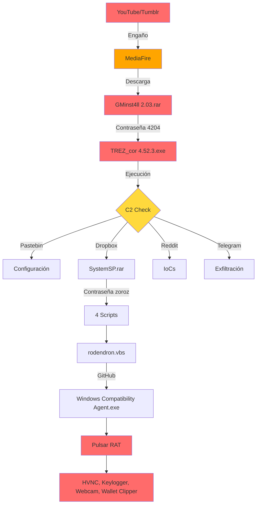
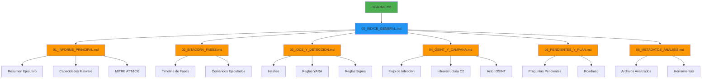
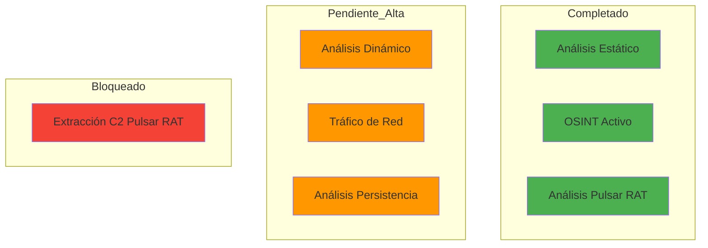

# Análisis de Malware - GMinst4ll 2.03.rar

**Fecha:** 11-13 de junio de 2026  
**Analista:** Análisis forense de malware  
**Tipo de malware:** InfoStealer / Loader con múltiples payloads (Pulsar RAT, SystemSP, GitHub C2)

---

## Resumen del Proyecto

Este proyecto contiene el análisis forense completo de la muestra de malware **GMinst4ll 2.03.rar**, un infoStealer/loader que distribuye múltiples payloads incluyendo Pulsar RAT v1.6.6.0, SystemSP (killer AV + persistencia), y ejecutables Python/Rust desde GitHub.

### Características Principales del Malware
- **Persistencia:** Winlogon UserInit, tareas programadas, RunOnce
- **Evasión:** Anti-VM, anti-debugging, deshabilitación de AV
- **Exfiltración:** Telegram API, Pastebin C2, Dropbox
- **Payloads:** Pulsar RAT (.NET), SystemSP (VBScript/Batch), GitHub C2 (Python/Rust)
- **Bloqueo AV:** Modificación de hosts file, detención de servicios, exclusiones Defender

---

## Flujo de Infección



---

## Arquitectura de Documentos



---

## Estructura del Proyecto

```
virus/
├── docs/                          # Documentación del análisis
│   ├── 00_INDICE_GENERAL.md       # Índice de documentos
│   ├── 01_INFORME_PRINCIPAL.md    # Informe ejecutivo
│   ├── 02_BITACORA_FASES.md       # Bitácora de 15 fases
│   ├── 03_IOCS_Y_DETECCION.md     # IoCs y reglas de detección
│   ├── 04_OSINT_Y_CAMPANA.md      # Análisis de campaña
│   ├── 05_PENDIENTES_Y_PLAN.md    # Trabajo pendiente
│   └── 06_METADATOS_ANALISIS.md   # Metadatos de análisis estático
├── malware_samples/               # Muestras de malware analizadas
│   ├── gminst4ll/                 # GMinst4ll 2.03.rar (loader principal)
│   ├── systemsp/                  # SystemSP.rar (killer AV + persistencia)
│   ├── pulsar_rat/                # beket.rar (Pulsar RAT v1.6.6.0)
│   ├── github_c2/                 # Ejecutables Python (GitHub C2)
│   └── rust_executables/          # Ejecutables Rust (launcher)
├── scripts/                       # Scripts de análisis
│   ├── dynamic/                   # Scripts de análisis dinámico
│   ├── pulsar/                    # Scripts específicos Pulsar RAT
│   ├── static/                    # Scripts de análisis estático
│   └── utils/                     # Utilidades varias
├── tools/                         # Herramientas de análisis
│   └── de4dot-cex/                # Deobfuscador .NET
├── yara_rules/                    # Reglas YARA
│   ├── antidebug_antivm/          # Anti-debug/anti-VM
│   ├── capabilities/              # Capacidades de malware
│   ├── crypto/                    # Criptografía
│   ├── malware/                   # Reglas de malware
│   └── packers/                   # Packers
├── data/                          # Datos de análisis (vacío, disponible para uso futuro)
├── results/                       # Resultados de análisis (vacío, disponible para uso futuro)
├── img/                           # Imágenes/capturas
├── Makefile                       # Automatización de comandos
├── Vagrantfile                    # Configuración de VMs
└── README.md                      # Este archivo
```

---

## Documentación

### 📄 Documentos Principales

| Documento | Descripción | Audiencia |
|-----------|-------------|-----------|
| [00_INDICE_GENERAL.md](docs/00_INDICE_GENERAL.md) | Índice de todos los documentos | Todos |
| [01_INFORME_PRINCIPAL.md](docs/01_INFORME_PRINCIPAL_GMINST4LL.md) | Informe ejecutivo (10-15 páginas) | Ejecutivos, stakeholders |
| [02_BITACORA_FASES.md](docs/02_BITACORA_FASES_GMINST4LL.md) | Proceso de análisis por 15 fases | Analistas técnicos |
| [03_IOCS_Y_DETECCION.md](docs/03_IOCS_Y_DETECCION_GMINST4LL.md) | IoCs, reglas YARA/Sigma, consultas SIEM | Blue team, SOC |
| [04_OSINT_Y_CAMPANA.md](docs/04_OSINT_Y_CAMPANA_GMINST4LL.md) | Análisis de campaña e infraestructura | Threat researchers |
| [05_PENDIENTES_Y_PLAN.md](docs/05_PENDIENTES_Y_PLAN_GMINST4LL.md) | Trabajo pendiente y plan futuro | Analistas |
| [06_METADATOS_ANALISIS.md](docs/06_METADATOS_ANALISIS_TXT_GMINST4LL.md) | Metadatos de análisis estático | Forenses |

---

## Muestras de Malware

### gminst4ll/
- **GMinst4ll 2.03.rar** - Loader principal (884 MB)
- **TREZ_cor 4.52.3.exe** - Ejecutable Rust (payload secundario)
- **Contraseña:** `4204`

### systemsp/
- **SystemSP.rar** - Killer AV + persistencia
- **max.vbs** - Persistencia Winlogon
- **babuchen.bat** - Killer AV (detiene 14 servicios)
- **rodendron.vbs** - Descargador GitHub C2
- **WinStatChecking.bat** - Bloqueador DNS/hosts
- **Contraseña:** `zoroz`

### pulsar_rat/
- **beket.rar** - Pulsar RAT v1.6.6.0
- **appy_patched.exe** - Pulsar RAT .NET (1.9 MB)
- **Contraseña:** No documentada

### github_c2/
- **Windows_Compatibility_Agent.exe** - Python 3.13 (12.4 MB)
- **Windows_Compatibility_Agent_Host.exe** - Python 3.14 (8.5 MB)
- **kamzat.exe** - Python 3.13 (12.4 MB)
- **postevak.exe** - Python 3.13 (7.9 MB)

### rust_executables/
- **appy.exe** - Rust launcher (719 KB)

---

## Información del Actor

### Identificador Principal
- **Usuario GitHub:** boycots563
- **Repositorio C2:** https://github.com/boycots563/wlt56 (251 commits, activo al 2026-06-11)
- **Telegram operador:** @KJL4999S (Chat ID: 6820575341)
- **Origen probable:** Eslovaquia (archivo subido a MediaFire desde allí el 2026-06-10)

### Nombres Temáticos de Payloads
- babuchen - Killer AV
- rodendron - Descargador GitHub C2
- kamzat - Payload alternativo Python
- postevak - Payload alternativo Python
- SystemSP - Sistema de persistencia

---

## Capacidades del Malware

### GMinst4ll (Loader Principal)
- **Persistencia:** Winlogon UserInit, tareas programadas
- **Exfiltración:** Telegram Bot API, Pastebin C2, Dropbox
- **Robo de información:** Navegadores (Chrome, Edge, Brave, Opera, Firefox), wallets (Metamask, Trust Wallet, Atomic)
- **Evasión:** Anti-VM, anti-debugging

### SystemSP (Payload Secundario)
- **Killer AV:** Detiene 14 servicios AV, destruye 34 suites de seguridad
- **Persistencia:** Winlogon UserInit, RunOnce, tareas programadas
- **Bloqueo de seguridad:** Modifica hosts file (66 dominios AV), fuerza DNS a 8.8.8.8
- **Deshabilita Windows Update:** Elimina servicios y claves de registro

### Pulsar RAT v1.6.6.0
- **HVNC:** Hidden Virtual Network Computing (SharpDX DirectX)
- **Keylogger:** Gma.System.MouseKeyHook library
- **Webcam access:** AForge.Video.DirectShow library
- **Audio capture:** NAudio library (Core, Wasapi, WinMM)
- **Clipboard manager:** Hijacking de portapapeles
- **Remote desktop:** Escritorio remoto completo
- **Wallet clipper:** XMR detectado estáticamente (9 criptomonedas inferidas de regex)
- **Anti-evasion:** 25+ checks anti-VM/anti-debug

---

## IoCs Principales

### URLs C2
- `https://pastebin.com/raw/FgUMQ9vE` - Token Telegram + Chat ID
- `https://pastebin.com/raw/E3s5iTTz` - URL descarga SystemSP.rar
- `https://www.dropbox.com/scl/fi/5awp2xpk4r65t6dz0bmcu/SystemSP.rar` - Payload secundario
- `https://github.com/boycots563/wlt56/raw/main/Windows%20Compatibility%20Agent.exe` - GitHub C2
- `https://api.telegram.org/bot7675556882:[TOKEN]/sendDocument` - Exfiltración

### Hashes SHA256
- **GMinst4ll 2.03.rar:** `d70c31b02f88ad239507c47c9fbde3353b5b93b6892e48bf5ba25322aa667e77`
- **SystemSP.rar:** `a50e078598a08faa5ec554c36e58cf201f167e5f272b39f5107fffc6c44369f8`
- **appy.exe (Pulsar RAT original en beket.rar):** `5b20cb36abbacc69ee5d0c7008f1ad081db2767625659b4bb8eba6ecc511bd2a`
- **appy_patched.exe (Pulsar RAT parcheado):** `eabe4c16caa0ad6e2228e10664a5add26202d5c68ce9a8ebd30481b7daded699`

### Token de Telegram
- **Bot ID:** 7675556882
- **Username:** buchstys4_bot
- **Chat ID exfiltración:** 6820575341

---

## Impacto y Riesgo

### Nivel de Riesgo
**Alto** - Capacidades de robo de información sensible, persistencia robusta, múltiples canales de exfiltración

### Impacto Técnico
- **Capacidad de robo:** Alta (navegadores, wallets, tokens)
- **Capacidad de persistencia:** Alta (modificación de registry)
- **Capacidad de evasión:** Media (strings de AV, anti-VM)
- **Capacidad de exfiltración:** Alta (múltiples canales C2)

### Impacto por Dimensión
| Dimensión | Estado | Descripción |
|-----------|--------|-------------|
| Confidencialidad | Afectada | Robo de credenciales, wallets, tokens |
| Integridad | Afectada | Modificación de registry, archivos del sistema |
| Disponibilidad | No evaluable | No se observaron evidencias suficientes |

### Pasos de Contención Inmediatos
1. **Aislar el host:** Desconectar de la red
2. **Bloquear IoCs:** Bloquear URLs, dominios, IPs listados
3. **Búsqueda retrospectiva:** Buscar IoCs en endpoints
4. **Revisar credenciales:** Revisar credenciales potencialmente comprometidas

---

## Mapeo MITRE ATT&CK

### Técnicas Identificadas

| Táctica | Técnica | Descripción |
|---------|---------|-------------|
| Initial Access | T1566.002 | Spearphishing Link |
| Execution | T1059.001 | Command and Scripting Interpreter (PowerShell) |
| Persistence | T1547.001 | Modify System Binary (Winlogon UserInit) |
| Defense Evasion | T1562.001 | Impair Defenses (Killer AV) |
| Credential Access | T1056.001 | Input Capture (Keylogger) |
| Command and Control | T1102 | Web Service (Pastebin, Reddit, Telegram, Dropbox) |
| Exfiltration | T1567.002 | Exfiltration Over Web Service (Telegram) |

---

## Reglas de Detección

### YARA
- **GMinst4ll_Stealer** - Detecta loader principal
- **PulsarRAT_AES_GCM_Config** - Detecta Pulsar RAT por nonces AES-GCM
- **PulsarRAT_Deobfuscated_Strings** - Detecta Pulsar RAT por strings desofuscados

### Sigma
- **Winlogon UserInit Modification** - Detecta persistencia
- **SystemSP Directory Creation** - Detecta instalación
- **Suspicious WScript Execution** - Detecta ejecución de scripts

---

## Herramientas

### Scripts
- `scripts/dynamic/` - Análisis dinámico en VM
- `scripts/pulsar/` - Análisis específico Pulsar RAT
- `scripts/static/` - Análisis estático (strings, hashes, PE info)
- `scripts/utils/` - Utilidades varias

### Herramientas
- `tools/de4dot-cex/` - Deobfuscador .NET (ConfuserEx)
- `yara_rules/` - Reglas YARA para detección

### Automatización
- `Makefile` - Comandos de análisis automatizados
- `Vagrantfile` - Configuración de VMs (Ubuntu, Windows)

---

## Cómo Usar Este Proyecto

### Para Ejecutivos/Stakeholders
1. Leer `docs/01_INFORME_PRINCIPAL_GMINST4LL.md` para resumen ejecutivo
2. Revisar sección de riesgo e impacto
3. Implementar recomendaciones de contención

### Para Analistas Técnicos
1. Usar `docs/02_BITACORA_FASES_GMINST4LL.md` como guía de laboratorio
2. Replicar análisis usando scripts en `scripts/`
3. Consultar `docs/06_METADATOS_ANALISIS_TXT_GMINST4LL.md` para trazabilidad

### Para Blue Team/SOC
1. Implementar IoCs de `docs/03_IOCS_Y_DETECCION_GMINST4LL.md`
2. Desplegar reglas YARA en EDR
3. Implementar reglas Sigma en SIEM
4. Usar consultas SIEM para hunting

### Para Threat Researchers
1. Expandir OSINT usando `docs/04_OSINT_Y_CAMPANA_GMINST4LL.md`
2. Investigar infraestructura de distribución
3. Rastrear operador @KJL4999S (Telegram)
4. Monitorear repositorio GitHub `boycots563/wlt56`

### Para Continuar el Análisis
1. Revisar `docs/05_PENDIENTES_Y_PLAN_GMINST4LL.md`
2. Priorizar tareas según lista
3. Validar hipótesis pendientes
4. Documentar nuevos hallazgos

---

## Roadmap del Análisis



---

## Estado del Análisis

| Fase | Estado |
|------|--------|
| Preparación del entorno | ✅ Completado |
| Análisis estático básico | ✅ Completado |
| Análisis de metadatos | ✅ Completado |
| Escaneo AV | ⚠️ Parcial |
| Análisis de strings | ✅ Completado |
| Extracción en sandbox | ✅ Completado |
| Análisis de archivos extraídos | ✅ Completado |
| Análisis YARA | ✅ Completado |
| Ingeniería inversa básica | ✅ Completado |
| Análisis OSINT | ✅ Completado |
| Preparación VM Windows | ✅ Completado |
| Análisis dinámico | ⏳ Parcial |
| Análisis de tráfico de red | ⏳ Pendiente |
| Análisis de persistencia | ⏳ Pendiente |
| Reporte final | ✅ Completado |

### Análisis Estático Completado (2026-06-13)
- 14 archivos .txt de análisis detallado generados
- Capacidades de Pulsar RAT validadas (HVNC, Keylogger, Webcam, Audio, Clipboard, Remote desktop)
- Wallet clipper: Solo XMR detectado estáticamente (9 criptomonedas inferidas de regex)
- Anti-evasion: 25+ checks anti-VM/anti-debug confirmados
- Nombres temáticos analizados (babuchen, rodendron, kamzat, postevak)
- Uso de Telegram en GMinst4ll confirmado
- Análisis de passwords y cookies en GMinst4ll
- IPs/dominios: Actor usa plataformas legítimas, no infraestructura propia

### Archivos de Análisis Generados

**gminst4ll/**
- archive_rar_analisis.txt - Análisis P1: archive.rar
- p3_cifrado_analisis.txt - Análisis P3: Cifrado/archivado de datos
- p4_reddit_pastebin_analisis.txt - Análisis P4: Reddit/Pastebin
- p7_vm_detection_analisis.txt - Análisis P7: Detección VM/sandbox
- p9_navegadores_analisis.txt - Análisis P9: Navegadores robados
- p10_wallets_analisis.txt - Análisis P10: Búsqueda de wallets
- telegram_analisis.txt - Análisis de Telegram en GMinst4ll
- passwords_analisis.txt - Análisis de passwords en GMinst4ll
- cookies_analisis.txt - Análisis de cookies en GMinst4ll
- ips_dominios_analisis.txt - Análisis de IPs/dominios asociados al actor

**pulsar_rat/**
- capacidades_pulsar_rat_analisis.txt - Capacidades Pulsar RAT (HVNC, Keylogger, Webcam, Audio, Clipboard, Remote desktop)
- wallet_clipper_analisis.txt - Análisis de wallet clipper en Pulsar RAT
- anti_evasion_analisis.txt - Análisis de anti-evasion en Pulsar RAT

**systemsp/**
- nombres_tematicos_analisis.txt - Análisis de nombres temáticos (babuchen, rodendron, kamzat, postevak)

**github_c2/**
- boycots563_significado.txt - Análisis del nombre "boycots563"

---

## Advertencias

⚠️ **ADVERTENCIA:** Este proyecto contiene muestras de malware real. Solo debe analizarse en un entorno aislado (sandbox/VM) desconectado de redes de producción.

⚠️ **Las muestras de malware están protegidas con contraseñas:**
- GMinst4ll 2.03.rar: `4204`
- SystemSP.rar: `zoroz`

⚠️ **No ejecute las muestras en su máquina principal o en entornos de producción.**

---

## Licencia

Este proyecto es para fines educativos y de investigación en ciberseguridad. El análisis de malware debe realizarse de manera ética y legal.

---

## Contacto

Para preguntas sobre este análisis, consulte la documentación en el directorio `docs/`.

---

**Última actualización:** 13 de junio de 2026
