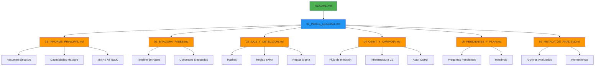

# Índice General - Análisis de Malware GMinst4ll 2.03.rar

**Fecha:** 11-13 de junio de 2026  
**Analista:** Análisis forense de malware

---

## Estructura de Documentos

Los documentos han sido organizados en 6 documentos principales para facilitar la navegación y el uso:

### 1. Informe Principal
**Documento sintético con hallazgos clave (máximo 10-15 páginas)**

📄 [01_INFORME_PRINCIPAL_GMINST4LL.md](01_INFORME_PRINCIPAL_GMINST4LL.md)
- Resumen ejecutivo
- Alcance y limitaciones
- Datos de la muestra
- Hallazgos confirmados
- Capacidades inferidas
- IoCs consolidados
- Mapeo MITRE ATT&CK
- Detección y hunting
- Riesgo e impacto
- Contención y remediación
- Conclusión

---

### 2. Bitácora de Fases
**Proceso real de análisis por las 15 fases del proyecto**

📄 [02_BITACORA_FASES_GMINST4LL.md](02_BITACORA_FASES_GMINST4LL.md)
- Fase 1: Preparación del Entorno Seguro ✅
- Fase 2: Análisis Estático Básico del RAR ✅
- Fase 3: Análisis de Metadatos y Estructura ✅
- Fase 4: Escaneo con ClamAV ⚠️
- Fase 5: Análisis de Strings y Patrones ✅
- Fase 6: Extracción Controlada en Sandbox ✅
- Fase 7: Análisis de Archivos Extraídos ✅
- Fase 8: Análisis con YARA Rules ✅
- Fase 9: Ingeniería Inversa Básica ✅
- Fase 10: Análisis OSINT ✅
- Fase 11: Preparación VM Windows ✅
- Fase 12: Análisis Dinámico ⏳
- Fase 13: Análisis de Tráfico de Red ⏳
- Fase 14: Análisis de Persistencia ⏳
- Fase 15: Reporte Final ✅

---

### 3. IoCs y Detección
**Indicadores de compromiso y reglas operativas**

📄 [03_IOCS_Y_DETECCION_GMINST4LL.md](03_IOCS_Y_DETECCION_GMINST4LL.md)
- Hashes (SHA256, MD5, SHA1, ssdeep)
- Archivos y rutas
- Mutex
- Claves de registro
- URLs, dominios e IPs
- Artefactos sensibles de campaña
- Regla YARA
- Reglas Sigma
- Recomendaciones EDR/AV
- Consultas SIEM (Splunk, ELK, KQL)

---

### 4. OSINT y Campaña
**Infraestructura de distribución y análisis de campaña**

📄 [04_OSINT_Y_CAMPANA_GMINST4LL.md](04_OSINT_Y_CAMPANA_GMINST4LL.md)
- Resumen de campaña
- Plataformas de distribución (YouTube, Tumblr, MediaFire, Discord)
- Análisis por plataforma
- Variantes identificadas
- Clustering y relaciones
- Timeline de campaña
- Indicadores de engaño
- Recomendaciones de OSINT

---

### 5. Pendientes y Plan
**Backlog analítico y trabajo futuro**

📄 [05_PENDIENTES_Y_PLAN_GMINST4LL.md](05_PENDIENTES_Y_PLAN_GMINST4LL.md)
- Resumen de estado
- 10 preguntas abiertas críticas
- Prioridades de investigación (Alta/Media/Baja)
- Hipótesis a validar
- Herramientas y recursos necesarios
- Comandos y procedimientos previstos
- Timeline propuesto
- Riesgos y mitigaciones

---

### 6. Metadatos de Análisis
**Metadatos del análisis estático de archivos .txt**

📄 [06_METADATOS_ANALISIS_TXT_GMINST4LL.md](06_METADATOS_ANALISIS_TXT_GMINST4LL.md)
- 39 archivos .txt analizados
- Herramientas utilizadas
- Metodología de análisis
- Estadísticas de IoCs extraídos

---

## Convención de Evidencia

- **Confirmado:** Observado directa y repetiblemente
- **Inferido con alta confianza:** Respaldado por múltiples artefactos estáticos
- **Hipótesis:** Plausible pero no validado
- **Pendiente:** Requiere análisis dinámico o de memoria

---

## Resumen de Estado

| Documento | Estado |
|-----------|--------|
| 01 Informe Principal | ✅ Completo |
| 02 Bitácora de Fases | 11/15 fases completadas |
| 03 IoCs y Detección | ✅ Completo |
| 04 OSINT y Campaña | ✅ Completo |
| 05 Pendientes y Plan | ✅ Completo |
| 06 Metadatos de Análisis | ✅ Completo |

---

## Archivos de Referencia

**Documento fuente completo:** `ANALISIS_MALWARE.md` (archivado como referencia)

**Archivos auxiliares:**
- `Makefile` - Automatización de comandos de análisis
- `Vagrantfile` - Configuración de VMs de análisis

---

## Cómo Usar Esta Documentación

**Para ejecutivos/stakeholders:**
→ Leer `01_INFORME_PRINCIPAL_GMINST4LL.md` únicamente

**Para analistas técnicos que replican el análisis:**
→ Usar `02_BITACORA_FASES_GMINST4LL.md` como guía de laboratorio

**Para equipos de seguridad/blue team:**
→ Implementar IoCs de `03_IOCS_Y_DETECCION_GMINST4LL.md`

**Para investigadores de amenazas:**
→ Expandir OSINT usando `04_OSINT_Y_CAMPANA_GMINST4LL.md`

**Para continuar el análisis:**
→ Seguir `05_PENDIENTES_Y_PLAN_GMINST4LL.md`

