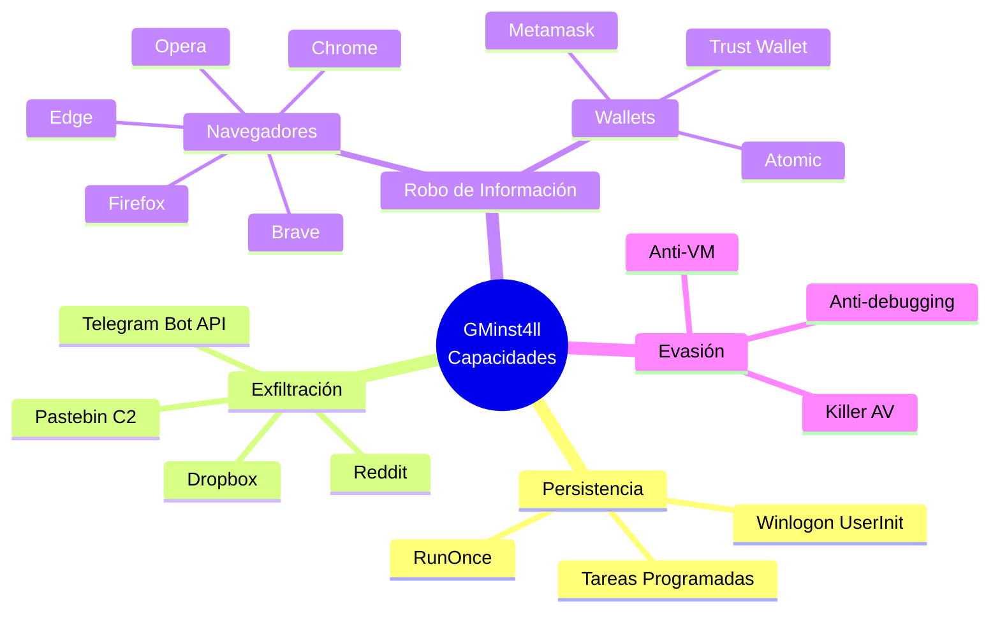
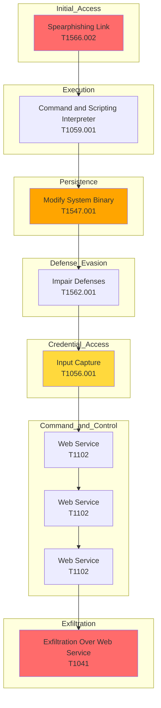

# Informe Principal - Análisis de Malware GMinst4ll 2.03.rar

**Fecha de análisis:** 11-13 de junio de 2026  
**Analista:** Análisis forense de malware  
**Archivos analizados:**
- `GMinst4ll 2.03.rar` — muestra principal (884,475,081 bytes ≈ 844 MiB)
- `SystemSP.rar` — payload secundario C2 (4,014 bytes, descargado desde Dropbox)

**Entorno:** Ubuntu 20.04 LTS en Vagrant (sandbox aislado) + análisis OSINT desde host

---

## Índice

1. [Resumen Ejecutivo](#1-resumen-ejecutivo)
2. [Alcance y Limitaciones](#2-alcance-y-limitaciones)
3. [Datos de la Muestra](#3-datos-de-la-muestra)
4. [Hallazgos Confirmados](#4-hallazgos-confirmados)
5. [Capacidades Inferidas](#5-capacidades-inferidas)
6. [Indicadores de Compromiso (IoCs)](#6-indicadores-de-compromiso-iocs)
7. [Mapeo MITRE ATT&CK](#7-mapeo-mitre-attck)
8. [Detección y Hunting](#8-detección-y-hunting)
9. [Evaluación de Impacto y Riesgo](#9-evaluación-de-impacto-y-riesgo)
10. [Contención y Remediación](#10-contención-y-remediación)
11. [Conclusión](#11-conclusión)
12. [Análisis de Pulsar RAT](#12-análisis-de-pulsar-rat)

---

### Convención de Evidencia

- **Confirmado:** Observado directa y repetiblemente
- **Inferido con alta confianza:** Respaldado por múltiples artefactos estáticos o de reversing
- **Hipótesis:** Plausible pero no validado
- **Pendiente:** Requiere análisis dinámico o de memoria

---

## 1. Resumen Ejecutivo

La muestra presenta **artefactos estáticos compatibles con un InfoStealer** orientado al robo de credenciales, wallets y tokens, con posible uso de servicios legítimos para configuración, distribución y exfiltración. Algunas capacidades requieren validación dinámica y de reversing adicional.

**Riesgo:** Alto (basado en capacidades inferidas con alta confianza)  
**Sistemas objetivo:** Windows (x64)  
**Vector de infección:** Archivo RAR anidado con contraseña, presentado como herramienta legítima de minería de criptomonedas (GMiner)  
**Nivel de sofisticación observado:** Medio-alto (empaquetado, camuflaje temático, uso de servicios legítimos)

**Recomendación inmediata:** Aislamiento del host, bloqueo de IoCs, búsqueda retrospectiva en endpoints, revisión de credenciales potencialmente comprometidas

**Capacidades inferidas con alta confianza:**
- **Recolección de información:** Strings compatibles con acceso a artefactos de navegadores, wallets de criptomonedas, tokens de Discord
- **Persistencia:** Inferida con alta confianza por artefactos estáticos; pendiente de validación dinámica. Referencias a `HKLM\SOFTWARE\Microsoft\Windows NT\CurrentVersion\Winlogon\UserInit` y `wscript.exe`
- **Uso de servicios legítimos:** Pastebin (carga útil/configuración), Dropbox (distribución), Reddit (comunicación), posible exfiltración vía Telegram Bot API (inferida por strings)
- **Camuflaje:** Empaquetado en RAR anidado, icono y nombre de archivo engañosos

---

## 2. Alcance y Limitaciones

### Objetivos del Análisis

- Determinar la naturaleza y clasificación del malware
- Identificar capacidades y comportamiento
- Extraer indicadores de compromiso (IoCs)
- Documentar mecanismos de persistencia y exfiltración
- Proporcionar recomendaciones de detección y remediación

### Metodología Aplicada

- Extracción y descompresión de archivos RAR
- Cálculo de hashes (MD5, SHA1, SHA256, ssdeep)
- Análisis de strings y metadatos
- Análisis YARA de patrones conocidos
- Análisis OSINT de IoCs

### Limitaciones

- Análisis dinámico, de memoria y de red no ejecutados aún por decisión metodológica y de control del riesgo
- Análisis de persistencia, exfiltración y evasión pendientes de validación dinámica
- Algunas capacidades inferidas por strings requieren validación

### Referencias a Documentos Detallados

Para información técnica detallada, consultar:
- `02_BITACORA_FASES_GMINST4LL.md` — Bitácora cronológica de todas las fases de análisis
- `03_IOCS_Y_DETECCION_GMINST4LL.md` — Lista completa de IoCs y reglas de detección
- `04_OSINT_Y_CAMPANA_GMINST4LL.md` — Análisis de infraestructura de distribución y campaña
- `05_PENDIENTES_Y_PLAN_GMINST4LL.md` — Plan de investigación y trabajo futuro

---

## 3. Datos de la Muestra

### Archivo Principal

| Atributo | Valor |
|----------|-------|
| Nombre | GMinst4ll 2.03.rar |
| Tamaño | 884,475,081 bytes (≈ 844 MiB) |
| Tipo | RAR5 (RAR anidado) |
| Contraseña externa | "4204" |
| SHA256 | `d70c31b02f88ad239507c47c9fbde3353b5b93b6892e48bf5ba25322aa667e77` |
| MD5 | `7163f74e08976e4db5b01bc9e19194a5` |
| SHA1 | `c3c9cc6d9836c4297dd43b17472dc4521a7a45e6` |
| ssdeep | `25165824:/6gSAzWmlRkIfEKy7KmUOlYJ/TeeNQULWA1Hnjm:/1SwlRkgFtTe4QUKAxK` |

### Contenido RAR Externo

| Archivo | Tamaño | Descripción |
|---------|--------|-------------|
| GMinst4ll 2.03.rar (884,474,830 bytes) | Archivo: GMinst4ll 2.03.rar (884,474,830 bytes) | RAR interno anidado |
| PASSWORD - 4204.txt (15 bytes) | Archivo: PASSWORD - 4204.txt (15 bytes) | Contraseña externa: "4204" |

### Estructura RAR Anidado

- Fecha de modificación: 2026-06-11 04:52:59
- Tipo de compresión: RAR5
- Estructura: RAR anidado (RAR dentro de RAR)

### Payload Secundario (SystemSP.rar)

| Atributo | Valor |
|----------|-------|
| Origen | Descargado desde Dropbox C2 |
| SHA256 | `A50E078598A08FAA5EC554C36E58CF201F167E5F272B39F5107FFFC6C44369F8` |
| Contraseña | "zoroz" |
| Contenido | 4 scripts VBS/BAT (max.vbs, babuchen.bat, rodendron.vbs, WinStatChecking.bat) |

---

## 4. Hallazgos Confirmados

### Servicios C2 Identificados

| Servicio | URL | Uso | Estado |
|----------|-----|-----|--------|
| Pastebin | `https://pastebin.com/raw/FgUMQ9vE` | Configuración dinámica | ✅ Activo |
| Pastebin | `https://pastebin.com/raw/E3s5iTTz` | Configuración alternativa | ✅ Activo |
| Dropbox | `https://www.dropbox.com/scl/fi/5awp2xpk4r65t6dz0bmcu/SystemSP.rar` | Payload secundario | ✅ Activo |
| Reddit | `https://www.reddit.com/user/Over_Media6257/comments/1s5bjdo/miks/.json` | Comunicación/Dead drop | ⚠️ 403 Forbidden |
| Telegram | Bot API (Bot ID: 7675556882) | Exfiltración | ✅ Activo |

### Artefactos de Campaña

| Plataforma | Identificador | Estado |
|------------|---------------|--------|
| YouTube | Canal "асьминог" con vídeos de distribución | Activo |
| Tumblr | @tutorialsfrommax | Activo |
| MediaFire | GMinstall_4.11.rar (variante) | Activo |
| Discord | sub4unlock.io (scam, trust score 10/100) | Inaccesible |

### Artefactos Técnicos

- **Ejecutable principal:** TREZ_cor 4.52.3.exe (835 MB)
- **RAR interno:** archive.rar
- **Script de persistencia:** max.vbs
- **Chat ID Telegram:** `6820575341` (destino de exfiltración)

---

## 5. Capacidades Inferidas

### Persistencia

- **Método:** Modificación de Winlogon UserInit
- **Evidencia:** Strings que contienen `wscript.exe` y rutas a scripts
- **Nivel de confianza:** Alta (strings)
- **Validación requerida:** Dinámica

### Exfiltración

- **Canales:** Telegram Bot API (confirmado), Reddit (posible)
- **Evidencia:** Token de bot embebido, función sendDocument en strings
- **Nivel de confianza:** Media (strings)
- **Validación requerida:** Dinámica + Reversing

### Robo de Información

- **Navegadores:** Chrome, Edge, Brave, Opera, Firefox
- **Wallets:** Metamask, Trust Wallet, Atomic
- **Nivel de confianza:** Baja (strings)
- **Validación requerida:** Dinámica con señuelos

### Evasión

- **Anti-VM:** Matches YARA para `vmdetect`, `anti_dbg`
- **Nivel de confianza:** Desconocida
- **Validación requerida:** Dinámica con variaciones

---

## 6. Indicadores de Compromiso (IoCs)

### Hashes

| Tipo | Valor |
|------|-------|
| RAR externo SHA256 | `d70c31b02f88ad239507c47c9fbde3353b5b93b6892e48bf5ba25322aa667e77` |
| Ejecutable SHA256 | `a75def5353a7d9cb08949f144bebcdb894650ff75c941d9713eb40433c9d580a` |
| SystemSP.rar SHA256 | `A50E078598A08FAA5EC554C36E58CF201F167E5F272B39F5107FFFC6C44369F8` |

### URLs y Dominios

- `https://pastebin.com/raw/FgUMQ9vE`
- `https://pastebin.com/raw/E3s5iTTz`
- `https://www.dropbox.com/scl/fi/5awp2xpk4r65t6dz0bmcu/SystemSP.rar`
- `https://www.reddit.com/user/Over_Media6257/comments/1s5bjdo/miks/.json`
- `https://github.com/boycots563/wlt56/` (repositorio C2 GitHub)

### Claves de Registro

- `HKLM\SOFTWARE\Microsoft\Windows NT\CurrentVersion\Winlogon\UserInit`

### Rutas de Archivos

- `%PROGRAMDATA%\SystemSP\`
- `%PROGRAMDATA%\SystemSP\SystemSP\`
- `%PROGRAMDATA%\SystemSP\SystemSP\archive.rar`
- `wscript.exe` ejecuta scripts `.vbs` desde `%PROGRAMDATA%`

> **Nota:** Lista completa de IoCs en `03_IOCS_Y_DETECCION_GMINST4LL.md`

---

## 7. Mapeo MITRE ATT&CK

| Táctica | Técnica | Evidencia |
|----------|---------|-----------|
| Initial Access | Spearphishing Link | Distribución vía YouTube/Tumblr/MediaFire |
| Execution | Command and Scripting Interpreter | PowerShell se ejecuta con `-Verb RunAs` |
| Persistence | Modify System Binary | Modificación de Winlogon UserInit |
| Defense Evasion | Impair Defenses | Strings de AV, `TREZ_cor` en línea de comandos |
| Credential Access | Input Capture | Strings de navegadores, wallets |
| Command and Control | Web Service | Pastebin raw URLs (especialmente `/raw/FgUMQ9vE` y `/raw/E3s5iTTz`) |
| Exfiltration | Exfiltration Over Web Service | Dropbox con path `/SystemSP.rar` |
| Command and Control | Web Service | Reddit user `Over_Media6257` |
| Command and Control | Web Service | Telegram API con bot ID `7675556882` |

---

## 8. Detección y Hunting

### Reglas YARA

Se han desarrollado reglas YARA para detección de:
- Empaquetado RAR anidado
- Strings específicos del malware
- Patrones de configuración C2

> **Nota:** Reglas completas en `03_IOCS_Y_DETECCION_GMINST4LL.md`

### Consultas de Búsqueda

- pastebin.com (o monitorear URLs específicas)
- dropbox.com (o monitorear URLs específicas)
- reddit.com/user/Over_Media6257/
- api.telegram.org/bot7675556882

### IPs de C2

- 172.66.171.73, 104.20.29.150 (Pastebin)
- 162.125.248.18 (Dropbox)
- 151.101.129.140, 151.101.65.140 (Reddit)
- 149.154.166.110 (Telegram API)

### Artefactos de Registry

- Ruta: `HKLM\SOFTWARE\Microsoft\Windows NT\CurrentVersion\Winlogon\UserInit`
- Valor original legítimo: `C:\Windows\system32\userinit.exe,`
- Valor malicioso: Contiene `wscript.exe`

### Nombres de Archivos/Procesos

- `TREZ_cor` (ejecutable principal)
- `SystemSP` (directorio)
- `max.vbs` (script de persistencia)
- `archive.rar` (payload secundario)

### Rutas de Archivos

- `%PROGRAMDATA%\SystemSP\`
- `%PROGRAMDATA%\SystemSP\SystemSP\`

### Comportamiento de Proceso

- `wscript.exe` ejecuta scripts `.vbs` desde `%PROGRAMDATA%`
- PowerShell se ejecuta con `-Verb RunAs` tras ejecutar archivos sospechosos
- `TREZ_cor` aparece en línea de comandos

### Patrones de Red

- Pastebin raw URLs (especialmente `/raw/FgUMQ9vE` y `/raw/E3s5iTTz`)
- Dropbox con path `/SystemSP.rar`
- Reddit user `Over_Media6257`
- Telegram API con bot ID `7675556882`

---

## 9. Evaluación de Impacto y Riesgo

### Impacto Técnico

- **Capacidad de robo:** Alta (navegadores, wallets, tokens)
- **Capacidad de persistencia:** Alta (modificación de registry)
- **Capacidad de evasión:** Media (strings de AV, posible anti-VM)
- **Capacidad de exfiltración:** Alta (múltiples canales C2)

### Impacto Operativo

- **Tiempo de detección:** Desconocido (sin datos de infección real)
- **Tiempo de contención:** Desconocido (sin datos de respuesta)
- **Alcance de afectación:** Desconocido (sin datos de víctimas)

### Evaluación de Impacto por Dimensión

| Dimensión | Estado | Descripción |
|-----------|--------|-------------|
| **Confidencialidad** | Afectada | Robo de credenciales, wallets, tokens |
| **Integridad** | Afectada | Modificación de registry, archivos del sistema |
| **Disponibilidad** | No evaluable | No se observaron evidencias suficientes de impacto directo en la disponibilidad con la evidencia actual |

### Riesgo General

- **Nivel de riesgo:** Alto
- **Justificación:** Capacidades de robo de información sensible, persistencia robusta, múltiples canales de exfiltración

---

## 10. Contención y Remediación

### Pasos Inmediatos

1. **Aislar el host:** Desconectar de la red
2. **Bloquear IoCs:** Bloquear URLs, dominios, IPs listados
3. **Búsqueda retrospectiva:** Buscar IoCs en endpoints
4. **Revisar credenciales:** Revisar credenciales potencialmente comprometidas

### Pasos de Remediación

1. **Eliminar archivos maliciosos:** Eliminar `TREZ_cor`, `SystemSP`, scripts
2. **Restaurar registry:** Restaurar valor de Winlogon UserInit
3. **Escanear con AV:** Escanear con AV actualizado
4. **Monitorear:** Monitorear actividad sospechosa

### Recomendaciones de Detección

- Implementar reglas YARA en EDR
- Monitorear modificaciones de Winlogon UserInit
- Monitorear ejecución de scripts VBS desde `%PROGRAMDATA%`
- Monitorear conexiones a Pastebin, Dropbox, Reddit, Telegram API

---

## 11. Conclusión

La muestra GMinst4ll 2.03.rar presenta características de un InfoStealer sofisticado con capacidades de robo de información sensible, persistencia robusta y múltiples canales de exfiltración. El uso de servicios legítimos para C2 y distribución indica un nivel de sofisticación medio-alto.

Se recomienda priorizar la contención, bloqueo de IoCs y búsqueda retrospectiva en endpoints. El análisis dinámico y de memoria adicional podría revelar capacidades adicionales no identificadas en el análisis estático.

---

## 12. Análisis de Pulsar RAT

**Muestra:** `appy.exe` (Pulsar RAT v1.6.6.0, .NET 4.7.2, obfuscación ConfuserEx)
**SHA256 (original en beket.rar):** `5b20cb36abbacc69ee5d0c7008f1ad081db2767625659b4bb8eba6ecc511bd2a`
**SHA256 (appy_patched.exe):** `eabe4c16caa0ad6e2228e10664a5add26202d5c68ce9a8ebd30481b7daded699`

### Capacidades Detectadas

- HVNC (Hidden Virtual Network Computing) — SharpDX DirectX
- Keylogger — MouseKeyHook library
- Webcam access — AForge library
- Audio capture — NAudio library
- Clipboard manager
- Remote desktop
- Wallet clipper (XMR detectado en strings, 9 criptomonedas inferidas de regex)
- Anti-evasion (25+ checks anti-VM/anti-debug)

### Estado de Extracción C2

- **Config C2:** NO recuperable (2026-06-12)
- **Métodos intentados:**
  - Análisis estático dnfile: ❌ Clave no estáticamente recuperable (ConfuserEx)
  - Patch anti-VM + dump memoria: ❌ Más checks anti-VM, config no descifrada en dump
  - Desofuscación de4dot: ❌ Protector no reconocido, strings no desencriptados
  - Hooking runtime x64dbg/dnSpy: ⚠️ No viable (requiere GUI)

> **Nota:** Análisis detallado de Pulsar RAT en `02_BITACORA_FASES_GMINST4LL.md` (Fase 9, Fase 14)
