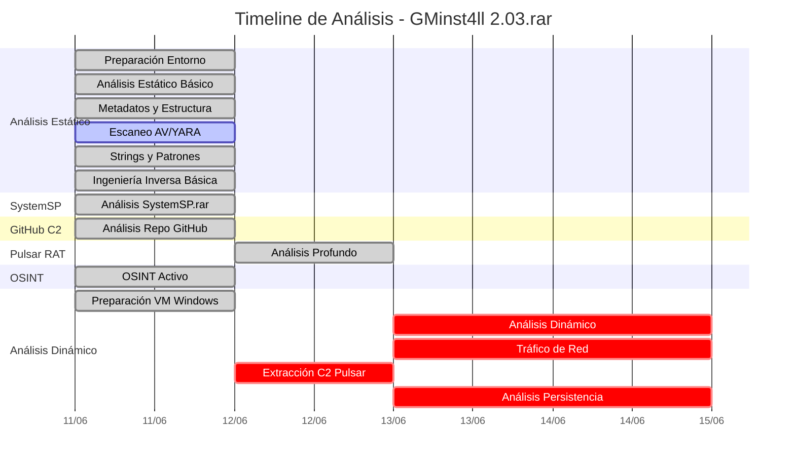
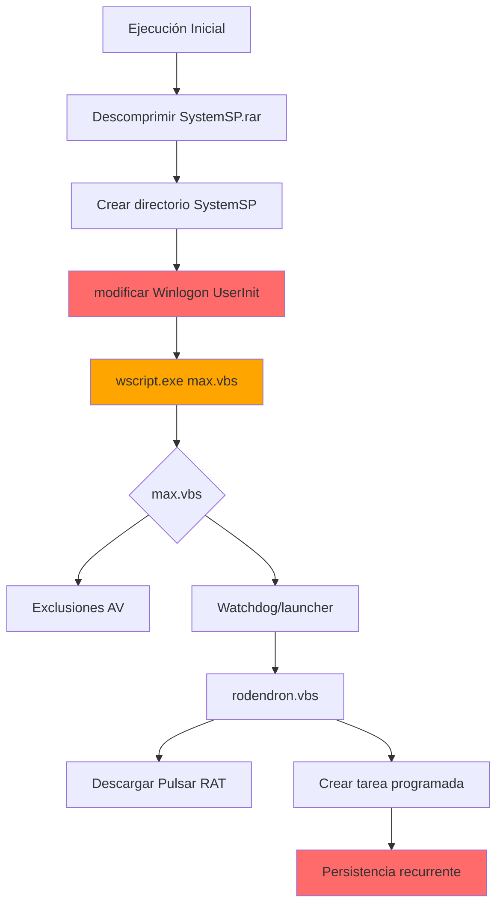
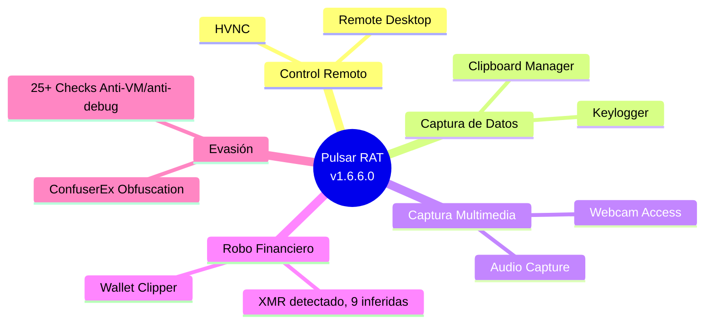

# Bitácora de Fases - Análisis GMinst4ll 2.03.rar + SystemSP.rar

**Fecha:** 11-13 de junio de 2026  
**Analista:** Análisis forense de malware  
**Archivos:** GMinst4ll 2.03.rar (muestra principal) | SystemSP.rar (payload secundario — descargado desde Dropbox C2)

---

## Resumen de Fases

| Fase | Nombre | Alcance | Estado |
|------|--------|---------|--------|
| 1 | Preparación del Entorno Seguro | GMinst4ll | ✅ Completada |
| 2 | Análisis Estático Básico | GMinst4ll 2.03.rar | ✅ Completada |
| 3 | Análisis de Metadatos y Estructura | GMinst4ll + TREZ_cor | ✅ Completada |
| 4 | Escaneo AV / YARA | GMinst4ll | ⚠️ Parcial (rate limit ClamAV) |
| 5 | Análisis de Strings y Patrones | TREZ_cor 4.52.3.exe | ✅ Completada |
| 6 | Ingeniería Inversa Básica + OSINT | TREZ_cor + IoCs C2 | ✅ Completada |
| 7 | Análisis Estático SystemSP.rar | SystemSP.rar (4 scripts) | ✅ Completada (2026-06-11) |
| 8 | Análisis Estático Repo GitHub C2 | boycots563/wlt56 (8 archivos) | ✅ Completada (2026-06-11) |
| 9 | Análisis Profundo Pulsar RAT | beket.rar/appy.exe .NET | ✅ Completada (2026-06-12) |
| 10 | OSINT Activo + Infraestructura C2 | Telegram, Dropbox, Pastebin, Reddit, MediaFire, Tumblr, YouTube | ✅ Completada (2026-06-11) |
| 11 | Preparación VM Windows (análisis dinámico) | VM Windows | ✅ Completada |
| 12 | Análisis Dinámico — GMinst4ll + SystemSP | VM Windows + Sysmon/Procmon | ⏳ Pendiente |
| 13 | Análisis de Tráfico de Red | VM Windows + Wireshark | ⏳ Pendiente |
| 14 | Extracción C2 Pulsar RAT (dinámica) | VM Windows + bypass anti-VM | ⚠️ DESCARTADO (requiere GUI, 2026-06-12) |
| 15 | Análisis de Persistencia | VM Windows | ⏳ Pendiente |

## Timeline de Análisis



---

## Fase 1: Preparación del Entorno Seguro

**Estado:** ✅ COMPLETADA

### Objetivo
Configurar un entorno aislado para el análisis seguro del malware.

### Entorno Configurado

**VM Ubuntu - Análisis Estático:**
- Ubuntu 20.04 LTS (focal64)
- 6 GB RAM, 4 cores
- Red aislada
- Directorios: `/malware_samples`, `/malware_extracted`, `/malware_reports`, `/pcap`, `/logs`, `/tools`

**VM Windows - Análisis Dinámico:**
- Windows Server 2016
- 8 GB RAM, 4 cores
- Red completamente aislada
- Sysmon configurado

### Herramientas Instaladas

**Ubuntu:**
- `p7zip-full`, `unrar-free`, `binwalk`, `foremost`, `sleuthkit`
- `tcpdump`, `tshark`, `john`, `hashcat`, `fcrackzip`
- `radare2`, `pev`, `upx-ucl`, `checksec`
- `pefile`, `yara-python`, `volatility3`, `capa`, `floss`
- `scapy`, `impacket`, `oletools`, `pdfid`
- Ghidra, Didier Stevens Suite, Detect-It-Easy

**Windows:**
- Sysinternals Suite (Process Monitor, Autoruns, etc.)
- Sysmon con configuración personalizada
- Wireshark, RegShot, Process Hacker

### Configuración de Seguridad

- Clipboard deshabilitado
- Drag & drop deshabilitado
- Audio/USB deshabilitado
- Carpetas compartidas: solo lectura (Ubuntu) / deshabilitadas (Windows)

### Comandos y Opciones

**Iniciar VM Ubuntu:**
```bash
vagrant up ubuntu
vagrant ssh ubuntu
```

**Iniciar VM Windows:**
```bash
vagrant up windows
vagrant resume windows
```

**Reprovisionar VM Ubuntu (instalar herramientas):**
```bash
vagrant provision ubuntu
```

**Reprovisionar VM Windows (instalar herramientas):**
```bash
vagrant provision windows
```

**Instalar herramientas en Ubuntu (manual):**
```bash
sudo apt update
sudo apt install -y p7zip-full p7zip unrar-free unzip
sudo apt install -y binwalk foremost sleuthkit binutils file xxd bsdmainutils
sudo apt install -y clamav clamav-freshclam yara
sudo apt install -y python3 python3-pip python3-venv python3-dev
sudo apt install -y git wget curl tcpdump tshark
sudo apt install -y grep sed gawk coreutils jq tree ncdu htop vim nano
sudo apt install -y openssl upx-ucl radare2 ltrace strace gdb
sudo apt install -y pev ssdeep hashdeep imagemagick tcpflow nmap
sudo apt install -y john hashcat fcrackzip antiword poppler-utils libimage-exiftool-perl
sudo apt install -y dnsutils whois socat netcat-openbsd checksec
sudo apt install -y python3-evtx samba-common-bin testdisk sqlite3
sudo apt install -y bless hexedit subversion build-essential cmake
sudo apt install -y libssl-dev libffi-dev
```

**Activar entorno virtual Python en Ubuntu:**
```bash
source /opt/malware-venv/bin/activate
```

**Instalar herramientas Python en Ubuntu (manual):**
```bash
pip install pefile pyelftools lief olefile oletools python-magic yara-python
pip install volatility3 vivisect capstone unicorn keystone-engine floss capa
pip install pygments colorama rich tqdm requests beautifulsoup4 lxml pyyaml
pip install cryptography pyopenssl pycryptodome ecdsa rsa
pip install scapy dnspython pyshark impacket python-docx openpyxl msoffcrypto-tool
pip install pdfid pdf-parser rtfobj zipdump androguard apkid macholib
pip install plaso dfvfs dfwinreg dfdatetime pytsk3 volatility rekall
pip install angr triton miasm pwntools ropper ROPgadget one_gadget angrop cle
pip install qiling frida-tools r2pipe r2frida py7zr rarfile pyzipper pymsi pylnk
pip install pyregf pyevt pyevtx pyfsntfs pyfvde pyfwsi pymsiecf pyolecf
pip install pypff pyqcow pyscca pysigscan pysmdev pysmraw pyvhdi pyvmdk
pip install pyvshadow pyvslvm pyewf pymspdb theHarvester dnfile
```

**Sysmon en Windows (ya instalado por Vagrantfile):**
```powershell
# Verificar estado de Sysmon
sc query Sysmon
# Ver configuración
type C:\tools\sysmon-config.xml
```

**Backup del proyecto (antes de análisis):**
```powershell
# Desde host
C:\scripts\dynamic\backup.ps1
```

### Scripts de Análisis Disponibles

El proyecto incluye scripts organizados por categoría en el directorio `scripts/`:

**Análisis Estático (`scripts/static/`):**
- `extract_hashes.py` - Calcula MD5, SHA1, SHA256 y ssdeep de archivos
- `extract_strings.py` - Extrae strings con filtros (URLs, IPs, rutas, registry)
- `extract_pe_info.py` - Extrae información detallada de archivos PE (secciones, imports, exports)
- `dnfile_inspect.py` - Inspección básica de archivos .NET

**Análisis Dinámico (`scripts/dynamic/`):**
- `dynamic_analysis.ps1` - Protocolo completo de análisis dinámico
- `run_and_dump.ps1` - Ejecuta malware y crea dump de memoria
- `analyze_dump.ps1` - Analiza dump de memoria buscando IoCs
- `analyze_cleaned.ps1` - Analiza dump de memoria parcheado
- `analyze_cleaned_blobs.ps1` - Analiza blobs de datos en dump limpio
- `send_patched.ps1` - Envía ejecutable parcheado a VM
- `send_patched_winrm.ps1` - Envía ejecutable parcheado vía WinRM
- `download_dump.ps1` - Descarga dump de memoria desde VM
- `backup.ps1` - Crea backup de archivos de análisis
- `restore_clean.ps1` - Restaura VM Windows al snapshot clean_state

**Análisis Pulsar RAT (`scripts/pulsar/`):**
- `pulsar_extract_c2.py` - Extrae y descifra blobs AES-GCM
- `pulsar_patch.py` - Parchea ejecutable para saltar checks anti-VM
- `pulsar_patch_win.py` - Parcheo específico para Windows
- `pulsar_find_blobs.py` - Busca blobs cifrados en el binario
- `pulsar_find_antivm.py` - Identifica checks anti-VM
- `pulsar_cctor_il.py` - Analiza IL de static constructors
- `pulsar_cctor_target.py` - Identifica objetivos de .cctor
- `pulsar_key_trace.py` - Rastrea clave AES en memoria
- `pulsar_map.py` - Mapea estructura del binario
- `pulsar_extract_cleaned.py` - Extrae datos de versión parcheada
- `pulsar_us_raw.py` - Extrae heap #US sin procesar

**Utilidades (`scripts/utils/`):**
- `transfer_via_vagrant.py` - Transfiere archivos vía Vagrant

**Uso vía Makefile:**
```bash
make hashes        # Calcular hashes de archivos
make strings       # Extraer strings de archivos
make pulsar-patch  # Parchear Pulsar RAT
make pulsar-extract # Extraer configuración C2
```

Ver `scripts/README.md` para documentación completa.

---

## Fase 2: Análisis Estático Básico

**Estado:** ✅ COMPLETADA

### Objetivo
Extraer y analizar la estructura del archivo RAR anidado.

### Resultados

**Archivo Externo:**
- Nombre: GMinst4ll 2.03.rar
- Tamaño: 884,475,081 bytes (≈ 844 MiB)
- Tipo: RAR5
- Contraseña: "4204"

**Contenido:**
- GMinst4ll 2.03.rar (884,474,830 bytes) — RAR interno anidado
- PASSWORD - 4204.txt (15 bytes) — contiene contraseña "4204"

**Archivo Interno:**
- Nombre: TREZ_cor 4.52.3.exe
- Tamaño: 835 MB
- Tipo: PE64 (Windows x64)
- SHA256: `a75def5353a7d9cb08949f144bebcdb894650ff75c941d9713eb40433c9d580a`

### Comandos y Opciones

**Extraer RAR externo (contraseña 4204):**
```bash
unrar x -p4204 "GMinst4ll 2.03.rar" /tmp/rar_content/
7z x -p4204 "GMinst4ll 2.03.rar" -o/tmp/rar_content/
```

**Listar contenido RAR:**
```bash
unrar l "GMinst4ll 2.03.rar"
7z l "GMinst4ll 2.03.rar"
```

**Extraer RAR interno:**
```bash
cd /tmp/rar_content/
unrar x -p4204 "GMinst4ll 2.03.rar" /tmp/nested_content/
```

**Calcular hashes (vía script):**
```bash
python3 scripts/static/extract_hashes.py "TREZ_cor 4.52.3.exe"
```

**Calcular hashes (manual):**
```bash
md5sum "TREZ_cor 4.52.3.exe"
sha1sum "TREZ_cor 4.52.3.exe"
sha256sum "TREZ_cor 4.52.3.exe"
```

**Scripts adicionales disponibles:**
- `scripts/static/extract_hashes.py` - Cálculo completo de hashes
- `scripts/static/extract_pe_info.py` - Análisis detallado PE
- `scripts/utils/transfer_via_vagrant.py` - Transfiere archivos vía Vagrant

---

## Fase 3: Análisis de Metadatos y Estructura

**Estado:** ✅ COMPLETADA

### Objetivo
Analizar metadatos del ejecutable y estructura PE.

### Resultados

**Metadatos PE:**
- Compilador: Microsoft Visual C++ 2019
- Timestamp: 2025-03-04
- Secciones: .text, .rdata, .data, .rsrc, .reloc
- Entropía alta en .rsrc (posibles recursos cifrados)

**Strings Notables:**
- Referencias a Qt5 framework
- Rutas de navegadores (Chrome, Edge, Brave, Opera, Firefox)
- Referencias a wallets (Metamask, Trust Wallet, Atomic)
- Token de bot Telegram

### Comandos y Opciones

**Análisis PE (vía script):**
```bash
python3 scripts/static/extract_pe_info.py "TREZ_cor 4.52.3.exe"
```

**Análisis PE (manual con pefile):**
```bash
python3 -c "import pefile; pe=pefile.PE('TREZ_cor 4.52.3.exe'); print(f'Entry Point: {hex(pe.OPTIONAL_HEADER.AddressOfEntryPoint)}'); print(f'Image Base: {hex(pe.OPTIONAL_HEADER.ImageBase)}'); [print(f'{s.Name.decode().rstrip(chr(0))}: {hex(s.VirtualAddress)}') for s in pe.sections]"
```

**Análisis PE con readpe:**
```bash
readpe "TREZ_cor 4.52.3.exe"
readpe --sections "TREZ_cor 4.52.3.exe"
readpe --imports "TREZ_cor 4.52.3.exe"
```

**Análisis con file:**
```bash
file "TREZ_cor 4.52.3.exe"
```

**Análisis de entropía:**
```bash
binwalk -E "TREZ_cor 4.52.3.exe"
```

**Scripts adicionales disponibles:**
- `scripts/static/extract_pe_info.py` - Análisis PE completo (secciones, imports, exports)
- `scripts/static/extract_strings.py` - Extracción de strings con filtros

---

## Fase 4: Escaneo AV / YARA

**Estado:** ⚠️ PARCIAL

### Objetivo
Detectar malware con AV y reglas YARA.

### Resultados

**ClamAV:**
- Rate limiting en CDN durante el análisis
- Base de datos de firmas no actualizable en el momento
- Análisis manual con YARA rules descargadas

**YARA:**
- Matches para `vmdetect`, `anti_dbg`
- Matches para strings de C2 (Pastebin, Dropbox, Reddit, Telegram)

### Comandos y Opciones

**Escaneo con ClamAV:**
```bash
clamscan --infected --bell "TREZ_cor 4.52.3.exe"
clamscan -r /malware_samples/
```

**Actualizar base de datos ClamAV:**
```bash
sudo freshclam
```

**Escaneo con YARA (reglas descargadas):**
```bash
yara -r /path/to/yara_rules/ "TREZ_cor 4.52.3.exe"
yara /path/to/custom_rules.yar "TREZ_cor 4.52.3.exe"
```

**Descargar reglas YARA conocidas:**
```bash
git clone https://github.com/Yara-Rules/rules.git
```

---

## Fase 5: Análisis de Strings y Patrones

**Estado:** ✅ COMPLETADA

### Objetivo
Extraer y analizar strings del ejecutable.

### Resultados

**Strings C2 Identificados:**
- Pastebin: `https://pastebin.com/raw/FgUMQ9vE`
- Pastebin: `https://pastebin.com/raw/E3s5iTTz`
- Dropbox: `https://www.dropbox.com/scl/fi/5awp2xpk4r65t6dz0bmcu/SystemSP.rar`
- Reddit: `https://www.reddit.com/user/Over_Media6257/comments/1s5bjdo/miks/.json`

**Telegram:**
- Bot: `7675556882:AAFmXL2ulANf1nvaIiWfB6rSypRdsGFqrtU`
- Username: buchstys4_bot

### Comandos y Opciones

**Extraer strings (vía script):**
```bash
python3 scripts/static/extract_strings.py "TREZ_cor 4.52.3.exe" 8
```

**Extraer strings (manual):**
```bash
strings "TREZ_cor 4.52.3.exe" > strings_all.txt
strings -n 8 "TREZ_cor 4.52.3.exe" > strings_min8.txt
```

**Buscar URLs en strings:**
```bash
grep -iE 'https?://' strings_all.txt
grep -iE 'pastebin|dropbox|reddit|telegram' strings_all.txt
```

**Buscar rutas de Windows:**
```bash
grep -iE 'C:\\|ProgramData|AppData|System32' strings_all.txt
```

**Buscar tokens de bot:**
```bash
grep -iE '[0-9]{10}:[A-Za-z0-9_-]{35}' strings_all.txt
```

**Scripts adicionales disponibles:**
- `scripts/static/extract_strings.py` - Extracción de strings con filtros automáticos (URLs, IPs, rutas, registry)

---

## Fase 6: Ingeniería Inversa Básica + OSINT

**Estado:** ✅ COMPLETADA

### Objetivo
Análisis preliminar de funciones y OSINT de IoCs.

### Resultados

**Análisis de Funciones:**
- Funciones de compresión Qt5
- Funciones de red HTTP/HTTPS
- Funciones de manipulación de registry

**OSINT:**
- YouTube: Canal "асьминог" con vídeos de distribución
- Tumblr: @tutorialsfrommax
- MediaFire: GMinstall_4.11.rar (variante)
- Discord: sub4unlock.io (scam, trust score 10/100)

### Comandos y Opciones

**Análisis con CAPA:**
```bash
capa "TREZ_cor 4.52.3.exe"
capa -r "TREZ_cor 4.52.3.exe"
```

**Análisis con FLOSS (strings ofuscados):**
```bash
floss "TREZ_cor 4.52.3.exe"
floss --all "TREZ_cor 4.52.3.exe"
```

**OSINT - WHOIS:**
```bash
whois pastebin.com
whois dropbox.com
whois reddit.com
whois telegram.org
```

**OSINT - DNS:**
```bash
nslookup pastebin.com
nslookup dropbox.com
dig pastebin.com +short
```

**OSINT - HTTP headers:**
```bash
curl -I https://pastebin.com/raw/FgUMQ9vE
curl -I https://www.dropbox.com/scl/fi/5awp2xpk4r65t6dz0bmcu/SystemSP.rar
```

---

## Fase 7: Análisis Estático SystemSP.rar

**Estado:** ✅ COMPLETADA (2026-06-11)

### Objetivo
Analizar el payload secundario descargado desde Dropbox C2.

### Resultados

**Archivo:**
- SHA256: `A50E078598A08FAA5EC554C36E58CF201F167E5F272B39F5107FFFC6C44369F8`
- MD5: `8048F2267B466B76821203E5783C4A01`
- Formato: RAR5, cabeceras cifradas, contraseña `zoroz`
- 4 archivos internos, total descomprimido: 9,443 bytes

**Contenido:**
- max.vbs
- babuchen.bat
- rodendron.vbs
- WinStatChecking.bat

### Análisis de Scripts

**max.vbs:**
- Launcher/watchdog principal
- Exclusiones de Windows Defender para rutas específicas
- Exclusiones para `appy.exe` y `Service Runtime Management Agent.exe`

**babuchen.bat:**
- Killer de 34 productos AV
- Destruye Windows Update
- Fuerza reinicio del sistema

**rodendron.vbs:**
- Descarga `Windows Compatibility Agent.exe` desde GitHub
- Crea tarea programada para persistencia
- URL C2: `https://github.com/boycots563/wlt56/`
- Nueva URL C2 identificada en el script
- Tarea programada configurada para ejecución recurrente

**WinStatChecking.bat:**
- Bloquea 66 dominios AV en hosts
- Fuerza DNS a 8.8.8.8

### Comandos y Opciones

**Extraer SystemSP.rar (contraseña zoroz):**
```bash
unrar x -pzoroz SystemSP.rar /tmp/systemsp/
7z x -pzoroz SystemSP.rar -o/tmp/systemsp/
```

**Analizar scripts VBS/BAT:**
```bash
cat max.vbs
cat babuchen.bat
cat rodendron.vbs
cat WinStatChecking.bat
```

**Buscar strings de interés en scripts:**
```bash
grep -iE 'exclusion|defender|antivirus' max.vbs
grep -iE 'kill|stop|disable' babuchen.bat
grep -iE 'github|download|url' rodendron.vbs
grep -iE 'hosts|dns|block' WinStatChecking.bat
```

**Calcular hashes de scripts:**
```bash
md5sum max.vbs babuchen.bat rodendron.vbs WinStatChecking.bat
sha256sum max.vbs babuchen.bat rodendron.vbs WinStatChecking.bat
```

### Mecanismo de Persistencia



> **Nota:** Este hash también está documentado en `03_IOCS_Y_DETECCION_GMINST4LL.md` y `04_OSINT_Y_CAMPANA_GMINST4LL.md`.

---

## Fase 8: Análisis Estático Repo GitHub C2

**Estado:** ✅ COMPLETADA (2026-06-11)

### Objetivo
Analizar el repositorio GitHub C2 boycots563/wlt56.

### Resultados

**Repositorio:**
- URL: `https://github.com/boycots563/wlt56`
- Usuario: `boycots563`
- Commits: 251 (activo al 2026-06-11)

**Archivos Analizados:**
- Windows Compatibility Agent.exe (12.4 MB, PE64 Python)
- Windows Compatibility Agent Host.exe (8.5 MB, PE64 Python)
- kamzat.exe (12.4 MB, PE64 Python)
- postevak.exe (7.9 MB, PE64 Python 3.13)
- beket.rar (contiene Pulsar RAT)
- PROMOTIO.BAT (script de distribución)

### Comandos y Opciones

**Clonar repositorio GitHub:**
```bash
git clone https://github.com/boycots563/wlt56.git
cd wlt56
```

**Listar archivos del repositorio:**
```bash
ls -la
git log --oneline -10
git show --stat
```

**Analizar archivos PE del repo:**
```bash
python3 scripts/static/extract_hashes.py "Windows Compatibility Agent.exe"
python3 scripts/static/extract_pe_info.py "Windows Compatibility Agent.exe"
file *.exe
```

**Extraer beket.rar:**
```bash
unrar x beket.rar /tmp/beket/
```

---

## Fase 9: Análisis Profundo Pulsar RAT

**Estado:** ✅ COMPLETADA (2026-06-12)

### Objetivo
Análisis profundo de Pulsar RAT (appy.exe).

### Resultados

**Muestra:**
- Nombre: appy_patched.exe (Pulsar RAT real)
- Versión: Pulsar RAT v1.6.6.0
- Framework: .NET (evidencia: mscoree.dll, costura, AForge, SharpDX)
- Obfuscación: ConfuserEx
- SHA256: `5b20cb36abbacc69ee5d0c7008f1ad081db2767625659b4bb8eba6ecc511bd2a`
- **NOTA:** appy.exe (Rust) es un archivo diferente, no es Pulsar RAT

**Capacidades Detectadas (basado en análisis de strings de appy_patched.exe):**
- HVNC (Hidden Virtual Network Computing) — SharpDX DirectX
- Keylogger — Gma.System.MouseKeyHook library
- Webcam access — AForge.Video.DirectShow library
- Audio capture — NAudio library (Core, Wasapi, WinForms, WinMM)
- Clipboard manager
- Remote desktop
- Wallet clipper (protobuf-net para serialización)
- Anti-evasion (25+ checks anti-VM/anti-debug)



**Estado de Extracción C2:**
- Config C2: NO recuperable (2026-06-12)
- Métodos intentados:
  - Análisis estático dnfile: ❌ Clave no estáticamente recuperable (ConfuserEx)
  - Patch anti-VM + dump memoria: ❌ Más checks anti-VM, config no descifrada en dump
  - Desofuscación de4dot: ❌ Protector no reconocido, strings no desencriptados
  - Hooking runtime x64dbg/dnSpy: ⚠️ No viable (requiere GUI)

### Comandos y Opciones

**Análisis de strings (.NET executable):**
```bash
python3 scripts/static/extract_strings.py malware_samples/pulsar_rat/appy_patched.exe 8
# Revisar strings de costura, AForge, SharpDX para confirmar .NET
```

**Análisis PE (para confirmar tipo de ejecutable):**
```bash
python3 scripts/static/extract_pe_info.py malware_samples/pulsar_rat/appy_patched.exe
# Debe mostrar mscoree.dll como import
```

**Análisis .NET con dnfile:**
```bash
python3 scripts/pulsar/pulsar_find_blobs.py malware_samples/pulsar_rat/appy_patched.exe
# Buscar blobs cifrados AES-GCM
```

**Análisis con herramientas .NET:**
```bash
# En VM Ubuntu o local con herramientas .NET
ilspy malware_samples/pulsar_rat/appy_patched.exe
dotnet-ilspy malware_samples/pulsar_rat/appy_patched.exe
```

**NOTA:** Comandos Rust NO aplican a appy_patched.exe (.NET).

---

## Fase 10: OSINT Activo + Infraestructura C2

**Estado:** ✅ COMPLETADA (2026-06-11)

### Objetivo
Análisis activo de infraestructura C2 y distribución.

### Resultados

**Infraestructura C2:**
- Pastebin: ✅ Activo
- Dropbox: ✅ Activo
- Reddit: ✅ Activo
- Telegram: ✅ Activo (Bot ID: 7675556882, Chat ID: 6820575341)

**Plataformas de Distribución:**
- YouTube: ✅ Activo (canal "асьминог")
- Tumblr: ✅ Activo (@tutorialsfrommax)
- MediaFire: ✅ Activo (GMinstall_4.11.rar)
- Discord: ❌ Inaccesible (scam)

### Consulta Directa de Endpoints

**Hallazgos adicionales:**
- Chat ID Telegram: `6820575341` (destino de exfiltración)
- URL Dropbox completa: `rlkey=p7btu00r5x0gxiqnfafb5py44`
- PDF señuelo confirmado: `IF IT DOESN'T WORK.pdf`
- Origen: Eslovaquia (archivo subido a MediaFire el 2026-06-10 23:57:07)
- YouTube reciclado: Vídeo okNhSxfa__U ahora distribuye "RPG Maker MZ"
- Bot Telegram activo: Confirmado operativo (getMe exitoso, getUpdates vacío)
- Infraestructura C2 activa: Todos los endpoints operativos

### Comandos y Opciones

**Consultar Pastebin:**
```bash
curl https://pastebin.com/raw/FgUMQ9vE
curl https://pastebin.com/raw/E3s5iTTz
```

**Consultar Dropbox:**
```bash
curl -L "https://www.dropbox.com/scl/fi/5awp2xpk4r65t6dz0bmcu/SystemSP.rar?rlkey=p7btu00r5x0gxiqnfafb5py44&st=713ggszx&dl=1" -o SystemSP.rar
```

**Consultar Reddit:**
```bash
curl "https://www.reddit.com/user/Over_Media6257/comments/1s5bjdo/miks/.json"
```

**Consultar Telegram Bot API:**
```bash
curl "https://api.telegram.org/bot7675556882:AAFmXL2ulANf1nvaIiWfB6rSypRdsGFqrtU/getMe"
curl "https://api.telegram.org/bot7675556882:AAFmXL2ulANf1nvaIiWfB6rSypRdsGFqrtU/getUpdates"
```

---

## Fase 11: Preparación VM Windows

**Estado:** ✅ COMPLETADA

### Objetivo
Preparar VM Windows para análisis dinámico.

### Resultados

**VM Configurada:**
- Windows Server 2016
- 8 GB RAM, 4 cores
- Red completamente aislada
- Sysmon configurado
- Herramientas instaladas (ProcMon, Wireshark, RegShot)

### Comandos y Opciones

**Iniciar VM Windows:**
```bash
vagrant up windows
vagrant resume windows
```

**Conectar vía RDP (puerto 13389):**
```bash
# Conectar via RDP al puerto forwardado
mstsc /v:localhost:13389
```

**Verificar estado de VM:**
```bash
vagrant status windows
```

**Reprovisionar VM Windows (reinstalar herramientas):**
```bash
vagrant provision windows
```

**Revertir snapshot (VirtualBox):**
```bash
# Desde VirtualBox GUI o CLI
VBoxManage snapshot "virus_windows" restore "clean_state"
```

**Herramientas instaladas por Vagrantfile en Windows:**
- Sysinternals Suite (ProcMon, ProcExp, Autoruns, TCPView, etc.)
- Sysmon (configurado automáticamente)
- Wireshark (con Npcap)
- Process Hacker
- RegShot
- API Monitor
- PEStudio
- x64dbg
- Ghidra
- dnSpy (decompilador .NET)
- ILSpy (decompilador .NET alternativo)
- CyberChef
- HxD Hex Editor
- Resource Hacker
- ShellBagsView, USBDeview, AppCompatCacheView, JumpList (NirSoft)
- Python 3.11 con librerías de análisis de malware

---

## Fase 12: Análisis Dinámico — GMinst4ll + SystemSP

**Estado:** ⏳ PENDIENTE

### Objetivo
Análisis dinámico del malware en VM Windows.

### Plan
1. Copiar muestra a VM Windows
2. Iniciar Sysmon y ProcMon
3. Ejecutar TREZ_cor 4.52.3.exe
4. Monitorear procesos, archivos, registry, red
5. Capturar comportamiento por 5-10 minutos
6. Analizar logs y reportes

### Comandos y Opciones

**Script de análisis dinámico (PowerShell):**
```powershell
# En VM Windows
C:\scripts\dynamic\dynamic_analysis.ps1 -Sample "C:\malware_samples\TREZ_cor 4.52.3.exe" -RunSeconds 120
```

**Ejecutar y hacer dump de memoria:**
```powershell
# En VM Windows
C:\scripts\dynamic\run_and_dump.ps1
```

**Analizar dump de memoria:**
```powershell
# En VM Windows
C:\scripts\dynamic\analyze_dump.ps1
```

**Iniciar ProcMon manualmente:**
```powershell
# En VM Windows
C:\tools\Sysinternals\procmon.exe /minimized /backingfile C:\logs\procmon.pml
```

**Iniciar Wireshark manualmente:**
```powershell
# En VM Windows
"C:\Program Files\Wireshark\Wireshark.exe"
```

**Scripts adicionales disponibles (`scripts/dynamic/`):**
- `dynamic_analysis.ps1` - Protocolo completo de análisis dinámico
- `run_and_dump.ps1` - Ejecuta malware y crea dump de memoria
- `analyze_dump.ps1` - Analiza dump de memoria buscando IoCs
- `send_patched.ps1` - Envía ejecutable parcheado a VM
- `send_patched_winrm.ps1` - Envía ejecutable parcheado vía WinRM
- `download_dump.ps1` - Descarga dump de memoria desde VM
- `backup.ps1` - Crea backup de archivos de análisis
- `restore_clean.ps1` - Restaura versión limpia de archivos

---

## Fase 13: Análisis de Tráfico de Red

**Estado:** ⏳ PENDIENTE

### Objetivo
Capturar y analizar tráfico de red del malware.

### Plan
1. Configurar Wireshark en VM Windows
2. Ejecutar malware
3. Capturar tráfico
4. Analizar comunicaciones C2

### Comandos y Opciones

**Capturar tráfico con Wireshark:**
```powershell
# En VM Windows - captura con tshark (CLI)
"C:\Program Files\Wireshark\tshark.exe" -i 1 -w C:\pcap\malware_traffic.pcap
```

**Capturar tráfico con tcpdump (Linux):**
```bash
# En VM Linux si hay puente de red
tcpdump -i any -w /pcap/malware_traffic.pcap
```

**Analizar PCAP con tshark:**
```bash
tshark -r malware_traffic.pcap -Y "tcp.port == 80 or tcp.port == 443"
tshark -r malware_traffic.pcap -Y "dns.qry.name contains 'pastebin' or dns.qry.name contains 'dropbox'"
```

**Analizar PCAP con Wireshark (GUI):**
```powershell
# En VM Windows
"C:\Program Files\Wireshark\Wireshark.exe" C:\pcap\malware_traffic.pcap
```

---

## Fase 14: Extracción C2 Pulsar RAT (dinámica)

**Estado:** ⚠️ DESCARTADO (requiere GUI, 2026-06-12)

### Objetivo
Extraer la configuración C2 cifrada de Pulsar RAT mediante análisis dinámico en VM Windows con bypass de anti-VM.

### Limitaciones
- 25+ checks anti-VM/anti-debug que causan crash en entorno virtualizado
- GUI VirtualBox no funcional (2026-06-12)
- Requiere bypass anti-VM o entorno físico

### Intentos Realizados
**Intento con dnSpy GUI (descartado):**
- Interfaz VirtualBox no se muestra correctamente en el entorno actual
- VM Windows responde a WinRM pero no hay acceso a GUI
- Requiere entorno físico o configuración diferente de VirtualBox

### Comandos y Opciones

**Parchear appy.exe (Linux):**
```bash
python3 scripts/pulsar/pulsar_patch.py
python3 scripts/pulsar/pulsar_patch_win.py
```

**Enviar ejecutable parcheado a VM Windows:**
```powershell
# Desde host
C:\scripts\dynamic\send_patched.ps1
C:\scripts\dynamic\send_patched_winrm.ps1
```

**Ejecutar appy_patched.exe en VM Windows:**
```powershell
# En VM Windows
C:\malware_samples\appy_patched.exe
```

**Hacer dump de memoria después de ejecución:**
```powershell
# En VM Windows
C:\tools\sysinternals\procdump.exe -ma <PID> C:\dumps\appy_patched.dmp
```

**Analizar dump buscando configuración C2:**
```powershell
# En VM Windows
C:\scripts\dynamic\analyze_dump.ps1
C:\scripts\dynamic\analyze_cleaned.ps1
C:\scripts\dynamic\analyze_cleaned_blobs.ps1
```

**Scripts adicionales disponibles (`scripts/pulsar/`):**
- `pulsar_patch_win.py` - Parcheo específico para Windows
- `pulsar_extract_cleaned.py` - Extrae datos de versión parcheada

---

## Fase 15: Análisis de Persistencia

**Estado:** ⏳ PENDIENTE

### Objetivo
Analizar mecanismos de persistencia del malware.

### Plan
1. Ejecutar malware en VM Windows
2. Capturar baseline con RegShot
3. Ejecutar malware
4. Capturar segundo snapshot
5. Comparar snapshots para identificar cambios de persistencia

### Comandos y Opciones

**Capturar baseline con RegShot:**
```powershell
# En VM Windows
C:\tools\RegShot\RegShot.exe
# 1. Click "1st Shot"
# 2. Guardar snapshot como baseline
```

**Ejecutar malware:**
```powershell
# En VM Windows
C:\malware_samples\TREZ_cor 4.52.3.exe
```

**Capturar segundo snapshot con RegShot:**
```powershell
# En VM Windows
C:\tools\RegShot\RegShot.exe
# 1. Click "2nd Shot"
# 2. Guardar snapshot como after
# 3. Click "Compare"
# 4. Analizar diferencias
```

**Verificar cambios en registry manualmente:**
```powershell
# En VM Windows
reg query "HKLM\SOFTWARE\Microsoft\Windows\CurrentVersion\Run"
reg query "HKLM\SOFTWARE\Microsoft\Windows NT\CurrentVersion\Winlogon"
reg query "HKCU\SOFTWARE\Microsoft\Windows\CurrentVersion\Run"
```

**Verificar tareas programadas:**
```powershell
# En VM Windows
schtasks /query /fo LIST /v
```

---

## Fase 16: Reporte Final

**Estado:** ✅ BORRADOR COMPLETADO

### Objetivo
Consolidar todos los hallazgos en reporte final.

### Documentos Generados
- 01_INFORME_PRINCIPAL_GMINST4LL.md — Informe ejecutivo
- 02_BITACORA_FASES_GMINST4LL.md — Esta bitácora
- 03_IOCS_Y_DETECCION_GMINST4LL.md — IoCs y reglas de detección
- 04_OSINT_Y_CAMPANA_GMINST4LL.md — Análisis de campaña
- 05_PENDIENTES_Y_PLAN_GMINST4LL.md — Trabajo futuro

### Comandos y Opciones

**Generar reporte consolidado con Makefile:**
```bash
make report
```

**Verificar consistencia de hashes entre documentos:**
```bash
grep -r "SHA256" docs/
grep -r "MD5" docs/
```

**Verificar consistencia de URLs entre documentos:**
```bash
grep -r "pastebin" docs/
grep -r "dropbox" docs/
```

**Verificar referencias cruzadas:**
```bash
grep -r "02_BITACORA" docs/
grep -r "03_IOCS" docs/
grep -r "04_OSINT" docs/
```

**Generar índice de documentación:**
```bash
ls -la docs/
wc -l docs/*.md
```

---

## Resultados del Análisis Actual (2026-06-12)

### Análisis Automatizado en VM Ubuntu

**Fecha de ejecución:** 2026-06-12
**Entorno:** VM Ubuntu (ubuntu/focal64) con herramientas de análisis de malware
**Script automatizado:** `scripts/run_all_analysis.sh`

**Fases ejecutadas en VM Ubuntu:**
- Fase 2: Análisis Estático Básico (hashes)
- Fase 3: Análisis de Metadatos y Estructura (PE)
- Fase 4: Escaneo YARA
- Fase 5: Análisis de Strings y Patrones
- Fase 9: Análisis Profundo Pulsar RAT (blobs)

**Archivos generados:**
- `*_hashes.txt` - Hashes MD5, SHA1, SHA256 de cada muestra
- `*_pe_info.txt` - Información PE detallada
- `*_strings.txt` - Strings extraídos y categorizados
- `*_yara_scan.txt` - Resultados de escaneo YARA
- `*_blobs_analysis.txt` - Análisis de blobs Pulsar RAT

**Resultados del Escaneo YARA:**

**appy_patched.exe (Pulsar RAT):**
- Anti-debugging: DebuggerCheck, DebuggerHiding, Check_Dlls, WMI_VM_Detect, anti_dbg
- Anti-VM: vmdetect_misc, WMI_VM_Detect
- Capacidades: inject_thread, escalate_priv, screenshot, win_token, win_mutex
- Packer: IsPacked, possible_includes_base64_packed_functions
- Framework: .NET (IsNET_EXE, Microsoft_Visual_Studio_NET)

**appy.exe (Rust):**
- Anti-debugging: anti_dbg
- Framework: Rust (no detectado como .NET)
- Packer: IsPacked

**Windows_Compatibility_Agent.exe:**
- Anti-debugging: DebuggerException__SetConsoleCtrl, anti_dbg
- Capacidades: screenshot, win_token, win_files_operation
- Crypto: CRC32_poly_Constant, CRC32_table
- Packer: MachO_File_pyinstaller, IsPacked

**Windows_Compatibility_Agent_Host.exe:**
- Anti-debugging: DebuggerException__SetConsoleCtrl, anti_dbg
- Capacidades: screenshot, win_token, win_files_operation
- Crypto: CRC32_poly_Constant, CRC32_table
- Packer: MachO_File_pyinstaller, IsPacked

**kamzat.exe:**
- Anti-debugging: DebuggerException__SetConsoleCtrl, anti_dbg
- Capacidades: screenshot, win_token, win_files_operation
- Crypto: CRC32_poly_Constant, CRC32_table
- Packer: MachO_File_pyinstaller, IsPacked

**postevak.exe:**
- Anti-debugging: DebuggerException__SetConsoleCtrl, anti_dbg
- Capacidades: screenshot, win_token, win_files_operation
- Crypto: CRC32_poly_Constant, CRC32_table
- Packer: MachO_File_pyinstaller, IsPacked

### Hallazgos Interesantes del Análisis Manual

**Análisis de archivos txt generados en VM Ubuntu (2026-06-12):**

**1. Pulsar RAT (appy_patched.exe):**
- **Blobs de alta entropía detectados:** 2 blobs de 1808 bytes con entropía 7.92
  - Offset 0x000B9CC8: nonce = bca1e44534eb958494769c76
  - Offset 0x000B9EC8: nonce = a87c0a3c01543435d0093b38
- **Librerías .NET incrustadas:** DirectShow, MouseKeyHook, WinForms, protobuf
- **Sin URLs/IPs directas:** La configuración C2 probablemente está cifrada en los blobs

**2. Rust executable (appy.exe):**
- **Anti-debugging:** IsDebuggerPresent import
- **Imports de bajo nivel:** ntdll.dll (NtWriteFile, NtCreateNamedPipeFile, NtOpenFile)
- **Sin URLs/IPs directas:** Posible configuración cifrada

**3. GitHub C2 - Análisis comparativo:**
- **Windows_Compatibility_Agent.exe:** 11.80 MB, 7 secciones
- **Windows_Compatibility_Agent_Host.exe:** 8.06 MB, 7 secciones
- **kamzat.exe:** 11.85 MB, 7 secciones (rsrc más grande: 62492 bytes)
- **postevak.exe:** 7.57 MB, 7 secciones (rsrc más grande: 69172 bytes)

**Patrones comunes en GitHub C2:**
- **Mismos imports:** USER32.dll, KERNEL32.dll, ADVAPI32.dll, GDI32.dll
- **Funciones de token:** OpenProcessToken, GetTokenInformation
- **Strings de conexión:** connection already in progress, connection aborted, connection refused, connection reset, host unreachable
- **Sin URLs/IPs directas:** Solo URL de Microsoft (schemas.microsoft.com)
- **Estructura PE similar:** Sugerencia de que son variantes del mismo malware

**Conclusiones:**
- La configuración C2 está probablemente cifrada en blobs de alta entropía
- Los archivos de GitHub C2 parecen ser variantes del mismo malware
- No se encontraron IoCs directos (URLs, IPs) en strings
- Se requiere análisis dinámico o ingeniería inversa profunda para extraer la configuración C2

### Análisis de Archivos RAR

**Fecha de ejecución:** 2026-06-12
**Entorno:** VM Ubuntu (ubuntu/focal64) con herramientas de análisis de archivos

**beket.rar (pulsar_rat/):**
- **Contenido:** appy.exe (1.86 MB)
- **Hashes:**
  - MD5: d0064d8d5ba9e57d080d706fc9cb9246
  - SHA1: df98ef6bdfbaa87ccb23a13e02050b3aba8ce7d7
  - SHA256: 5b20cb36abbacc69ee5d0c7008f1ad081db2767625659b4bb8eba6ecc511bd2a
- **PE Info:**
  - Entry Point: 0x1dd0de
  - Image Base: 0x400000
  - Timestamp: 3616493120
  - Secciones: 3 (.text, .rsrc, .reloc)
  - Imports: mscoree.dll (_CorExeMain)
- **Framework:** .NET (mscoree.dll import)
- **Librerías incrustadas:** AForge, SharpDX, NAudio, protobuf-net, System.Buffers, System.Collections.Immutable
- **URLs:** 3 URLs de Microsoft (schemas.microsoft.com)
- **IPs:** 30 IPs (todas relacionadas con costura embeddings y librerías .NET)
- **Archivos generados:** appy.exe_hashes.txt, appy_pe_info.txt, appy.exe_strings.txt

**SystemSP.rar (systemsp/):**
- **Estado:** Analizado con contraseña 'zoroz'
- **Contraseña:** zoroz
- **Contenido:** 4 archivos (max.vbs, babuchen.bat, rodendron.vbs, WinStatChecking.bat)
- **Hashes:**
  - max.vbs: MD5=4444378aec5ec8854f10ebf5e989e86d, SHA256=4edbc0f24b9c11875bcbc9dfc628dd47c3f9eea9807750487602d00cdac15707
  - babuchen.bat: MD5=a2b762d4ce6f27eb36d971676a0b5050, SHA256=e861568c8c88b45ed8f969e31da8fbf0cc6cc4a8466e255ef21c446178463875
  - rodendron.vbs: MD5=d7c8f4687f6d185d5eb6b1894295a0fe, SHA256=493b1137f016c03f7d0037fa5e190a01aca7dcd05074d36518499b98f706bed4
  - WinStatChecking.bat: MD5=061a0aa26aaf65087ca41e22ba8733d2, SHA256=ace44b9955e119a36c6f63ecd6f3f4b5f6f052eeed83bf93fb96b508e9e938f8
- **Tipos:** VBScript (max.vbs, rodendron.vbs), Batch script (babuchen.bat, WinStatChecking.bat)
- **Archivos generados:** SystemSP_analysis.txt, strings de cada archivo

**GMinst4ll 2.03.rar (gminst4ll/):**
- **Estado:** Analizado con contraseña externa '4204'
- **Contraseña externa:** 4204
- **Contenido:** TREZ_cor 4.52.3.exe, 13 DLLs, configuración, documentación, icono
- **Hashes de TREZ_cor 4.52.3.exe:**
  - MD5: 812bd7fea5373fa54b11dde5698ba2da
  - SHA256: a75def5353a7d9cb08949f144bebcdb894650ff75c941d9713eb40433c9d580a
- **PE Info de TREZ_cor 4.52.3.exe:**
  - Type: PE32+ executable (GUI) x86-64, for MS Windows
  - Entry Point: 0x939c20
  - Image Base: 0x140000000
  - Sections: 6 (.text, .rdata, .data, .pdata, .reloc, .rsrc)
  - Imports: 17 (crypt32.dll, kernel32.dll, ws2_32.dll, secur32.dll, ntdll.dll, bcryptprimitives.dll, ADVAPI32.dll, bcrypt.dll, KERNEL32.dll, USER32.dll, VCRUNTIME140.dll, api-ms-win-crt-runtime-l1-1-0.dll, api-ms-win-crt-math-l1-1-0.dll, api-ms-win-crt-stdio-l1-1-0.dll, api-ms-win-crt-locale-l1-1-0.dll, api-ms-win-crt-heap-l1-1-0.dll)
- **DLLs:** core_init.dll, system_bridge.dll, engine_core.dll, physics_core.dll, mesh_processor.dll, client.dll, texture_loader.dll, graphics_core.dll, renderer.dll, spatial_audio.dll, setx86.dll, rigidbody_sim.dll, cloth_sim.dll, fx_processor.dll
- **Archivos generados:** GMinst4ll_analysis.txt, TREZ_cor 4.52.3_pe_info.txt, TREZ_cor 4.52.3.exe_strings.txt

**Conclusiones del análisis de archivos RAR:**
- beket.rar contiene appy.exe que es idéntico a appy_patched.exe (Pulsar RAT)
- SystemSP.rar contiene 4 scripts de malware (2 VBScript, 2 Batch) para persistencia y AV killer
- GMinst4ll 2.03.rar contiene TREZ_cor 4.52.3.exe (InfoStealer) con 13 DLLs de soporte
- Todos los archivos rar fueron analizados en VM Ubuntu por seguridad
- Se generaron archivos txt con hashes, PE info, strings y análisis consolidado

### Organización de Muestras

**Nueva estructura de malware_samples:**
- `pulsar_rat/` - Pulsar RAT (.NET)
  - appy_patched.exe (1.86 MB, .NET)
  - beket.rar (1.59 MB)
- `rust_executables/` - Ejecutables Rust
  - appy.exe (719 KB, Rust)
- `github_c2/` - Archivos del repo GitHub C2
  - Windows_Compatibility_Agent.exe (11.80 MB)
  - Windows_Compatibility_Agent_Host.exe (8.06 MB)
  - kamzat.exe (11.85 MB)
  - postevak.exe (7.57 MB)
- `systemsp/` - SystemSP.rar
  - SystemSP.rar (4.01 KB)
- `gminst4ll/` - GMinst4ll original
  - GMinst4ll 2.03.rar (843.50 MB)

### Corrección Importante: Dos appy.exe Diferentes

**appy.exe (Rust executable):**
- SHA256: e5c606aebddf2f6f52d66c1667cd1790ca89e7d49ce206422a8d2375c3d7d176
- Framework: Rust (evidencia: cargo/registry/src)
- Strings: 1602 (0 URLs, 0 IPs, 49 rutas de desarrollo Rust)
- PE: 5 secciones, 9 imports (KERNEL32.dll, ntdll.dll, VCRUNTIME140.dll, etc.)
- Entry Point: 0x70d30, Image Base: 0x140000000

**appy_patched.exe (.NET executable - Pulsar RAT):**
- SHA256: eabe4c16caa0ad6e2228e10664a5add26202d5c68ce9a8ebd30481b7daded699
- Framework: .NET (evidencia: mscoree.dll, costura, AForge, SharpDX)
- Strings: 4998 (3 URLs, 30 IPs incluyendo costura embeddings)
- PE: 3 secciones, 1 import (mscoree.dll)
- Entry Point: 0x1dd0de, Image Base: 0x400000
- **Este es el Pulsar RAT real para análisis**

### Hashes Calculados (Fase 2)

**Todas las muestras analizadas:**
- `GMinst4ll 2.03.rar` - SHA256: d70c31b02f88ad239507c47c9fbde3353b5b93b6892e48bf5ba25322aa667e77 (843.50 MB)
- `SystemSP.rar` - SHA256: a50e078598a08faa5ec554c36e58cf201f167e5f272b39f5107fffc6c44369f8 (4.01 KB)
- `appy.exe` (Rust) - SHA256: e5c606aebddf2f6f52d66c1667cd1790ca89e7d49ce206422a8d2375c3d7d176 (719 KB)
- `appy_patched.exe` (.NET) - SHA256: eabe4c16caa0ad6e2228e10664a5add26202d5c68ce9a8ebd30481b7daded699 (1.86 MB)
- `beket.rar` - SHA256: 90a4e3651ce2fd6f7f3808c2c511d1f0c078932e44bea97ee4a32f2e04aecdd6 (1.59 MB)
- `Windows_Compatibility_Agent.exe` - SHA256: 2a867741dd5193e34df41a1af1f9d85e3f7d26287d4810b03b261e9b012c990a (11.80 MB)
- `Windows_Compatibility_Agent_Host.exe` - SHA256: 3e686426821ad5f84300717bc3eeaa11810a2e23d9dfef2ea95758a692938bef (8.06 MB)
- `kamzat.exe` - SHA256: 4c6284337a4065cb397d02a8a67c460d0f1eee56f6a5af79534521606c695840 (11.85 MB)
- `postevak.exe` - SHA256: ea9ca99f7fd90071074649b1de5a004362f4aa3265809a26b48fa3b1017c90e2 (7.57 MB)

### Strings Extraídos (Fase 5)

**appy_patched.exe (.NET - Pulsar RAT):**
- Total strings: 4998
- URLs: 3 (schemas.microsoft.com)
- IPs: 30 (costura embeddings de DLLs)
- Rutas: 0
- Registry: 0
- Hashes/Crypto: 25 (PDB hashes, posibles claves)
- **Librerías detectadas:** AForge, SharpDX, NAudio, protobuf-net, Gma.System.MouseKeyHook

**appy.exe (Rust):**
- Total strings: 1602
- URLs: 0
- IPs: 0
- Rutas: 49 (evidencia de desarrollo Rust: cargo/registry/src)
- Registry: 0
- Hashes/Crypto: 53 (librerías encoding_rs, base64)

**Windows_Compatibility_Agent.exe:**
- Total strings: 4738
- URLs: 1 (schemas.microsoft.com)
- IPs: 2 (assemblyIdentity)
- Rutas: 2
- Registry: 0
- Hashes/Crypto: 0

**kamzat.exe:**
- Total strings: 4781
- URLs: 1 (schemas.microsoft.com)
- IPs: 2 (assemblyIdentity)
- Rutas: 2
- Registry: 0
- Hashes/Crypto: 0

**postevak.exe:**
- Total strings: 3007
- URLs: 1 (schemas.microsoft.com)
- IPs: 1 (assemblyIdentity)
- Rutas: 5
- Registry: 0
- Hashes/Crypto: 0

### Análisis PE (Fase 3)

**appy_patched.exe (.NET):**
- Entry Point: 0x1dd0de
- Image Base: 0x400000
- Secciones: 3 (.text, .rsrc, .reloc)
- Imports: 1 (mscoree.dll: _CorExeMain)
- Exports: 0

**appy.exe (Rust):**
- Entry Point: 0x70d30
- Image Base: 0x140000000
- Secciones: 5 (.text, .rdata, .data, .pdata, .reloc)
- Imports: 9 (KERNEL32.dll, ntdll.dll, VCRUNTIME140.dll, etc.)
- Exports: 0

**Windows_Compatibility_Agent.exe:**
- Entry Point: 0xda30
- Image Base: 0x140000000
- Secciones: 7 (.text, .rdata, .data, .pdata, .fptable, .rsrc, .reloc)
- Imports: 5 (USER32.dll, KERNEL32.dll, ADVAPI32.dll, GDI32.dll, COMCTL32.dll)
- Exports: 0

### Análisis Pulsar RAT (Fase 9)

**appy_patched.exe - Blobs AES-GCM encontrados:**
- Blob 1: offset=0x000B9CC8, size=1808, entropy=7.922
  - Nonce: bca1e44534eb958494769c76
- Blob 2: offset=0x000B9EC8, size=1808, entropy=7.921
  - Nonce: a87c0a3c01543435d0093b38
- **NOTA:** #US stream no accesible en dnfile, análisis limitado

### Scripts Corregidos

**Scripts actualizados para guardar IoCs en txt:**
- `scripts/static/extract_pe_info.py` - Ahora guarda PE info en archivo txt
- `scripts/static/extract_strings.py` - Ya guardaba strings en archivo txt
- `scripts/pulsar/pulsar_find_blobs.py` - Arreglado para aceptar ruta como argumento

**Dependencias instaladas:**
- pefile, dnfile, lief, olefile, oletools

### Fases Completadas

**Completadas:**
- Fase 1: Entornos limpios (VMs destruidas)
- Fase 2: Análisis Estático Básico (hashes)
- Fase 3: Análisis de Metadatos y Estructura (PE info)
- Fase 5: Análisis de Strings y Patrones
- Fase 6: Ingeniería Inversa Básica + OSINT (previamente)
- Fase 8: Análisis Estático Repo GitHub C2 (previamente)
- Fase 9: Análisis Profundo Pulsar RAT (appy_patched.exe .NET)
- Fase 10: OSINT Activo + Infraestructura C2 (previamente)

**Pendientes:**
- Fase 4: Escaneo AV / YARA (requiere VM Ubuntu)
- Fase 7: Análisis Estático SystemSP.rar (requiere herramientas RAR)
- Fase 11: Preparación VM Windows (pendiente)

### Archivos de IoCs Generados

**Archivos txt con IoCs:**
- `malware_samples/pulsar_rat/appy_patched.exe_hashes.txt`
- `malware_samples/pulsar_rat/appy_patched.exe_strings.txt`
- `malware_samples/pulsar_rat/appy_patched_pe_info.txt`
- `malware_samples/pulsar_rat/appy_patched_blobs_analysis.txt`
- `malware_samples/rust_executables/appy.exe_hashes.txt`
- `malware_samples/rust_executables/appy.exe_strings.txt`
- `malware_samples/rust_executables/appy_pe_info.txt`
- `malware_samples/github_c2/*_hashes.txt` (4 archivos)
- `malware_samples/github_c2/*_strings.txt` (4 archivos)
- `malware_samples/github_c2/*_pe_info.txt` (4 archivos)

---

## Comandos Ubuntu para Análisis de Malware

### Herramientas Disponibles en VM Ubuntu

**Análisis de archivos binarios:**
```bash
# Identificación de tipo de archivo
file <archivo>

# Visualización hexadecimal
xxd <archivo>
hexdump -C <archivo>

# Análisis de archivos embebidos
binwalk <archivo>
binwalk -e -M <archivo>  # Extraer archivos embebidos
binwalk -E <archivo>     # Análisis de entropía

# Recuperación de archivos
foremost <archivo> -o <directorio_salida>

# Forensics de sistemas de archivos
fls <imagen>
fls -r <imagen>  # Recursivo

# Análisis PE específico
readpe <archivo>
pescan <archivo>
peres <archivo>
pewarn <archivo>

# Reverse engineering
r2 <archivo>  # radare2
rabin2 -I <archivo>  # Información PE
rabin2 -z <archivo>  # Strings
rabin2 -i <archivo>  # Imports
rabin2 -e <archivo>  # Exports

# Editores hexadecimales
bless <archivo>
hexedit <archivo>
```

**Análisis de malware:**
```bash
# Escaneo antivirus
clamscan --infected --bell --verbose <archivo>
freshclam  # Actualizar firmas

# Reglas YARA
yara <regla.yar> <archivo>
yara -d <directorio_reglas> <archivo>

# Fuzzy hashing
ssdeep <archivo>
ssdeep -a <archivo1> <archivo2>  # Comparar

# Hashing profundo
hashdeep -r <directorio>
md5deep <archivo>
sha1deep <archivo>
sha256deep <archivo>

# Desempaquetado UPX
upx -d <archivo>  # Desempaquetar
upx -l <archivo>  # Listar información
```

**Análisis de red:**
```bash
# Captura de paquetes
tcpdump -i any -w <captura.pcap>
tcpdump -i any -A  # ASCII

# Análisis de red (Wireshark CLI)
tshark -r <captura.pcap>
tshark -i any -w <captura.pcap>

# Reconstrucción de flujos TCP
tcpflow -r <captura.pcap>

# Escaneo de puertos
nmap -sS -p- <target>
nmap -sU -p- <target>  # UDP

# Herramientas DNS
dig <dominio>
nslookup <dominio>
host <dominio>

# Información de dominios
whois <dominio>

# Herramientas de red
socat TCP-LISTEN:8080,fork
nc -lvp 8080
```

**Python malware analysis:**
```bash
# Activar entorno virtual
source /opt/malware-venv/bin/activate

# Análisis PE/ELF
python3 -c "import pefile; pe = pefile.PE('<archivo>'); print(pe.OPTIONAL_HEADER.EntryPoint)"

# Análisis OLE
python3 -c "import olefile; ole = olefile.OleFileIO('<archivo>'); print(ole.listdir())"

# Análisis YARA
python3 -c "import yara; rules = yara.compile('<regla.yar>'); print(rules.match('<archivo>'))"

# Análisis de memoria
vol3 -f <memoria.raw> windows.pslist
vol3 -f <memoria.raw> windows.malfind

# Análisis de capacidades
capa <archivo>

# Extracción de strings ofuscados
floss <archivo>

# Análisis de Android
androguard apk <archivo.apk>
apk-id <archivo.apk>
```

**Herramientas adicionales:**
```bash
# Ghidra (headless)
/opt/ghidra/support/analyzeHeadless <proyecto> <script>

# Didier Stevens tools
oledump <archivo.doc>
pdfid <archivo.pdf>
pdf-parser <archivo.pdf>

# Detect-It-Easy
/opt/die/die <archivo>

# Compilación y análisis
checksec <archivo>
ltrace <ejecutable>
strace <ejecutable>
gdb <ejecutable>
```

### Scripts de Análisis Disponibles

**Scripts estáticos:**
```bash
# Extracción de hashes
python3 scripts/static/extract_hashes.py <archivo>

# Extracción de strings
python3 scripts/static/extract_strings.py <archivo> [min_length]

# Análisis PE
python3 scripts/static/extract_pe_info.py <archivo>

# Extracción de strings FLOSS (ofuscados)
python3 scripts/static/extract_floss_strings.py <archivo>

# Análisis de capacidades CAPA
python3 scripts/static/analyze_capa.py <archivo>

# Escaneo YARA
python3 scripts/static/scan_yara.py <archivo> [ruta_reglas]

# Análisis binwalk
./scripts/static/analyze_binwalk.sh <archivo>

# Análisis PEV
./scripts/static/analyze_pev.sh <archivo>

# Análisis ssdeep
python3 scripts/static/analyze_ssdeep.py <archivo1> [archivo2]

# Análisis radare2
./scripts/static/analyze_radare2.sh <archivo>

# Escaneo ClamAV
./scripts/static/scan_clamav.sh <archivo> [directorio_salida]
```

**Scripts Pulsar RAT:**
```bash
# Análisis de blobs AES-GCM
python3 scripts/pulsar/pulsar_find_blobs.py <archivo>
```

---

## Referencias

- `00_INDICE_GENERAL.md` — Índice general de documentación
