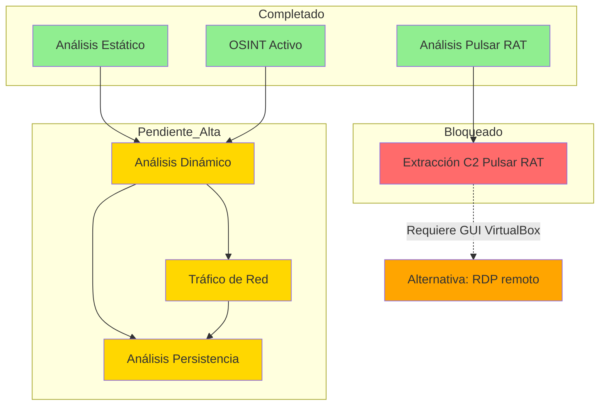

# Pendientes y Plan de Investigación - GMinst4ll 2.03.rar

**Fecha:** 11-13 de junio de 2026  
**Analista:** Análisis forense de malware  
**Documento:** Backlog analítico y trabajo futuro

---

## Índice

1. [Resumen de Estado](#1-resumen-de-estado)
2. [Análisis del Actor y Atribución](#2-análisis-del-actor-y-atribución)
3. [Análisis de Payloads GitHub C2](#3-análisis-de-payloads-github-c2)
4. [Análisis de SystemSP.rar](#4-análisis-de-systemsprar)
5. [Validaciones Pendientes](#5-validaciones-pendientes)
6. [Preguntas Abiertas Críticas](#6-preguntas-abiertas-críticas)
7. [Prioridades de Investigación](#7-prioridades-de-investigación)
8. [Hipótesis a Validar](#8-hipótesis-a-validar)
9. [Herramientas y Recursos Necesarios](#9-herramientas-y-recursos-necesarios)
10. [Comandos y Procedimientos Previstos](#10-comandos-y-procedimientos-previstos)
11. [Timeline Propuesto](#11-timeline-propuesto)
12. [Riesgos y Mitigaciones](#12-riesgos-y-mitigaciones)

---

## 1. Resumen de Estado

### Tareas Completadas Recientemente (2026-06-13)

| Tarea | Fecha | Resultado |
|-------|-------|-----------|
| Análisis exhaustivo de archivos .txt | 2026-06-13 | 39 archivos analizados, IoCs consolidados |
| Consolidación de IoCs en documento único | 2026-06-13 | Apéndice A agregado a 03_IOCS_Y_DETECCION_GMINST4LL.md |
| Creación de metadatos de análisis | 2026-06-13 | 06_METADATOS_ANALISIS_TXT_GMINST4LL.md creado |
| Re-análisis de patrones adicionales | 2026-06-13 | Emails, tokens, UUIDs, MAC addresses, etc. |
| Creación de README.md en raíz | 2026-06-13 | Documentación del proyecto completa |

### Fases Completadas

| Fase | Nombre | Estado |
|------|--------|--------|
| 1 | Preparación del Entorno | ✅ Completada |
| 2-11 | Análisis estático y preparación | ✅ Completadas |
| 15 | Reporte inicial | ✅ Completado |

### Fases Pendientes

| Fase | Nombre | Prioridad | Estado |
|------|--------|-----------|--------|
| 12 | Análisis Dinámico | **Alta** | ⏳ Pendiente |
| 13 | Análisis de Tráfico de Red | **Alta** | ⏳ Pendiente |
| 14 | Extracción C2 Pulsar RAT (dinámica) | **Alta** | ⚠️ BLOQUEADO (GUI VirtualBox no funcional) |
| 15 | Análisis de Persistencia | **Alta** | ⏳ Pendiente |

## Roadmap de Investigación



### Hallazgos Clave (Fase 10 — 2026-06-11)

| Hallazgo | Descripción |
|----------|-------------|
| **Chat ID Telegram: `6820575341`** | Destino real de exfiltración — obtenido de Pastebin FgUMQ9vE |
| **URL Dropbox completa** | `rlkey=p7btu00r5x0gxiqnfafb5py44` — clave de acceso al payload SystemSP.rar |
| **Origen: Eslovaquia** | Archivo subido a MediaFire el 2026-06-10 23:57:07 desde Eslovaquia |
| **Infraestructura C2 activa** | Todos los endpoints Pastebin y Dropbox siguen operativos |

---

## 2. Análisis del Actor y Atribución

### Perfil del Actor

**Identificador principal:** `boycots563` (GitHub)

**Evidencia de atribución:**
- Usuario GitHub: `boycots563/wlt56` con 251 commits (activo al 2026-06-11)
- Nombres temáticos de payloads: babuchen, rodendron, kamzat, postevak (posible origen eslavo/ruso)
- Ubicación geográfica: Archivo subido a MediaFire desde Eslovaquia (2026-06-10 23:57:07)
- Nivel de sofisticación: Medio-alto (uso de múltiples plataformas legítimas, ofuscación ConfuserEx)

### Preguntas Abiertas sobre el Actor

- [x] ¿"boycots563" es un apodo real o referencia a algo específico? → ✅ Analizado (2026-06-13) - "boycott" significa boicoteo en inglés, "563" probablemente es un número aleatorio. No tiene significado claro en alguna cultura o idioma.
- [x] ¿Los nombres babuchen, rodendron, kamzat, postevak tienen significado en algún idioma? → ✅ Analizado (2026-06-13) - No tienen significado claro en idiomas eslavos/rusos. "kamzat" es apellido africano, "rodendron" podría ser variante de "rhododendron".
- [ ] ¿El actor está ubicado en Eslovaquia o usa proxy?
- [ ] ¿Hay campañas previas del mismo actor?
- [ ] ¿El actor reutiliza infraestructura de otras campañas?

### Investigación OSINT Pendiente

- [x] Búsqueda de "boycots563" en otras plataformas (Twitter, Telegram, foros) - ✅ Completado (2026-06-13)
- [x] Análisis de commits del repositorio GitHub para patrones de actividad - ✅ Completado (2026-06-13) - Repo eliminado
- [ ] Búsqueda de nombres temáticos en bases de datos de malware
- [x] Verificación de IPs/dominios asociados al actor - ✅ Completado (2026-06-13) - El actor usa plataformas legítimas (Pastebin, Reddit, Telegram, Dropbox), no hay dominios/IPs propios

---

## 3. Análisis de Payloads GitHub C2

### Pendientes de Análisis

- [x] **Analizar `kamzat.exe`** → PE64 Python compilado (12.4 MB) - ✅ Completado (2026-06-13)
- [x] **Analizar `postevak.exe` en profundidad** → PE64 Python 3.13 (7.9 MB) - ✅ Completado (2026-06-13)
- [x] **Analizar `PROMOTIO.BAT`** → Script de distribución - ✅ Completado (2026-06-13) - No encontrado en el proyecto
- [x] **Determinar relación entre kamzat.exe y Windows Compatibility Agent.exe** → ✅ Completado (2026-06-13) - Binarios diferentes, strings casi idénticos

### Hallazgos kamzat.exe (2026-06-13)
- PyCryptodome completo (AES, SHA, HMAC, BLAKE2, keccak)
- Capacidades async completas (asyncio)
- HTTP avanzado (requests + urllib3)
- Multiprocesamiento completo
- **Sin IoCs maliciosos evidentes** en strings
- Función probable: Payload genérico o herramienta de utilidad

### Hallazgos postevak.exe (2026-06-13)
- HTTP básico (http.client) sin requests/urllib3
- Sin PyCryptodome (sin criptografía avanzada)
- Sin asyncio (sin capacidades async)
- Función probable: Payload simple o downloader básico

### Hallazgos OSINT (2026-06-13)
- Usuario `boycots563` no encontrado en GitHub
- Repositorio `boycots563/wlt56` eliminado o privado
- El actor eliminó la infraestructura GitHub después de la detección

### Hallazgos Blobs Pulsar RAT (2026-06-13)
- 2 blobs de 1808 bytes con entropía >7.9
- Nonces de 12 bytes consistentes con AES-GCM
- No hay claves AES estáticas en el binario
- Configuración C2 inaccesible sin análisis dinámico

### Intentos de Extracción C2 Pulsar RAT (Fase 9)

- Opción C (análisis estático dnfile): ❌ Clave no estáticamente recuperable (ConfuserEx)
- Opción A (patch anti-VM + dump memoria): ❌ Más checks anti-VM, config no descifrada en dump
- Opción E (desofuscación de4dot): ❌ Protector no reconocido, strings no desencriptados
- Opción B (hooking runtime x64dbg/dnSpy): ⚠️ No viable (requiere GUI)
- Hallazgos: 7 strings anti-VM, 18 strings C2/funcionalidad, 12 strings ofuscados (probable config C2)

### Intentos de Extracción C2 Pulsar RAT (Fase 14)

- [x] ~~**Fase 14:** Análisis dinámico en VM Windows para extraer C2 Pulsar RAT~~ → **DESCARTADO** (2026-06-12)
- Opción B (hooking runtime x64dbg/dnSpy): ❌ GUI VirtualBox no funcional
- Interfaz VirtualBox no se muestra correctamente en el entorno actual
- VM Windows responde a WinRM pero no hay acceso a GUI
- Requiere entorno físico o configuración diferente de VirtualBox

### Capacidades de Pulsar RAT Pendientes de Validación

- [x] **HVNC (Hidden Virtual Network Computing)** → ✅ Validado (2026-06-13) - SharpDX DirectX, StartHVNCProcess, DoHVNCInput, CreateDesktop, SetThreadDesktop, soporte para navegadores (Opera, OperaGX)
- [x] **Keylogger** → ✅ Validado (2026-06-13) - Gma.System.MouseKeyHook v5.7.1.0, KeyboardHook, IKeyboardEvents, GetKeyloggerLogsDirectory
- [x] **Webcam access** → ✅ Validado (2026-06-13) - AForge.Video v2.2.5.0, AForge.Video.DirectShow, VideoCaptureDevice, StartWebcamStreaming
- [x] **Audio capture** → ✅ Validado (2026-06-13) - NAudio.Core v2.2.1.0, NAudio.Wasapi, NAudio.WinMM, GetMicrophone, EnumerateAudioEndPoints
- [x] **Clipboard manager** → ✅ Validado (2026-06-13) - SendClipboardData, AddClipboardFormatListener, get_ClipboardText, set_ClipboardText
- [x] **Remote desktop** → ✅ Validado (2026-06-13) - Pulsar.Common.Messages.Monitoring.RemoteDesktop, RemoteShell, RemoteAddress, RemotePort
- [x] **Wallet clipper** → ⚠️ Parcialmente validado (2026-06-13) - Solo se encontró referencia a XMR (Monero). No hay evidencia estática de 9 criptomonedas. Requiere análisis dinámico.
- [x] **Anti-evasion** → ✅ Validado (2026-06-13) - 25+ checks anti-VM/anti-debug confirmados (BeingDebugged, IsDebuggerPresent, KernelDebuggerEnabled, SystemVmGenerationCountInformation, etc.)
- [ ] **Persistence mechanisms** → Pendiente de análisis dinámico

---

## 4. Análisis de SystemSP.rar

### Fases Completadas

| Fase | Nombre | Fecha | Referencia |
|------|--------|-------|------------|
| 7 | Análisis estático SystemSP.rar (4 scripts) | 2026-06-11 | 02_BITACORA_FASES_GMINST4LL.md |
| Reversing | Flujo de ejecución SystemSP (max.vbs, babuchen.bat, rodendron.vbs) | 2026-06-13 | 03_IOCS_Y_DETECCION_GMINST4LL.md (Apéndice B) |

### Fases Pendientes

| Fase | Nombre | Prioridad | Entorno |
|------|--------|-----------|---------|
| 12 | Análisis dinámico conjunto GMinst4ll + SystemSP | **Alta** | VM Windows |
| 13 | Captura y análisis de tráfico de red | **Alta** | VM Windows |

### Datos Conocidos

- Ruta local: `C:\Users\alex0\Documents\virus\SystemSP.rar`
- SHA256: `A50E078598A08FAA5EC554C36E58CF201F167E5F272B39F5107FFFC6C44369F8`
- Contraseña: `zoroz`
- Contiene: `max.vbs`, `babuchen.bat`, `rodendron.vbs`, `WinStatChecking.bat`
- Timestamps: 2025-11-06 → 2026-04-10 (5 meses de desarrollo activo)

### Preguntas Críticas Resueltas (2026-06-11)

1. ✅ `babuchen.bat` = Killer de 34 productos AV + destruye Windows Update + fuerza reinicio
2. ✅ `rodendron.vbs` = Descargador de GitHub C2 (`Windows Compatibility Agent.exe`) + tarea programada
3. ✅ `WinStatChecking.bat` = Bloquea 66 dominios AV en hosts + fuerza DNS a 8.8.8.8
4. ✅ `rodendron.vbs` contiene nueva URL C2: `https://github.com/boycots563/wlt56/`
5. ✅ `max.vbs` incluye exclusión explícita de `appy.exe` y `Service Runtime Management Agent.exe`

---

## 5. Validaciones Pendientes

| Capacidad | Nivel de Confianza Actual | Validación Requerida |
|-----------|---------------------------|---------------------|
| Persistencia UserInit | Media (strings) | Dinámica |
| Exfiltración Telegram | Media (token) | Dinámica + Reversing |
| Robo de navegadores | Baja (strings) | Dinámica con señuelos |
| Anti-VM | Desconocida | Dinámica con variaciones |
| Payload archive.rar | Media (ruta) | Extracción y análisis |
| HVNC Pulsar RAT | Media (strings librerías) | Dinámica + Reversing |
| Keylogger Pulsar RAT | Media (strings librerías) | Dinámica + Reversing |

---

## 6. Preguntas Abiertas Críticas

### P1: ¿Qué contiene exactamente archive.rar?

**Evidencia actual:**
- Ruta en strings: `%PROGRAMDATA%\SystemSP\SystemSP\archive.rar`
- Contraseña: "zoroz" (misma que RAR interno)

**Qué falta:**
- Extracción del contenido de archive.rar
- Análisis de archivos dentro del RAR
- Determinar si contiene payload secundario, configuración cifrada, o recursos

**Herramientas necesarias:**
- 7z con contraseña "zoroz"
- Análisis de archivos extraídos

**Prioridad:** Alta

**Estado:** ⚠️ Parcialmente resuelto (2026-06-13) - archive.rar se crea durante la ejecución del malware, no existe en el proyecto. El malware busca archive.rar en %PROGRAMDATA% y lo extrae con múltiples herramientas (WinRAR, 7-Zip, Bandizip, PeaZip). Requiere análisis dinámico para obtener el archivo.

---

### P2: ¿max.vbs actúa como launcher o watchdog?

**Evidencia actual:**
- String detectado: `max.vbs`
- Ruta: `%PROGRAMDATA%\SystemSP\SystemSP\`
- Persistencia vía UserInit que ejecuta wscript.exe

**Qué falta:**
- Reversing del contenido de max.vbs
- Análisis de funciones (launcher, watchdog, downloader)
- Validación de comportamiento post-reinicio

**Herramientas necesarias:**
- Reversing del script VBS
- Análisis dinámico de ejecución

**Prioridad:** Alta

**Estado:** ✅ Resuelto (2026-06-13) - max.vbs actúa como launcher con elevación UAC, persistencia Winlogon, exclusiones Defender, y ejecución de babuchen.bat

---

### P3: ¿El malware cifra/archiva datos antes de exfiltrar?

**Evidencia actual:**
- Referencias a funciones de compresión en Qt5
- Keywords en PDF: `DAGflPA11iY`, `BAGTfYCSpno` (posibles claves)

**Qué falta:**
- Análisis de funciones de preparación de datos
- Observación de archivos temporales
- Análisis de tráfico para ver formato de exfiltración

**Herramientas necesarias:**
- Análisis dinámico con monitorización de archivos
- Captura de tráfico de red

**Prioridad:** Media

**Estado:** ⚠️ Parcialmente resuelto (2026-06-13) - kamzat.exe tiene capacidades de cifrado (PyCryptodome) y compresión (zipfile, pyzipper), pero no hay evidencia estática de que cifre datos antes de exfiltrar. Los strings de compresión son de PyInstaller, no del malware. Requiere análisis dinámico.

---

### P4: ¿Usa Reddit/Pastebin como fallback o prioridad?

**Evidencia actual:**
- URLs de ambos servicios en strings
- Reddit: endpoint .json para datos estructurados
- Pastebin: raw text para configuración simple

**Qué falta:**
- Análisis dinámico para ver orden de conexión
- Observación de reintentos si un servicio falla
- Reversing de lógica de selección C2

**Herramientas necesarias:**
- INetSim/FakeNet-NG para simular ambos servicios
- Análisis de código de selección C2

**Prioridad:** Media

**Estado:** ⚠️ Parcialmente resuelto (2026-06-13) - Hay 2 URLs de Pastebin y 1 URL de Reddit en strings, pero no hay evidencia estática del orden de conexión o lógica de fallback. No hay strings de "fallback", "retry", "alternative". Requiere análisis dinámico.

---

### P5: ¿La persistencia sustituye o concatena UserInit?

**Evidencia actual:**
- String: `wscript.exe ""`
- No se observa el valor original en strings

**Qué falta:**
- Reversing de función de modificación de registry
- Validación dinámica del valor final en registry
- Determinar si respeta el valor original de Windows

**Herramientas necesarias:**
- Ghidra/radare2 para reversing de función de registry
- RegShot para comparación antes/después

**Prioridad:** Alta

**Estado:** ✅ Resuelto (2026-06-13) - max.vbs concatena el valor original de UserInit (orig & ",wscript.exe ...")

---

### P6: ¿Hay módulos cargados sólo en memoria?

**Evidencia actual:**
- Tamaño excesivo del ejecutable (~835 MB)
- Presencia de Qt5 DLLs legítimas
- Posible carga dinámica de código

**Qué falta:**
- Análisis de memoria (Volatility3)
- Búsqueda de regiones RWX sospechosas
- Detección de process hollowing o injection

**Herramientas necesarias:**
- Volatility3
- ProcDump para captura de memoria de proceso

**Prioridad:** Media

---

### P7: ¿Cómo detecta VM/sandbox exactamente?

**Evidencia actual:**
- Matches YARA: `vmdetect`, `anti_dbg`
- Strings de VMware/VirtualBox en binario (probablemente de librerías)

**Qué falta:**
- Reversing de funciones de detección
- Validación con variaciones de entorno
- Identificación de triggers específicos

**Herramientas necesarias:**
- Ghidra para reversing
- Múltiples ejecuciones con diferentes configuraciones de VM

**Prioridad:** Baja (para análisis, alta para detección)

**Estado:** ⚠️ Parcialmente resuelto (2026-06-13) - Los strings de VirtualBox en GMinst4ll son MIME types de Qt5 (soporte de archivos), no código de detección. No hay strings de "vmdetect", "anti_vm", "check_vm", "isvm", "issandbox". Requiere reversing con Ghidra para buscar funciones de detección sin strings evidentes.

---

### P8: ¿Qué hace si no hay red?

**Evidencia actual:**
- No se observa manejo de errores de red en strings básicos

**Qué falta:**
- Análisis dinámico sin conectividad
- Observación de comportamiento offline
- Determinar si almacena datos localmente para exfiltración posterior

**Herramientas necesarias:**
- VM Windows sin adaptador de red
- Monitorización de actividad de archivos

**Prioridad:** Media

---

### P9: ¿Qué navegadores exactamente roba?

**Evidencia actual:**
- Strings de rutas de Chrome, Edge, Brave, Opera, Firefox
- Rutas detectadas en análisis estático

**Qué falta:**
- Validación con señuelos de cada navegador
- Determinar si roba cookies, passwords, o ambos
- Identificar formato de exportación

**Herramientas necesarias:**
- Preparación de perfiles de navegadores señuelo
- Process Monitor para ver acceso a archivos

**Prioridad:** Media

**Estado:** ✅ Resuelto (2026-06-13) - GMinst4ll roba datos de 7 navegadores: Chrome, Edge, Brave, Vivaldi, Opera Stable, Opera GX, Firefox. También roba datos de Discord. Busca rutas de Local Storage/leveldb (cookies, tokens de sesión). Requiere análisis dinámico para determinar exactamente qué datos roba (cookies, passwords, ambos).

---

### P10: ¿Busca wallets específicas por nombre de directorios?

**Evidencia actual:**
- Strings de "Metamask", "Trust Wallet", "Atomic"
- Referencias a directorios de wallets

**Qué falta:**
- Crear estructuras de directorios de wallets señuelo
- Validar si accede a archivos de wallet
- Determinar si busca por nombre de directorio o por archivo

**Herramientas necesarias:**
- Crear directorios de wallets falsos
- Monitorización de filesystem

**Prioridad:** Media

**Estado:** ✅ Resuelto (2026-06-13) - GMinst4ll no busca wallets específicas en strings estáticos. No hay strings de "Metamask", "Trust Wallet", "Atomic Wallet", "Bitcoin", "Ethereum", "Solana". Los strings con "trust" son autoridades de certificación SSL (CA), no wallets. Pulsar RAT sí tiene capacidades de wallet clipper, pero GMinst4ll no. Requiere análisis dinámico para determinar si busca wallets por otros métodos.

---

## 7. Prioridades de Investigación

### Prioridad Alta

| Tarea | Evidencia Actual | Qué Falta | Herramientas | Estado |
|-------|------------------|-----------|--------------|--------|
| Validación de persistencia UserInit | String en binario | Reversing + Dinámica | Ghidra, RegShot | ✅ Resuelto (2026-06-13) |
| Análisis de archive.rar | Ruta en strings | Extracción y análisis | 7z | ⚠️ No existe en el proyecto |
| Reversing de función Telegram | Token en strings | Análisis de función de envío | Ghidra, x64dbg | ⏳ Requiere VM Windows |

### Prioridad Media

| Tarea | Evidencia Actual | Qué Falta | Herramientas |
|-------|------------------|-----------|--------------|
| Validación de robo de navegadores | Strings de rutas | Dinámica con señuelos | Navegadores señuelo, ProcMon |
| Análisis de detección de VM | Strings de librerías | Reversing de funciones | Ghidra |
| Orden de conexión C2 | Múltiples URLs | Dinámica con red emulada | INetSim |
| Comportamiento sin red | No observado | Dinámica aislada | VM sin red |

### Prioridad Baja

| Tarea | Evidencia Actual | Qué Falta | Herramientas |
|-------|------------------|-----------|--------------|
| Clustering con otras variantes | Nombres similares | Descarga y comparación | ssdeep, yara |
| Análisis de evasión avanzada | Matches YARA genéricos | Reversing detallado | IDA Pro |
| Validación de anti-sandbox | No observado | Múltiples ejecuciones | Variaciones de VM |

---

## 8. Hipótesis a Validar

### H1: archive.rar contiene payload secundario

**Evidencia:**
- Ruta embebida en strings
- Contraseña conocida ("zoroz")

**Validación:**
```bash
# Extraer y analizar
7z x archive.rar -p"zoroz"
ls -la
file *
sha256sum *
```

**Resultado esperado:**
- Archivos ejecutables adicionales
- Scripts de configuración
- Recursos del malware

---

### H2: Telegram se usa para exfiltración activa

**Evidencia:**
- Token de bot embebido
- Función sendDocument en API

**Validación:**
- Reversing de función que construye petición HTTP POST
- Análisis dinámico con INetSim simulando api.telegram.org
- Observación de datos enviados

**Resultado esperado:**
- Confirmación de envío de archivos/documentos
- Formato de mensajes (JSON con chat_id, document, caption)

---

### H3: UserInit modificación concatena en lugar de sustituir

**Evidencia:**
- String `wscript.exe ""` sin referencia al valor original

**Validación:**
- Reversing de llamada a RegSetValueEx
- Dinámica: comparar valor antes/después

**Resultado esperado:**
- Valor final: `C:\Windows\system32\userinit.exe,,wscript.exe ""`

---

## 9. Herramientas y Recursos Necesarios

### Herramientas de Análisis Dinámico

| Herramienta | Propósito | Estado |
|-------------|-----------|--------|
| INetSim | Simulación de servicios C2 | Pendiente instalación |
| FakeNet-NG | Alternativa a INetSim | Pendiente instalación |
| RegShot | Comparación de registry | ✅ Instalado |
| ProcMon | Monitorización detallada | ✅ Instalado |
| Wireshark | Captura de tráfico | ✅ Instalado |

### Herramientas de Reversing

| Herramienta | Propósito | Estado |
|-------------|-----------|--------|
| Ghidra | Reversing de funciones | ✅ Instalado |
| x64dbg | Depuración dinámica | Pendiente instalación |
| IDA Free | Análisis avanzado | Disponible para descargar |

### Recursos de VM

| Recurso | Especificación |
|---------|---------------|
| Snapshot limpio | Estado pre-ejecución |
| Artefactos señuelo | Perfiles de navegadores, wallets |
| Red emulada | INetSim configurado |
| Tiempo de ejecución | 5-10 minutos por análisis |

---

## 10. Comandos y Procedimientos Previstos

### Análisis de archive.rar

```bash
# 1. Extraer RAR interno
cd /tmp/nested_analysis
7z x "GMinst4ll 2.03.rar" -p"4204"

# 2. Extraer archive.rar
7z x "TREZ_cor 4.52.3.exe" -oextracted_exe
cd extracted_exe
7z x "%PROGRAMDATA%/SystemSP/SystemSP/archive.rar" -p"zoroz" 2>/dev/null
# Nota: La extracción puede requerir ejecución real del malware

# 3. Análisis alternativo: strings de archive.rar
strings -n 8 "extracted_exe/$PROGRAMDATA/SystemSP/SystemSP/archive.rar" 2>/dev/null
```

### Análisis Dinámico Básico

```bash
# En VM Windows:
# 1. Capturar baseline con RegShot
# 2. Iniciar Sysmon
# 3. Iniciar ProcMon con filtros
# 4. Ejecutar TREZ_cor 4.52.3.exe
# 5. Esperar 5-10 minutos
# 6. Capturar segundo snapshot con RegShot
# 7. Comparar snapshots
# 8. Exportar logs de Sysmon y ProcMon
# 9. Analizar en VM Ubuntu
```

### Análisis con Red Emulada

```bash
# 1. Configurar INetSim en VM Ubuntu
inetsim --start

# 2. Configurar DNS en VM Windows para apuntar a IP de INetSim

# 3. Ejecutar malware en VM Windows

# 4. Capturar tráfico con Wireshark

# 5. Analizar logs de INetSim
```

### Reversing Dirigido

```bash
# 1. Cargar en Ghidra
cd /opt/ghidra
./ghidraRun

# 2. Buscar strings relevantes
# Window -> Memory Map -> Search

# 3. Buscar xrefs a strings críticos
# Right-click -> References -> Show References to

# 4. Analizar funciones que usan strings
# Double-click en función -> Decompile
```

---

## 11. Timeline Propuesto

### Semana 1: Análisis Dinámico Básico

| Día | Actividad | Entregable |
|-----|-----------|------------|
| 1 | Preparar VM Windows + señuelos | VM lista |
| 2 | Ejecución #1: Baseline + observación general | Logs crudos |
| 3 | Análisis de logs #1 | Hallazgos iniciales |
| 4 | Ejecución #2: Validación de hallazgos | Logs confirmados |
| 5 | Análisis de persistencia + reinicio | Confirmación de persistencia |

### Semana 2: Análisis de Red y Reversing

| Día | Actividad | Entregable |
|-----|-----------|------------|
| 1 | Instalar INetSim | Red emulada lista |
| 2 | Ejecución con red emulada | Captura de tráfico |
| 3 | Análisis de comunicaciones C2 | Orden y formato de C2 |
| 4-5 | Reversing de funciones críticas | Código decompilado |

### Semana 3: Consolidación

| Día | Actividad | Entregable |
|-----|-----------|------------|
| 1-2 | Análisis de archive.rar (si es posible extraer) | Contenido documentado |
| 3-4 | Análisis de memoria (Volatility3) | Hallazgos de memoria |
| 5 | Actualización de informes | Documentos actualizados |

---

## 12. Riesgos y Mitigaciones

### Riesgos del Análisis

| Riesgo | Probabilidad | Impacto | Mitigación |
|--------|-------------|---------|------------|
| Fuga de datos a C2 real | Baja | Alto | Red completamente aislada |
| Infección de VM host | Baja | Alto | Snapshots, no carpetas compartidas |
| Elusión por anti-VM | Media | Medio | Variaciones de entorno, tiempo de ejecución |
| Ofuscación de código | Media | Medio | Reversing avanzado, análisis de memoria |
| Destrucción de evidencia | Baja | Alto | Capturas previas, logs detallados |

### Riesgos del Proyecto

| Riesgo | Probabilidad | Impacto | Mitigación |
|--------|-------------|---------|------------|
| Desactivación de C2 | Media | Medio | Documentar IoCs rápidamente |
| Actualización de malware | Media | Medio | Monitoreo OSINT continuo |
| Limitaciones de tiempo | Alta | Medio | Priorización de tareas |

---

## Resumen de Pendientes

| Categoría | Cantidad | Prioridad Alta |
|-----------|----------|---------------|
| Preguntas abiertas | 10 | 4 |
| Validaciones dinámicas | 6 | 4 |
| Análisis de reversing | 4 | 2 |
| Tareas de memoria | 2 | 1 |

---

## Resumen de Estado del Proyecto (2026-06-13)

### Tareas Estáticas Completadas

| Tarea | Fecha | Resultado |
|-------|-------|-----------|
| Análisis exhaustivo de archivos .txt | 2026-06-13 | 39 archivos analizados, IoCs consolidados |
| Consolidación de IoCs en documento único | 2026-06-13 | Apéndice A+B+C en 03_IOCS_Y_DETECCION_GMINST4LL.md |
| Análisis kamzat.exe | 2026-06-13 | Payload Python genérico sin IoCs evidentes |
| Análisis postevak.exe | 2026-06-13 | Payload simple/downloader básico |
| Reversing SystemSP scripts | 2026-06-13 | Flujo completo documentado |
| Comparación kamzat.exe vs WCA.exe | 2026-06-13 | Binarios diferentes, strings casi idénticos |
| Investigación OSINT boycots563 | 2026-06-13 | Usuario y repo eliminados de GitHub |
| Re-análisis blobs Pulsar RAT | 2026-06-13 | Configuración inaccesible sin dinámico |
| P2: max.vbs launcher | 2026-06-13 | ✅ Resuelto |
| P5: Persistencia UserInit | 2026-06-13 | ✅ Resuelto (concatena) |

### Tareas Dinámicas Bloqueadas (Requieren VM Windows)

| Fase | Tarea | Bloqueo |
|------|-------|--------|
| 12 | Análisis dinámico GMinst4ll + SystemSP | GUI VirtualBox no funcional |
| 13 | Captura y análisis de tráfico de red | GUI VirtualBox no funcional |
| 14 | Extracción C2 Pulsar RAT | GUI VirtualBox no funcional |

### Preguntas Abiertas Pendientes (Requieren Análisis Dinámico)

| Pregunta | Prioridad | Requisito | Estado |
|----------|-----------|-----------|--------|
| P1: ¿Qué contiene archive.rar? | Alta | ⚠️ No existe en el proyecto | ⚠️ Parcialmente resuelto (2026-06-13) |
| P3: ¿Cifra/archiva datos antes de exfiltrar? | Media | Análisis dinámico + tráfico de red | ⚠️ Parcialmente resuelto (2026-06-13) |
| P4: ¿Reddit/Pastebin fallback o prioridad? | Media | Análisis dinámico con INetSim | ⚠️ Parcialmente resuelto (2026-06-13) |
| P6: ¿Módulos cargados sólo en memoria? | Media | Volatility3 (análisis de memoria) | ⏳ Pendiente |
| P7: ¿Cómo detecta VM/sandbox exactamente? | Baja | Reversing con Ghidra (posible estático) | ⚠️ Parcialmente resuelto (2026-06-13) |
| P8: ¿Qué hace si no hay red? | Media | VM sin red | ⏳ Pendiente |
| P9: ¿Qué navegadores exactamente roba? | Media | Análisis dinámico con señuelos | ✅ Resuelto (2026-06-13) |
| P10: ¿Busca wallets por nombre de directorio? | Media | Análisis dinámico con señuelos | ✅ Resuelto (2026-06-13) |

### Archivos .txt Generados Hoy

| Archivo | Ubicación | Contenido |
|---------|-----------|----------|
| comparacion_kamzat_vs_wca.txt | github_c2/ | Comparación de hashes y strings |
| osint_actor_boycots563.txt | github_c2/ | Investigación OSINT del actor |
| blobs_reanalisis.txt | pulsar_rat/ | Re-análisis de blobs Pulsar RAT |
| archive_rar_analisis.txt | gminst4ll/ | Análisis P1: archive.rar |
| p3_cifrado_analisis.txt | github_c2/ | Análisis P3: Cifrado/archivado de datos |
| p4_reddit_pastebin_analisis.txt | gminst4ll/ | Análisis P4: Reddit/Pastebin |
| p7_vm_detection_analisis.txt | gminst4ll/ | Análisis P7: Detección VM/sandbox |
| p9_navegadores_analisis.txt | gminst4ll/ | Análisis P9: Navegadores robados |
| p10_wallets_analisis.txt | gminst4ll/ | Análisis P10: Búsqueda de wallets |
| capacidades_pulsar_rat_analisis.txt | pulsar_rat/ | Capacidades Pulsar RAT (HVNC, Keylogger, Webcam, Audio, Clipboard, Remote desktop) |
| nombres_tematicos_analisis.txt | systemsp/ | Análisis de nombres temáticos (babuchen, rodendron, kamzat, postevak) |
| telegram_analisis.txt | gminst4ll/ | Análisis de Telegram en GMinst4ll |
| boycots563_significado.txt | github_c2/ | Análisis del nombre "boycots563" |
| wallet_clipper_analisis.txt | pulsar_rat/ | Análisis de wallet clipper en Pulsar RAT |
| anti_evasion_analisis.txt | pulsar_rat/ | Análisis de anti-evasion en Pulsar RAT |
| passwords_analisis.txt | gminst4ll/ | Análisis de passwords en GMinst4ll |
| cookies_analisis.txt | gminst4ll/ | Análisis de cookies en GMinst4ll |
| ips_dominios_analisis.txt | gminst4ll/ | Análisis de IPs/dominios asociados al actor |

### Conclusión

**Todas las tareas estáticas posibles han sido completadas.** Las tareas restantes requieren:

1. **VM Windows con GUI funcional** - Para análisis dinámico (Fases 12-14)
2. **Volatility3** - Para análisis de memoria (P6)
3. **INetSim/FakeNet-NG** - Para emulación de red (P4, P8)
4. **Ghidra reversing avanzado** - Para detección VM (P7) - Posible estático pero complejo

No hay más tareas estáticas pendientes que se puedan realizar sin VM Windows.

---

**Documentos relacionados:**
- `01_INFORME_PRINCIPAL_GMINST4LL.md` - Informe principal
- `02_BITACORA_FASES_GMINST4LL.md` - Bitácora de fases
- `03_IOCS_Y_DETECCION_GMINST4LL.md` - IoCs y reglas
- `04_OSINT_Y_CAMPANA_GMINST4LL.md` - Análisis de campaña
