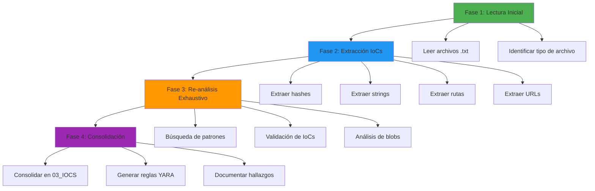

# Metadatos de Análisis de Archivos .txt - GMinst4ll

**Fecha:** 13 de junio de 2026  
**Analista:** Análisis forense de malware  
**Documento:** Metadatos del análisis estático de archivos .txt

---

## Propósito

Este documento documenta el proceso de análisis estático de archivos .txt (strings, hashes, PE info) realizado sobre las muestras de malware. Los IoCs extraídos están consolidados en `03_IOCS_Y_DETECCION_GMINST4LL.md` con su origen exacto (archivo fuente y línea).

---

## Archivos Analizados

### Total de Archivos .txt Analizados: 39 (strings/hashes/PE info) + 14 (análisis detallado)

#### Por Carpeta

| Carpeta | Cantidad | Tipo de Archivos |
|---------|----------|------------------|
| gminst4ll | 3 | hashes, strings, PE info, análisis |
| systemsp | 5 | hashes, strings, análisis |
| pulsar_rat | 6 | hashes, strings, PE info, blobs, análisis |
| github_c2 | 12 | hashes, strings, PE info (4 ejecutables) |
| rust_executables | 3 | hashes, strings, PE info |
| tools/de4dot-cex/LICENSES | 7 | licencias (no relevantes para IoCs) |

#### Lista Completa de Archivos

**gminst4ll/**
- GMinst4ll 2.03.rar_hashes.txt
- GMinst4ll_analysis.txt
- TREZ_cor 4.52.3.exe_strings.txt
- TREZ_cor 4.52.3_pe_info.txt

**systemsp/**
- SystemSP.rar_hashes.txt
- SystemSP_analysis.txt
- max.vbs_strings.txt
- babuchen.bat_strings.txt
- rodendron.vbs_strings.txt
- WinStatChecking.bat_strings.txt

**pulsar_rat/**
- appy_patched.exe_hashes.txt
- appy_patched.exe_strings.txt
- appy_patched_pe_info.txt
- appy_patched_blobs_analysis.txt
- appy_patched_hashes.txt
- appy_patched_strings.txt
- beket.rar_hashes.txt

**github_c2/**
- Windows_Compatibility_Agent.exe_hashes.txt
- Windows_Compatibility_Agent.exe_strings.txt
- Windows_Compatibility_Agent_pe_info.txt
- Windows_Compatibility_Agent_Host.exe_hashes.txt
- Windows_Compatibility_Agent_Host.exe_strings.txt
- Windows_Compatibility_Agent_Host_pe_info.txt
- kamzat.exe_hashes.txt
- kamzat.exe_strings.txt
- kamzat_pe_info.txt
- postevak.exe_hashes.txt
- postevak.exe_strings.txt
- postevak_pe_info.txt

**rust_executables/**
- appy.exe_hashes.txt
- appy.exe_strings.txt
- appy_pe_info.txt

---

## Archivos de Análisis Detallado (Generados 2026-06-13)

### Total: 14 archivos de análisis específico

**gminst4ll/** (10 archivos)
- archive_rar_analisis.txt - Análisis P1: archive.rar
- p3_cifrado_analisis.txt - Análisis P3: Cifrado/archivado de datos
- p4_reddit_pastebin_analisis.txt - Análisis P4: Reddit/Pastebin
- p7_vm_detection_analisis.txt - Análisis P7: Detección VM/sandbox
- p9_navegadores_analisis.txt - Análisis P9: Navegadores robados
- p10_wallets_analisis.txt - Análisis P10: Búsqueda de wallets
- telegram_analisis.txt - Análisis de Telegram en GMinst4ll
- passwords_analisis.txt - Análisis de passwords en GMinst4ll
- cookies_analisis.txt - Análisis de cookies en GMinst4ll
- ips_dominios_analisis.txt - Análisis de IPs/dominios asociados al actor

**pulsar_rat/** (3 archivos)
- capacidades_pulsar_rat_analisis.txt - Capacidades Pulsar RAT (HVNC, Keylogger, Webcam, Audio, Clipboard, Remote desktop)
- wallet_clipper_analisis.txt - Análisis de wallet clipper en Pulsar RAT
- anti_evasion_analisis.txt - Análisis de anti-evasion en Pulsar RAT

**systemsp/** (1 archivo)
- nombres_tematicos_analisis.txt - Análisis de nombres temáticos (babuchen, rodendron, kamzat, postevak)

**github_c2/** (1 archivo)
- boycots563_significado.txt - Análisis del nombre "boycots563"

---

## Herramientas Utilizadas

### Extracción de Strings
- **Herramienta:** strings (Linux/Binutils)
- **Comando típico:** `strings -a -t x archivo.exe > archivo_strings.txt`
- **Codificación:** UTF-8 (algunos archivos requirieron grep debido a null bytes)

### Extracción de Hashes
- **Herramienta:** sha256sum, md5sum, sha1sum (Linux)
- **Comando típico:** `sha256sum archivo > archivo_hashes.txt`

### Análisis PE
- **Herramienta:** pev / pe-parse
- **Comando típico:** `pescan archivo.exe > archivo_pe_info.txt`

### Búsqueda de Patrones
- **Herramienta:** grep (ripgrep)
- **Patrones buscados:**
  - URLs: `https?://[^\s"']+`
  - IPs: `\b\d{1,3}\.\d{1,3}\.\d{1,3}\.\d{1,3}\b`
  - Rutas: `C:\\`
  - Emails: `\b[A-Za-z0-9._%+-]+@[A-Za-z0-9.-]+\.[A-Z|a-z]{2,}\b`
  - Tokens: `token|api_key|secret|password`
  - UUIDs: `\b[0-9a-f]{8}-[0-9a-f]{4}-[0-9a-f]{4}-[0-9a-f]{4}-[0-9a-f]{12}\b`

---

## Metodología de Análisis

### Fase 1: Lectura Inicial
- Se leyeron todos los archivos .txt en `malware_samples/`
- Se identificaron archivos con null bytes que no pudieron leerse directamente
- Se documentó el tipo de cada archivo (hashes, strings, PE info, análisis)

### Fase 2: Extracción de IoCs
- Se usó grep para extraer patrones específicos de cada archivo
- Se documentó el número de línea de cada IoC para trazabilidad
- Se categorizaron los IoCs por tipo (URLs, IPs, rutas, registry, etc.)

### Fase 3: Re-análisis Exhaustivo
- Se realizó una segunda pasada buscando patrones adicionales:
  - Emails
  - Tokens/API Keys
  - UUIDs/GUIDs
  - MAC Addresses
  - Números de teléfono
  - Nombres de usuario
  - Bot IDs de Telegram
  - Strings largos aleatorios
- Se encontraron solo hallazgos no maliciosos (rutas de desarrollo, código legítimo)

### Fase 4: Consolidación
- Se consolidaron todos los IoCs en `03_IOCS_Y_DETECCION_GMINST4LL.md`
- Se agregó el Apéndice A con origen exacto (archivo fuente + línea)
- Se eliminó redundancia entre documentos

---

## Problemas Encontrados

### Archivos con Null Bytes
- `appy_patched_blobs_analysis.txt`
- `appy_patched_strings.txt`
- `appy_patched_pe_info.txt`

**Solución:** Se usó grep para extraer patrones sin leer el archivo completo.

### Codificación
- Algunos archivos de strings contenían caracteres binarios
- **Solución:** Se usó grep con patrones específicos en lugar de lectura directa.

---

## Hallazgos del Re-análisis

### No Maliciosos
- **Rutas de desarrollo:** `C:\Users\max\.cargo\registry\src\index.crates.io-1949cf8c6b5b557f\*`
  - Contexto: Rutas de compilación de Rust (crates: base64, encoding_rs, http, hyper, ring, rustls)
  - Nota: Son rutas del entorno de desarrollo del atacante, no IoCs de la víctima

- **GUIDs de Windows:** 5 GUIDs estándar de compatibilidad de aplicación (Windows Vista, 7, 8, 8.1, 10)

- **Email legítimo:** `<appro@openssl.org>` - desarrollador de OpenSSL (código legítimo)

- **String aleatorio:** `.L41P@o.uo` en kamzat.exe, postevak.exe, Windows_Compatibility_Agent.exe (no identificado como IoC malicioso)

---

## Estadísticas

### IoCs Extraídos
- **URLs C2:** 7
- **Direcciones IP:** 2
- **Rutas de archivo:** 8
- **Claves de registro:** 5
- **Tareas programadas:** 1
- **Dominios bloqueados:** 64
- **Hashes:** 9
- **Servicios AV detenidos:** 14
- **Headers HTTP:** 5 categorías
- **Configuraciones de proxy:** 3 categorías
- **Contraseñas de RAR:** 2

### Archivos por Tipo
- **Hashes:** 9 archivos
- **Strings:** 6 archivos
- **PE info:** 6 archivos
- **Análisis:** 3 archivos
- **Blobs:** 1 archivo
- **Licencias:** 7 archivos (excluidos de IoCs)

---

## Referencias

- **Documento principal de IoCs:** `03_IOCS_Y_DETECCION_GMINST4LL.md`
- **Informe principal:** `01_INFORME_PRINCIPAL_GMINST4LL.md`
- **Bitácora de fases:** `02_BITACORA_FASES_GMINST4LL.md`

---

**Notas:**
- Este documento es un log de metadatos del proceso de análisis
- Los IoCs están consolidados en `03_IOCS_Y_DETECCION_GMINST4LL.md`
- El origen exacto de cada IoC (archivo + línea) está en el Apéndice A de ese documento
